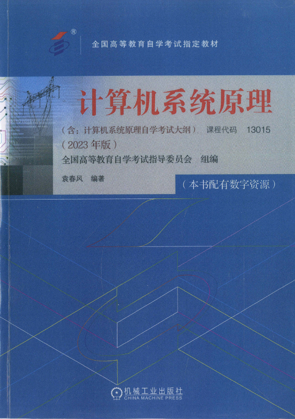

# 计算机系统原理（13015）学习笔记

> 📚 课程代码：13015｜专业课｜4学分｜笔试考核  
> 🏫 主考院校：北京邮电大学  
> 📖 教材：袁春风《计算机系统原理》（2023年版），机械工业出版社  
> 🏷️ 所属专业：计算机科学与技术（专升本）  
> 📌 专业代码：`01B0015`｜国家专业代码：`080901`



本项目用于记录全国高等教育自学考试《计算机系统原理》（课程代码：`13015`）的学习笔记、例题解析与思维导图。该课程是计算机科学与技术（专升本）专业的重要专业课，由北京邮电大学主考，教材为国家统编教材。

---

## 📚 课程信息

- **课程名称**：计算机系统原理
- **课程代码**：`13015`
- **课程性质**：专业课
- **学分**：4分
- **考核方式**：笔试
- **是否选考科目**：否
- **所属专业名称**：计算机科学与技术（专升本）
- **专业代码**：`01B0015`
- **国家专业代码**：`080901`
- **主考院校**：北京邮电大学
- **批准文号**：教职成厅[2018]1号

---

## 📘 教材信息

- **教材名称**：计算机系统原理
- **主编**：袁春风
- **出版社**：机械工业出版社
- **教材版本**：2023年版
- **教材类型**：国家统编教材
- **开始使用日期**：2023年11月1日

---

## 🧩 教材目录

1. 计算机系统概述
2. 数据的表示和运算
3. 程序的转换及机器级表示
4. 可执行文件的生成与加载
5. 程序的存储访问
6. 程序中I/O系操作的实现

---

## 📂 仓库结构

```text
.
├── README.md               # 仓库说明文档
├── cover.jpg               # 教材封面图片（请自行添加）
├── notes/                  # 各章节学习笔记
│   ├── chapter01.md
│   ├── chapter02.md
│   └── ...
├── examples/               # 典型例题与解析
├── mindmaps/               # 思维导图
├── attachments/            # 附件资料
└── references/             # 参考资料

```

---

## 🎯 学习目标

* 从“会背名词” → “能画结构图”
* 从“知道流程” → “解释为什么这样设计”
* 从“应付考试” → “真懂系统在干什么”

>《计算机系统原理》不是背出来的，是“想通&理解”的。
---

## 📝 说明

本仓库为个人自学笔记整理，仅用于学习与交流，请勿用于商业用途。
欢迎任何人参考和借鉴笔记，若有错误欢迎指出，共同进步！
>* 本仓库由 `chosen1cwp` 自学维护。
>* GitHub: [13015](https://github.com/chosen1cwp/13015)
>* Email: [chosen1cwp@gmail.com](mailto:chosen1cwp@gmail.com)

