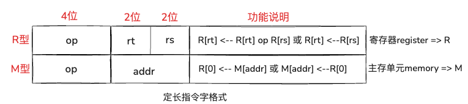
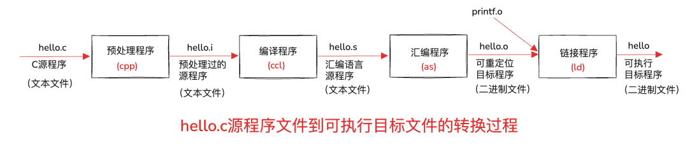
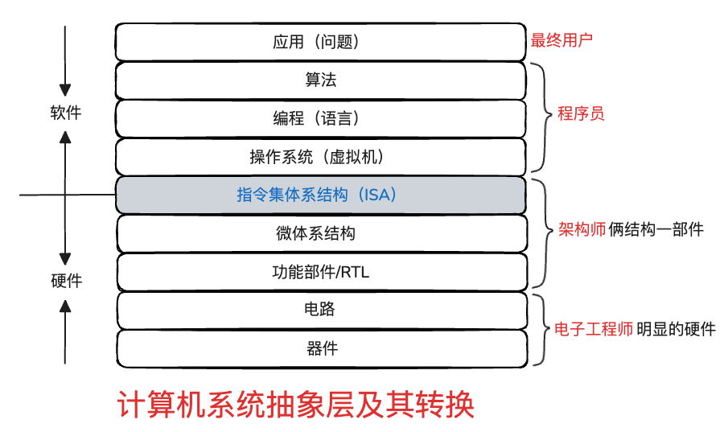

# 第一章、计算机系统概述

## 考点1 存储程序

1、**存储程序**的基本思想是什么？

（1）必须将事先编好的程序和原始数据送入主存后才能执行程序，一旦程序被启动执行，计算机不需要操作人员干预就能自动完成逐条指令取出和执行的任务。（==执行时从**主存**逐条指令读取到**CPU**中==）

例题：下列关于存储程序工作方式的描述，正确的是（B）

A：程序事先存储在磁盘中，执行时从磁盘逐条指令读取到CPU中  
B：程序事先存储在主存中，执行时从主存逐条指令读取到CPU中  
C：程序事先存储在主存中，所需数据必须从输入设备获取  
D：在主存中为了区分数据和程序，需要在信息表示中使用相应的标志信息

## 考点2 冯.诺依曼结构的基本思想

1、冯.诺依曼结构计算机的基本思想主要包括那几方面？

* 采用“**存储程序**”工作方式
* 计算机由**运算器、控制器、存储器、输入设备和输出设备**五个基本部件组成
    * 运算器：用来做算术运算（+-×÷）、逻辑运算（与或非）的
    * 控制器：逐条取出指令，进行译码的工作
    * 存储器：很多时候指的是主存，也就是内存，主要存放指令、数据
    * 输入设备：键盘、鼠标等
    * 输出设备：显示屏等
* ==存储器==不仅能存放数据，而且也能存放指令
* 计算机内部以**二进制**形式表示指令和数据

例题：

1、计算机的五个基本组成部件是输入设备、输出设备、控制器、（运算器）、和 （存储器）。  
2、冯.诺依曼结构计算机的基本思想主要包括哪几个方面？

采用 存储程序的工作方式  
计算机由五个基本部件组成  
存储器存放：指令和数据  
计算机内部使用二进制表示 指令和数据

## 考点3 程序和指令的执行过程

**指令**包括：==操作码==、==地址码==等字段

指令的格式分为两种：

* R型：寄存器	op为0000（传送mov）、0001（加add）操作
* M型：主存单元	op为1110（取数load）、  1111（存数store）操作

举例说明：

指令0001 0001的功能为R[0]<—R[0]+R[1]  表示将0号和1号寄存器内容相加的结果送到0号寄存器

指令1110 0110的功能为R[0]<—M[0110]，表示将6号主存单元中的内容取到0号寄存器

0110 转换成十进制 = 6

例题：若在该模型机上实现“z=x+y;”，x和y分别存放在主存5号和6号单元中，结果z存放在7号单元中，则相应程序在主存单元中的初始内容如图1.3所示。

## 考点4 程序运行

1、源程序文件到可执行目标文件的转换过程是什么？

* 1）**预处理阶段**
    * 预处理程序（cpp）对源程序中以字符 「**#**」 开头的命令进行处理
    * 以**.i**为扩展名
    * 预处理过源程序，是文本文件
* 2）**编译阶段**
    * 编译程序（ccl）对预处理后的源程序进行编译，生成一个汇编语言源程序文件
    * 以**.s**为扩展名
    * 汇编语言源程序，是文本文件
* 3）**汇编阶段**
    * 汇编程序（as）对汇编语言源程序进行汇编，生成一个**可重定位目标文件**
    * 以**.o**为扩展名
    * 二进制文件，打不开，打开是乱码
* 4）**链接阶段**
    * 链接程序（ld）将多个可重定位目标文件和标准库函数库中的可重定位目标文件合并成为一个**可执行目标文件**。
    * 二进制文件，打开是乱码

## 考点5 层次结构

大多数计算机使用者都属于**最终用户**

助记：**两结构一部件**，架构师

明显的硬件，电子工程师

## 考点6 系统性能评价 ⭐️⭐️⭐️⭐️⭐️ 【五星考点】

* （1)**时钟周期**，可以简单理解为时间单位，比如：1ns
* （2）**时钟频率**，和时钟周期互为**==倒数==**
* （3）**CPI（Cycles Per Instruction） 表示执行一条指令所属的时钟周期数**
    * 总时钟周期数/总指令数

计算公式1：

**用户CPU时间** = **程序总时钟周期数** ÷ **时钟频率**  
= **程序总时钟周期数** × **时钟周期**

例题：假设某个频繁使用的程序P在机器M1上运行需要10s，M1的时钟频率为2GHz。设计人员想开发一台与M1具有相同ISA的新机器M2.采用新技术可使M2的时钟频率增加，但同时也会使CPI增加。假定程序P在M2上的时钟周期数是在M1上的1.5倍，则M2的时钟频率至少达到多少才能使程序P在M2上的运行时间缩短为6s?

分析：

程序P在机器M1上运行需要10s，就说明程序P的在M1上的用户CPU时间是10s  
在已知M1的时钟频率为2GHz的前提下，  
根据公式：**用户CPU时间** = **程序总时钟周期数** ÷ **时钟频率 **  
就可以求出M1的时钟周期数：M1的程序总时钟周期数 ‎ =  **用户CPU时间 × 时钟频率 = 10s × **2GHz = 20G

根据假定条件：M2的时钟周期数是在M1的1.5倍，可执M2的程序总时钟周期数 = 20G × 1.5 = 30G  
根据假定条件：程序P在M2上的运行时间缩短为6s，得知M2上的用户CPU时间为6s

根据公式：  
**用户CPU时间** = **程序总时钟周期数** ÷ **时钟频率 **

**时钟频率 = 程序总时钟周期数 **÷ **用户CPU时间 **

则M2的时钟频率 = M2的程序总时钟周期数 ÷ M2用户CPU时间  
M2的时钟频率 = 30G ÷ 6s = 5GHz

1.1、计算机基本工作原理

1.1.1、冯.诺依曼结构基本思想

由数学家和物理学家`约翰·冯·诺依曼`提出。

### 主要思想包含以下几个方面：

存储程序概念：程序和数据以相同的方式存储在同一存储器中。这意味着计算机可以灵活地读写程序指令和数据，不需要专用的硬件单元分别处理编程和数据操作。

控制单元：负责解释并执行存储在存储器中的指令

运算单元：执行基本的算术和逻辑运算

存储器：存储程序指令和数据

输入设备：用于接受外部数据

输出设备：用于输出计算结果

顺序执行：程序指令按照其在存储器中的顺序逐条执行，除非遇到控制转移指令（如条件跳转指令），这使得程序的流程较为简单和直观。

二进制运算：使用二进制数表示所有数据和指令，这简化了物理实现，因为物理电路可以很容易地表示和处理二进制数据（如高/低 电压 或开/关状态）

统一存储：在冯。诺依曼结构中，存储器中的所有位置都是平等的，没有本质的区别（没有程序存储专区，也没有数据存储专区）这增加了计算机操作的灵活性。

### 冯诺依曼结构的主要部件：

* 用来存放指令和数据的**主存储器**，简称**主存**或**内存**。

* 用来进行算术逻辑运算的部件，即**算术逻辑部件**（ALU）

* 用于自动逐条取出指令并进行译码的部件。即**控制元件(CU)**，也称**控制器**

* 用来和用户交互的**输入设备和输出设备**  
  
  
  
  
  
  
  
  
  
  
  
  
  
  
  
