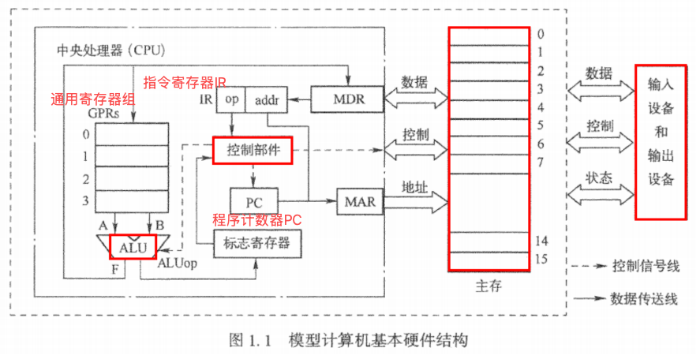
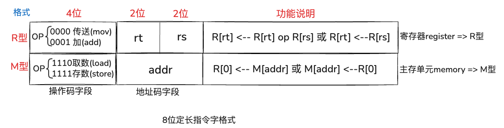
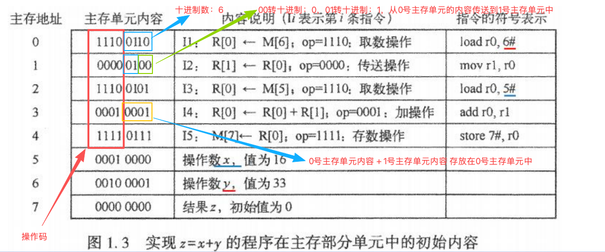
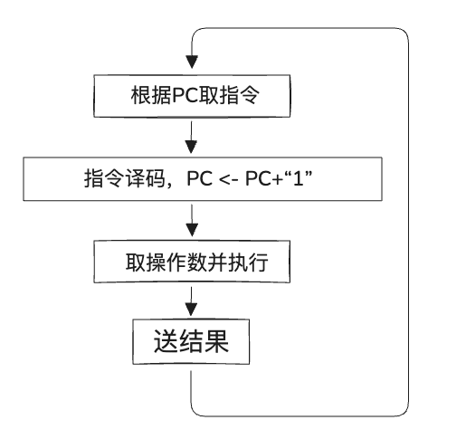
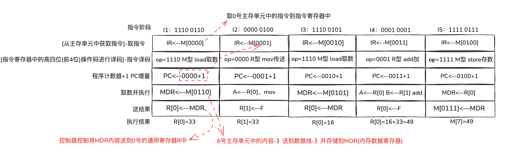
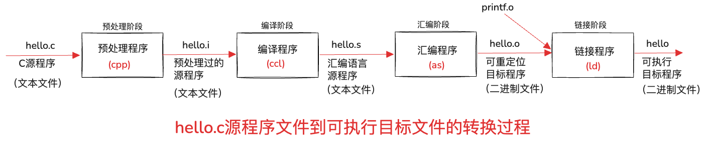
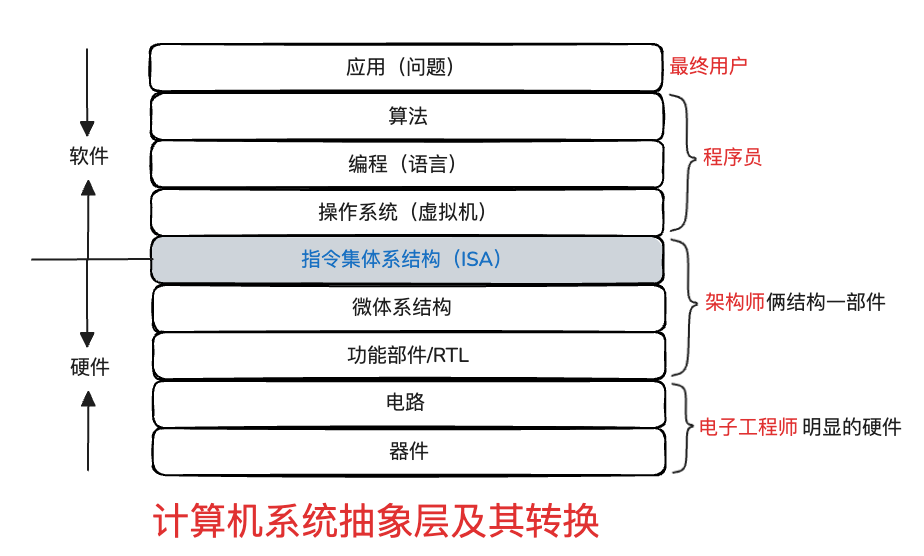
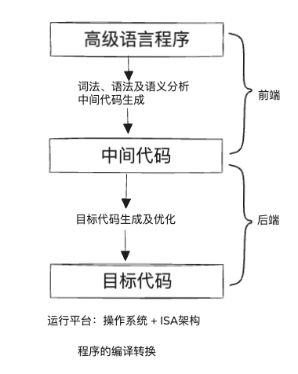

# 第一章、计算机系统概述(2026)

---
## 目录

- [一、存储程序](#考点一、存储程序)
- [二、冯.诺依曼结构基本思想](#考点二、冯.诺依曼结构基本思想)
- [三、模型计算机的基本硬件结构](#考点三、模型计算机的基本硬件结构)
- [四、指令](#考点四、指令)
- [五、程序和指令的执行过程](#考点五、程序和指令的执行过程)
- [六、程序设计语言和翻译程序](#考点六、程序设计语言和翻译程序)
- [七、从源程序到可执行文件](#考点七、从源程序到可执行文件)
- [八、计算机系统抽象层的转换](#考点八、计算机系统抽象层的转换)
- [九、计算机系统的不同用户](#考点九、计算机系统的不同用户)
- [十、计算机系统核心层之间的关联](#考点十、计算机系统核心层之间的关联)
- [十一、计算机性能的测试](#考点十一、计算机性能的测试)
- [十二、用指令执行速度进行性能评估](#考点十二、用指令执行速度进行性能评估)
- [十三、用基准程序进行性能评估](#考点十三、用基准程序进行性能评估)

---

### 考点一、存储程序

<span style="color:red;">存储程序</span>方式的<span style="color:red;">**基本思想**</span>是：

必须将事先编写好的<span style="color:blue;">**程序**</span>和<span style="color:blue;">**原始数据**</span>送入<span style="background-color:purple;">主存</span>后才能执行程序，一旦程序被启动执行，计算机<span style="background-color:purple;">不需要操作人员干预</span>就能**自动完成**<span style="color:blue;">**逐条指令**</span>取出和执行的任务。

比如：北京地铁19号线牛街站B出口**机器人摊煎饼**

### 考点二、冯.诺依曼结构基本思想

**冯诺依曼结构**计算机的<span style="color:red;">**基本思想**</span>主要包括以下四个方面

1. 采用“<span style="color:red;">**存储程序**</span>”工作方式
2. 计算机由<span style="color:red;">运算器</span>、<span style="color:red;">控制器</span>、<span style="color:red;">存储器</span>、<span style="color:red;">输入设备</span>和<span style="color:red;">输出设备</span>五个基本部件组成。
3. 存储器能存放<span style="color:red;">**数据**</span>，也能存放<span style="color:red;">**指令**</span>
4. 计算机内部以<span style="color:blue;">**二进制**</span>形式表示<span style="color:red;">指令</span>和<span style="color:red;">数据</span>

#### 习题

1、冯诺依曼计算机工作方式的基本特点是（<span style="color:red;">B</span>）

* A：多指令流单数据流
* <span style="color:red;">B：存储程序工作方式</span>
* C：堆栈操作
* D：存储器按内部选择地址

2、冯诺依曼结构计算机由运算器、（<span style="color:red;">控制器</span>）、（<span style="color:red;">存储器</span>）、输入设备和输出设备五大基本部件组成。

### 考点三、模型计算机的基本硬件结构

模型计算机的**基本硬件结构**如下：

1. <span style="color:red;">**主存储器**</span>（主存或内存）
2. <span style="color:red;">**算术逻辑部件**</span>（ALU）
3. <span style="color:red;">**控制元件**</span>（控制器）
4. <span style="color:red;">**输入/输出设备**</span>



**MAR** 和 **MDR** 是两个非常重要的寄存器

> MAR（Memory Address Register，内存地址寄存器）  
> MDR（Memory Data Register，内存数据寄存器)

总线：

* 1）<span style="color:red;">**地址**</span>线：用于<span style="background-color:red;">传输地址</span>信息
* 2）<span style="color:blue;">**数据**</span>线：用于<span style="background-color:blue;">传输数据</span>信息
* 3）<span style="color:green;">**控制**</span>线：用于<span style="background-color:green;">传输控制</span>信息

#### 习题

1、通用寄存器用于临时存放从主存取来的数据或运算的结果，下列不属于通用寄存器的部件是（<span style="color:red;">D</span>）

* A：指令寄存器 IR
* B：标志寄存器
* C：程序计数器 PC
* D：状态计数器

2、CPU访问主存时，需先将主存地址、读/写命令分别送到总线的（<span style="color:red;">地址线</span>）、控制线，然后通过总线的（<span style="color:red;">数据线</span>）发送或接收数据。

### 考点四、指令

**指令**使用0和1表示的一串`0/1`序列，用来指示CPU完成一个特定的<span style="color:red;">原子</span>操作【<span style="color:red;">不可分割</span>】。

* <span style="color:red;">取数</span>指令（**load**） 	  <span style="color:red;">**主存**</span> —》 通用寄存器    		【<span style="color:red;">M型</span>指令】
* <span style="color:red;">存数</span>指令（**store**）	  通用寄存器 —》<span style="color:red;">**主存**</span>    		【<span style="color:red;">M型</span>指令】【<span style="color:red;">存取</span>与<span style="color:yellow;">内存</span>相关】
* <span style="color:blue;">加法</span>指令（**add**）      通用寄存器 —》 通用寄存器     【<span style="color:blue;">R型</span>指令】
* <span style="color:blue;">传送</span>指令（**mov**）      通用寄存器 —》 通用寄存器     【<span style="color:blue;">R型</span>指令】

每条指令由<span style="color:red;">**操作码**</span>和<span style="color:red;">**地址码**</span>两部分组成。

下面模型机采用<span style="background-color:yellow;">8</span>位<span style="color:red;">**定长**</span>指令字



根据**前(高)四位**来确定是：<span style="color:blue;">**R型**</span> 还是 <span style="color:red;">**M型**</span>

**op**为<span style="color:red;">操作码</span>字段：

* 1、<span style="color:blue;">**R型**</span>**指令**
    * op为 <span style="color:blue;">0000</span> 定义为<span style="color:blue;">**传送（mov）**</span>操作
    * op为 <span style="color:blue;">0001</span> 定义为<span style="color:blue;">**加（add）**</span>操作
    * 比如：指令 <span style="color:blue;">0001</span> <span style="color:red;">00</span><span style="color:blue;">01</span> 的功能为：R[rt] + R[rs] -> R[rt] （R[<span style="color:red;">0</span>] + R[<span style="color:blue;">1</span>] -> R[<span style="color:red;">0</span>]）表示将0号和1号寄存器内容相加的结果送到0号寄存器
    * rt是00，二进制转换十进制就是0，0号寄存器
    * rs是01，二进制转换十进制就是1，1号寄存器
* 2、<span style="color:red;">**M型**</span>**指令**
    * op为 <span style="color:red;">1110</span> 定义为<span style="color:red;">取数（load）</span>操作
    * op为 <span style="color:red;">1111</span> 定义为<span style="color:red;">存数（store）</span>操作
    * 比如：指令<span style="color:red;">1110</span> 0110 的功能为R[<span style="color:red;">0</span>] <- M[0110] 表示将6（二进制0110转十进制=6）号主存单元（地址为0110）中的内容取到0号寄存器

### 考点五、程序和指令的执行过程

在上述模型机上实现 <span style="color:red;">**z=x+y**</span> ，x和y分别存放在主存5号和6号单元中，结果z存放在7号单元中，则相应程序在主存单元中的初始内容如图：



* R[0] 0号寄存器
* R[1] 1号寄存器
* M[6] 6号主存单元
* M[5] 5号主存单元

> 每次从主存单元 取数到 寄存器时，默认都是到<span style="color:red;">0号寄存器</span>的，  
> 所以6号主存单元的内容取到 0号寄存器后，需要把0好寄存器的内容 传送到 1号寄存器，  
> 否则5号主存单元的内容 取到 0号寄存器时，【默认是取到0号寄存器】，  
> 会覆盖掉0号寄存器 已经取到的内容（6号主存单元的内容33）

程序执行过程如下图所示：



每条指令的执行过程及结果如下图：



### 考点六、程序设计语言和翻译程序

程序设计语言从**抽象层次**上来分，可以分成**两类**：

* **低级语言**
    * <span style="color:red;">**机器**</span>语言  比如：`1110 0110`
    * <span style="color:red;">**汇编**</span>语言  比如：`load r0, 6#` (r0：0号寄存器 6#6号主存单元)
* **高级语言**
    * 比如：C、C++、Java等

计算机无法直接理解和执行高级编程语言程序，因而需要将**高级语言**程序转换成**机器语言**程序。
这个转换过程通常由计算机自动完成，进行这种转换的软件统称为<span style="color:red;">**翻译程序**</span>。

<span style="color:red;">**翻译程序**</span>有以下3类：

* <span style="color:red;">**汇编程序**</span>
    * 用于将<span style="color:blue;">**汇编语言**</span>**源程序**翻译成<span style="color:red;">**机器语言**</span>**目标程序**
    * 比如：工具有微软x86汇编器
* <span style="color:red;">**解释程序**</span>
    * 用于将<span style="color:blue;">**源程序**</span>中的语句按其<span style="background-color:purple;">执行顺序逐条翻译</span>成机器指令并立即执行。
    * 比如：`JavaScript`、`Python`
* <span style="color:red;">**编译程序**</span>
    * 用于将**高级语言**<span style="color:red;">源程序</span>翻译成<span style="color:blue;">汇编语言</span>或<span style="color:blue;">机器语言</span><span style="color:red;">目标程序</span>
    * 比如：`c、c++`

#### 习题

1、下列不属于翻译程序种类的是（<span style="color:red;">D</span>）

* A：汇编程序
* B：解释程序
* C：编译程序
* <span style="color:red;">D：链接程序</span>

2、用若干个（<span style="color:red;">助记符</span>）表示的与机器指令一一对应的指令为（<span style="color:red;">汇编</span>）指令

3、与机器语言相对应的符号化表示语言称为（<span style="color:red;">汇编</span>）语言。通常用容易记忆的英文单词或缩写表示指令操作码的含义，用标号、变量名、寄存器名等表示操作数或其地址码，这些英文单词或其缩写、标号、变量名等称为（<span style="color:red;">助记符</span>）

4、从抽象层次上来分，程序设计语言可分为（<span style="color:red;">低级</span>）语言和（<span style="color:red;">高级</span>）语言。

5、属于低级语言的是（<span style="color:red;">机器语言</span>）和（<span style="color:red;">汇编语言</span>）。

### 考点七、从源程序到可执行文件

下面是“hello.c”的c语言程序代码

```c
#include <stdio.h>

int main()
{
    printf("hello, world\n");
}
```

从`hello.c`到可执行目标文件hello的转换过程如下图所示:



1. <span style="color:red;">**预处理**</span>阶段：
    1. 预处理程序（<span style="color:blue;">**cpp**</span>）对源程序中以字符“#”开头的命令 `#include <stdio.h>` 进行处理
    2. 生成以<span style="color:red;">**.i**</span>为扩展名的源程序文件 `hello.i` (<span style="color:blue;">**文本文件**</span>)
2. <span style="color:red;">**编译**</span>阶段：
    1. 编译程序（<span style="color:blue;">**ccl**</span>）对预处理后的源程序 `hello.i` 进行编译，生成一个**汇编语言源程序**文件
    2. 生成以<span style="color:red;">**.s**</span>为扩展名的汇编语言源程序文件`hello.s`(<span style="color:blue;">**文本文件**</span>)
3. <span style="color:red;">**汇编**</span>阶段：
    1. 汇编程序（<span style="color:blue;">**as**</span>）对汇编语言源程序 `hello.s` 进行汇编，生成一个<span style="color:blue;">**可重定位目标文件**</span>
    2. 以<span style="color:red;">**.o**</span>为扩展名的可重定位目标文件hello.o(<span style="color:blue;">**二进制文件**</span>)打开是乱码
4. <span style="color:red;">**链接**</span>阶段：
    1. 链接程序（<span style="color:blue;">**ld**</span>）将多个<span style="color:red;">可重定位目标文件</span>和**标准库函数库**中的<span style="color:red;">**可重定位目标文件**</span>合并成为一个<span style="background-color:yellow;">可执行目标文件</span>。
    2. <span style="color:blue;">**二进制文件**</span>，打开是乱码

#### 习题

1、用来将若干个可重定位目标文件组合起来，生成一个可执行目标文件的过程称为（<span style="color:red;">D</span>）

* A：预处理
* B：编译
* C：汇编
* <span style="color:red;">D：链接</span>

2、从源程序变为可执行文件的第一个步骤是（<span style="color:red;">D</span>）

* A：链接
* B：编译
* C：汇编
* <span style="color:red;">D：预处理</span>

3、将高级语言源程序转换为可执行文件通常分为：（<span style="color:red;">预处理</span>）、编译、汇编和（<span style="color:red;">链接</span>）4步。

4、预处理是从（<span style="color:red;">源程序</span>）变到（<span style="color:red;"可执行></span>）文件的第一步。

### 考点八、计算机系统抽象层的转换

机器语言程序所运行的计算机硬件和软件之间需要有一个“<span style="background-color:purple;">**桥梁**</span>”，这个在软件和硬件之间的界面就是<span style="color:red;">**指令集体系结构**</span>

（<span style="color:red;">I</span>nstruction <span style="color:red;">S</span>et <span style="color:red;">A</span>rchitecture 简称：<span style="color:red;">**ISA**</span>）

简称 **指令集架构** 或 **指令系统**

它是软件和硬件之间接口的一个完整定义。



#### 习题

1、完整的计算机系统包括（<span style="color:red;">B</span>）

* A：运算器、存储器、控制器
* <span style="color:red;">B：硬件和软件</span>
* C：主机和实用程序
* D：外部设备和主机

2、指令集体系结构（ISA）是整个计算机系统的核心部分，ISA层上面是（<span style="color:red;">软件</span>）部分，下面是（<span style="color:red;">硬件</span>）部分。

3、下列不属于指令集体系结构设计所追求的目标的是（<span style="color:red;">B</span>）

* A：提高机器级程序的执行速度
* <span style="color:red;">B：增大控制存储器的容量</span>
* C：缩短机器级指令的长度
* D：提高机器级程序设计的灵活性

4、机器语言程序所运行的计算机硬件和软件之间需要一个“桥梁”，这个在软件和硬件之间的界面是（<span style="color:red;">A</span>）

* <span style="color:red;">A：指令集体系结构</span>
* B：微体系结构
* C：操作系统/虚拟机
* D：程序

### 考点九、计算机系统的不同用户

根据软件的用途，一般将软件分为两大类：

* <span style="color:red;">**系统软件**</span>
    * 包括：**操作系统**（如:`Windows`、`unix`、`linux`）、语言处理系统（如:`GCC`、`visual Studio` ）、**数据库管理系统**（如：`oracle`、`MySQL`）和**各类实用程序**（如：`磁盘碎片整理程序`、`备份程序`）等软件。
* <span style="color:red;">**应用软件**</span>
    * 例如，人们平时经常使用的电子邮件收发软件、多媒体播放软件、游戏软件、炒股软件、文字处理软件、电子表格软件、演示文稿制作软件等软件

按照在计算机上完成任务的不同，可以把使用计算机的用户分成以下4类：

* <span style="color:red;">**最终用户**</span>
    * 例如：使用炒股软件的股民、玩计算机游戏的人、进行会计电算化处理的财会人员等
* <span style="color:red;">**系统管理员**</span>
    * 其职责主要包括：安装、配置和维护系统的硬件和软件
* <span style="color:red;">**应用程序员**</span>
    * 例如：c++开发工程师、Java开发工程师
* <span style="color:red;">**系统程序员**</span>
    * 例如：开发操作系统、编译器、数据库管理系统等系统软件的程序员

#### 习题

1、介于计算机硬件与应用程序之间，包括为有效、安全地使用和管理计算机以及为开发和运行应用软件而提供的各种软件，称为（<span style="color:red;">B</span>）

* A：应用软件
* <span style="color:red;">B：系统软件</span>
* C：操作软件
* D：用户软件

2、按照在计算机上完成任务的不同，可以把使用计算机的用户分成以下4类：
（<span style="color:red;">最终用户</span>）、（<span style="color:red;">系统管理员</span>）、应用程序员和系统程序员。

3、用来管理整个计算机系统的资源，包括対它们进行（<span style="color:red;">调度</span>）、管理、监视和服务等的软件称为（<span style="color:red;">操作系统</span>）。

4、属于系统软件的是（<span style="color:red;">B</span>）

A：WPS office
B：<span style="color:red;">Windows 10</span>
C：RealPlayer
D：腾讯QQ

### 考点十、计算机系统核心层之间的关联

程序的编译转换如下图所示：



**应用程序接口**，有两种：

1、应用程序<span style="color:red;">**二进制**</span>接口—》<span style="color:red;">**ABI**</span>
（<span style="color:red;">A</span>pplication <span style="color:red;">B</span>inary <span style="color:red;">I</span>nterface 简称：<span style="color:red;">ABI</span>）  
面向：编译器、操作系统和硬件

2、应用程序<span style="color:red;">**编程**</span>接口—》<span style="color:red;">**API**</span>
（<span style="color:red;">A</span>pplication <span style="color:red;">P</span>rogramming <span style="color:red;">I</span>nterface 简称：<span style="color:red;">**API**</span>）  
面向：开发人员和上层应用


### 考点十一、计算机性能的测试

考量一个**计算机系统性能**的<span style="background-color:purple;">两个基本指标</span>

* 1、<span style="color:red;">**吞吐率**</span>
    * 单位时间内能完成的工作量
    * 比如：一个奶茶店一天时间能制作多少杯奶茶
* 2、<span style="color:red;">**响应时间**</span>
    * 作业提交开始 到 作业完成 所消耗的时间
    * 比如：奶茶店顾客下单一杯奶茶，从制作开始 到制作结束 所消耗的时间

通常把用户感觉到的**执行时间**分成以下两部分：

* 1、<span style="color:red;">**CPU时间**</span>
    * <span style="background-color:red;">**用户CPU时间**</span>（真正用于执行用户程序代码所消耗的时间）
    * **系统CPU时间**（为了执行用户程序代码，需要CPU运行操作系统所消耗的时间）
* 2、<span style="color:red;">**其他时间**</span>
    * 等待i/o操作完成的时间、CPU用于执行其他用户程序的时间

CPU性能是指<span style="background-color:yellow;">**用户CPU时间**</span>，它只包含CPU运行用户程序代码的时间。  
在对CPU时间进行计算时需要用到以下几个重要的概念和指标：

1、<span style="color:red;">**时钟周期**</span>：CPU里最小的**时间单位**，指时钟信号完成一个完整的高低电平振荡所需的时间，是计算机中最基本的时间单位。
> 比如：常见的3.5GHz，就是CPU每秒有35亿次“心跳”（时钟脉冲）

2、<span style="color:red;">**时钟频率**</span>：CPU的<span style="color:purple;">**主频**</span>，<span style="color:red;">**时钟周期的倒数**</span>  （<span style="background-color:blue;">每秒的时钟周期数</span>）时钟频率越高，CPU每秒可以执行的操作数就越多，指时钟信号在一秒钟内完成的振荡周期数。  
> 比如：3..5GHz对应的时钟周期 ≈ 0.286纳秒（1秒➗35亿），也就是每0.286纳秒完成亿次“心跳”*（时钟脉冲）

<span style="color:red;">时钟周期</span> 与 <span style="color:yellow;">时钟频率</span> 互为<span style="color:red;">**倒数**</span>：`时钟周期 × 时钟频率 = 1`

3、<span style="color:red;">**CPI**</span>(<span style="color:red;">C</span>ycles <span style="color:red;">P</span>er <span style="color:red;">I</span>nstruction)：表示<span style="background-color:purple;">执行一条指令所需的时钟周期数</span>

* ①对于<span style="color:blue;">一条特定指令</span>而言，此时CPI是一个<span style="color:red;">**确定的值**</span>
* ②对于<span style="color:blue;">一个程序</span>或<span style="color:blue;">一台机器</span>来说，其CPI指该程序或该机器指令集 中的所有指令执行所需的<span style="color:red;">**平均时钟周期数**</span>，此CPI是一个<span style="background-color:yellow;">平均值</span>。

| 名称 | 本质 | 理解 | 单位                            |
|---|---|---|-------------------------------|
| 时钟周期 | CPU “心跳”一次所需要的时间 | CPU 每干一小步操作，靠一次“滴答”推动；这个“滴答”的时间就是时钟周期，也就是每一小步的耗时 | 纳秒（ns）<br>1s = 10⁹ns          |
| 时钟频率 | CPU 每秒“心跳”多少次 | CPU 每秒有多少个时钟周期 | Hz（赫兹）<br>1GHz = 10⁹Hz        |
| CPI | 执行一条指令需要多少个时钟周期 | 平均每条指令要用多少次“滴答”才能完成 | 总周期数/总指令数（Cycles/Instruction） |


<span style="background-color:yellow;">**【<span style="color:red;">基础计算公式</span>】**</span>

如果<span style="color:red;">已知</span>程序**总指令条数**和**综合CPI**，则可用如下公式：  

<span style="color:red;">**程序总时钟周期数**</span> = **程序总指令条数** × **CPI**

如果<span style="color:red;">已知</span>程序中共有<span style="color:purple;">n</span>种不同类型的指令，第<span style="color:yellow;">i</span>种指令的条数和CPI分别为<span style="color:blue;">**Cᵢ**</span>和<span style="color:blue;">**CPIᵢ**</span>，

则程序<span style="color:red;">**总时钟周期数**</span> = $$\sum_{i=1}^{n} (CPIᵢ × Cᵢ)$$

**用户CPU时间** = <span style="color:red;">程序总时钟周期数</span> × <span style="color:yellow;">时钟周期</span> = <span style="color:red;">程序总时钟周期数</span> ÷ <span style="color:yellow;">时钟频率</span>

程序的<span style="color:blue;">**综合CPI**</span>（<span style="background-color:blue;">平均CPI</span>）也可由以下公式求得，其中，<span style="color:red;">**Fᵢ**</span>表示第<span style="color:red;">**i**</span>种指令在程序中所占的<span style="background-color:purple;">比例</span>。

<span style="color:blue;">**综合CPI**</span> = 程序<span style="color:red;">总时钟周期数</span> <span style="color:yellow;">÷</span> <span style="color:red;">程序总指令条数</span>
> CPI 指的是执行一条指令所需要的时钟周期数

<span style="color:blue;">**综合CPI**</span> =
$$\sum_{i=1}^{n} (CPIᵢ × Fᵢ)$$

#### 习题

1、假设某个频繁使用的程序P在机器M1上运行需要10s，M1的时钟频率为2GHz。
设计人员想开发一台与M1具有相同ISA的新机器M2。采用新技术可使M2的时钟频率增加，但同时也会使CPI增加。
假定程序P在M2上的时钟周期数是在M1上的1.5倍，则M2的时钟频率至少达到多少才能使程序P在M2上的运行时间缩短为6s？

<span style="color:yellow;">分析：</span>

1、程序P在机器M1上运行需要10s，说明程序P在机器M1上的<span style="background-color:yellow;">用户CPU时间</span>是10s  

2、机器M1的时钟频率为2GHz，结合公式：
用户CPU时间 = 程序总时钟周期数 ÷ 时钟频率 = 程序总时钟周期数 × 时钟周期

可求出程序P在机器M1上的<span style="color:blue;">程序总时钟周期数</span> = 用户CPU时间10s × 时钟频率2GHz

程序P在机器M1上的程序<span style="color:blue;">总时钟周期数</span> = 10s × 2GHz = 20

3、程序P在机器M2上的时钟周期数是M1上的1.5倍，可以得出程序P在M2上的<span style="color:blue;">总时钟周期数</span> = 20×1.5=30

4、程序P在机器M2上的运行时间缩短为6s，说明程序P在机器M2上的<span style="background-color:yellow;">用户CPU运行时间</span> = 6s

5、时钟周期 = 用户CPU时间 ÷ 时钟总时钟周期数数
时钟频率 = 时钟总时钟周期数数 ÷ 用户CPU时间

M2的时钟频率 = 30 ÷ 6 = 5GHz

2、假设计算机M的指令集中包含A、B、C三类指令，其CPI分别为1、2、4。  
某个程序P在计算机M上被编译成两个不同的目标代码序列P1和P2。  
P1所含A、B、C三类指令的条数分别为8、2、2  
P2所含A、B、C三类指令的条数分别为2、5、3  
1）那个代码序列总指令条数少？  
2）那个执行速度快？  
3）他们的CPI分别是多少？  

<span style="color:yellow;">分析：</span>

| 程序名称 | A类指令数 CPI=1 | B类指令数 CPI=2 | C类指令数 CPI=4 |
|----------|-----------------|-----------------|-----------------|
| P1       | 8               | 2               | 2               |
| P2       | 2               | 5               | 3               |

1）那个代码序列总指令条数少？

P1代码序列总指令条数 = 8 + 2 + 2 = 12  
P2代码序列总指令条数 = 2 + 5 + 3 = 10  
所以 P2代码序列总指令条数少  

2）那个执行速度快？也就是看两个目标代码序列P1、P2，那个的用户CPU时间短

用户CPU时间 = 时钟周期总数 × 时钟周期
> 因为两个目标代码序列P1、P2在同一台机器上运行，CPU“心跳”一次所需要的时间是相同的，所以时钟周期一样，所以看【时钟周期总数】大小即可判断那个执行速度快

时钟周期总数 = CPI × 指令条数  
P1 = (1×8) + (2×2) + (4×2) = 20  
P2 = (1×2) + (2×5) + (4×3) = 24  

P1 用户CPU时间 = P1 用户CPU时间 × 时钟周期 = 20 × 时钟周期
P2 用户CPU时间 = P2 用户CPU时间 × 时钟周期 = 24 × 时钟周期

所以目标代码序列P1更快

3）CPI分别是多少？这里求得是**综合CPI**

综合CPI = 程序时钟周期总数 ÷ 程序总指令条数

P1综合CPI = P1程序时钟周期总数 ÷ P1程序总指令条数 = 20 ÷ 12 ≈ 1.67
P2综合CPI = P2程序时钟周期总数 ÷ P2程序总指令条数 = 24 ÷ 10 = 2.4


### 考点十二、用指令执行速度进行性能评估

<span style="color:red;">**MIPS**</span>(Million Instruction Per Second) ，其含义是平均<span style="color:blue;">每秒钟</span>执行多少<span style="background-color:yellow;"><span style="color:red;">百万</span></span>条指令

反映了机器执行<span style="color:red;">**定点指令**</span>的速度

<span style="color:red;">**公式1**</span>：MIPS = 指令总数/10⁶    <span style="color:yellow;">÷</span>    CPU执行时间（秒）  
> 举例：指令总数=50000000，CPU执行时间=2秒  则MIPS = 5 × 10⁷/10⁶ ➗ 2 = 50➗2 = 25MIPS


<span style="color:red;">**公式2**</span>：MIPS = 时钟频率（Hz） <span style="color:yellow;">÷</span>  CPI × 10⁶  
> 举例：  
> 时钟频率是50<span style="color:red;">K</span>Hz，CPI=2，则MIPS = 50 × <span style="color:red;">10³</span> /  (2×10⁶） = 0.025 <span style="color:red;">MIPS</span>  
> 时钟频率是50<span style="color:red;">M</span>Hz，CPI=2，则MIPS = 50 × <span style="color:red;">10⁶</span> /  (2×10⁶） = 25 <span style="color:red;">MIPS</span>  
> 时钟频率是50<span style="color:red;">G</span>Hz，CPI=2，则MIPS = 50 × <span style="color:red;">10⁹</span> /  (2×10⁶） = 25000 <span style="color:red;">MIPS</span>  

<span style="color:red;">**MFLOPS**</span>（<span style="color:red;">M</span>illion <span style="color:red;">FLO</span>ating-point operations <span style="color:red;">P</span>er <span style="color:red;">S</span>econd），其含义是每秒所执行的<span style="color:blue;">浮点运算</span>有多少<span style="background-color:yellow;"><span style="color:red;">百万</span></span>次，它是基于所完成的<span style="color:blue;">**操作次数**</span>而不是**指令数**来衡量的。

反映了机器执行<span style="color:red;">浮点</span><span style="color:blue;">操作</span>的速度

类似的浮点操作速度还有：
* GFLOPS(10⁹次/s)
* TFLOPS(10¹²次/s)
* PFLOPS(10¹⁵次/s)
* EFLOPS(10¹⁸次/s)

#### 习题

1、假定某程序P编译后生成的目标代码由A、B、C、D四类指令组成，它们在程序中所占的比例分别为43%、21%、12%、24%，
已知它们的CPI分别为1、2、2、2。
现在重新对程序P进行编译优化，生成的新目标代码中A类指令条数减少了50%，其他类指令的条数没有变。

请回答下列问题：

1）编译优化前后程序的CPI各是多少？  
2）假定程序在一台主频为50MHz的计算机上运行，则优化前后的MIPS各是多少？

<span style="color:yellow;">分析：</span>

**CPI**：执行一条指令所需的时钟周期数，这里求的CPI是综合CPI(平均CPI)

根据综合CPI的计算公式：综合CPI = $$\sum_{i=1}^{n} (CPIᵢ × Fᵢ)$$

优化前程序的综合CPI = (43% × 1) + （21% × 2） + （12% × 2） + （24% × 2） = 157% = 1.57

优化后A类指令条数减少了50%，43%/2 = 21.5%，A、B、C、D四类指令所占的比例分别：

* A：（21.5）/(21.5+21+12+24) = 27%
* B：（21）/(21.5+21+12+24) = 27%
* C：（12）/(21.5+21+12+24) = 15%
* D：（24）/(21.5+21+12+24) = 31%

优化后程序的综合CPI = (27% × 1) + （27% × 2） + （15% × 2） + （31% × 2） = 1.73

主频为50MHz的计算机上运行，则说明时钟频率是`50MHz`，转换成Hz 是`50 × 10⁶`Hz

`根据MIPS公式2 = 时钟频率（Hz） /  CPI × 10⁶`

则优化前的MIPS = 50 × 10⁶Hz / 优化前CPI × 10⁶  
=50 × 10⁶Hz / 1.57× 10⁶  
=31.8MIPS  

则优化后的MIPS = 50 × 10⁶Hz / 优化后CPI × 10⁶  
=50 × 10⁶Hz / 1.73 × 10⁶     
=28.9MIPS  

### 考点十三、用基准程序进行性能评估

<span style="color:red;">**基准程序**</span>是进行**计算机性能评测**的一种重要工具。

**基准程序**是专门用来进行性能评价的一组程序，能够很好地反映机器在运行实际负载时的性能，可以通过在不同机器上运行相同的基准程序来比较在不同机器上的运行时间，从而评测其性能。


