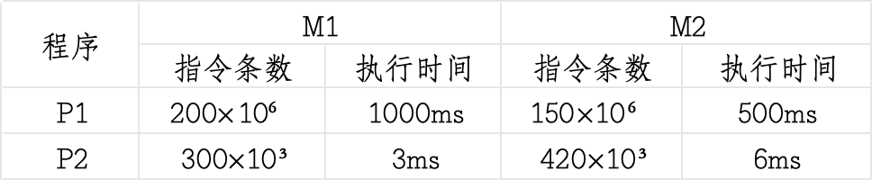
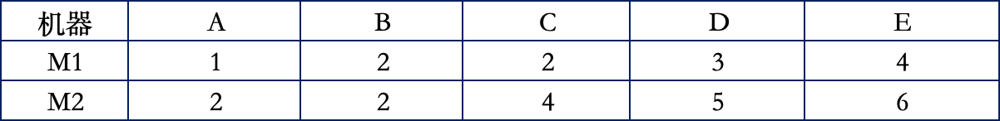
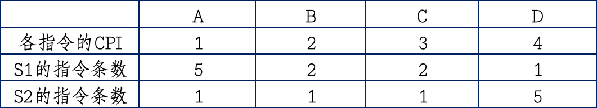

# 第一章课后习题

---
## 习题目录

- [1、给出以下概念的解释说明](#1给出以下概念的解释说明)
- [2、简单回答下列问题](#2简单回答下列问题)
- [3、第三题](#3第三题)
- [4、第四题](#4第四题)
- [5、第五题](#5第五题)
- [6、第六题](#6第六题)
- [7、第七题](#7第七题)
- [8、第八题](#8第八题)
- [9、第九题](#9第九题)
- [10、第十题](#10第十题)
- [11、第十一题](#11第十一题)
---

### 1、给出以下概念的解释说明。

### 2、简单回答下列问题。

### 3、第三题

假定你的朋友不太懂计算机，请用简单通俗的语言给你的朋友介绍计算机系统是如何工作的。

### 4、第四题

你对计算机系统的哪些部分最熟悉，哪些部分最不熟悉？最想进一步了解细节的是哪些部分的内容？

### 5、图1.1所示模型计算机(采用图1.2所示指令格式)的指令系统中，除了有mov(op=0000)、add(op=0001)、load(op=1110)和store(op=1111)指令外，R型指令还有减(sub,op=0010)和乘(mul，op=0011)等指令，请仿照图1.3给出求解表达式"z=(x-y)*y;"所对应的指令序列(包括机器代码和对应的汇编指令)以及在主存中的存放内容，并仿照图1.5给出每条指令的执行过程以及所包含的微操作。

### 6、若有两个基准测试程序P1和P2在机器M1和M2上运行，假定M1和M2的价格分别是5000元和8000元，下表给出了P1和P2在M1和M2上所花的时间和指令条数。

请回答下列问题:

(1)对于P1，哪台机器的速度快?快多少?对于P2呢?  

(2)在M1上执行P1和P2的速度分别是多少MIPS?在M2上的执行速度又各是多少? 从执行速度来看，对于P2，哪台机器的速度快?快多少?  

(3)假定M1和M2的时钟频率各是800MHz和1.2GHz，则在M1和M2上执行P1时的CPI各是多少?  

(4)如果某个用户需要大量使用程序P1，并且该用户主要关心系统的响应时间而不是吞吐率，那么，该用户需要大批购进机器时，应该选择M1还是M2?为什么?(提示:从性价比上考虑)  

(5)如果另一个用户也需要购进大批机器，但该用户使用P1和P2一样多，主要关心的也是响应时间，那么，应该选择M1还是M2?为什么?  

### 7、若机器M1和M2具有相同的指令集，其时钟频率分别为1GHz和1.6GHz。在指令集中有5种不同类型的指令A~E。下表给出了在M1和M2上每类指令的平均时钟周期数CPI。

### 8、假设同一套指令集用不同的方法设计了两种机器M1和M2。机器M1的时钟周期为0.8ns，机器M2的时钟周期为1.2ns。某程序P在机器M1上运行时的CPI为4，在M2上的CPI为2。对于程序P来说，哪台机器的执行速度更快?快多少?

### 9、假设某机器M的时钟频率为4GHz，用户程序P在M上的指令条数为8x10，其CPI为1.25，则P在M上的执行时间是多少?若在机器M上从程序P开始启动到执行结束所需的时间是4s，则P的用户CPU时间所占的百分比是多少?

### 10、假定某编译器对某段高级语言程序编译生成两种不同的指令序列S1和S2，在时钟频率为500MHz的机器M上运行，目标指令序列中用到的指令类型有A、B、C和D四类。四类指令在M上的CPI和两个指令序列所用的各类指令条数如下表所示。

请问S1和S2各有多少条指令?CPI各为多少?所含的时钟周期数各为多少?执行时间各为多少?

### 11、假定机器M的时钟频率为400MHz，某程序P在机器M上的执行时间为12.000s。对P优化时，将其所有的乘4指令都换成了一条左移两位的指令，得到优化后的程序P'。已知在M上乘法指令的CPI为102，左移指令的CPI为2，P'的执行时间为11.008s，则P中有多少条乘法指令被替换成了左移指令被执行?

