# 第二章、数据的表示和运算

---
## 目录

- [一、信息的二进制编码](#考点一信息的二进制编码)
- [二、进制记数制](#考点二进制记数制)
- [三、二进制数转换十进制数](#考点三二进制数转换十进制数)
- [四、十进制数转换成二进制数](#考点四十进制数转换成二进制数)
- [五、二八十六进制数的相互转换](#考点五二八十六进制数的相互转换)
- [六、定点数的编码表示](#考点六定点数的编码表示)
- [七、原码和反表示法](#考点七原码和反表示法)
- [八、补码表示法](#考点八补码表示法)
- [九、真值求补码](#考点九真值求补码)
- [十、补码求真值](#考点十补码求真值)
- [十一、补码求原码相反数的补码](#考点十一补码求原码相反数的补码)
- [十二、二进制整数](#考点十二二进制整数)
- [十三、IEEE754浮点数标准](#考点十三IEEE754浮点数标准)
- [十四、机器数的IEEE754浮点数转真值](#考点十四机器数的IEEE754浮点数转真值)
- [十五、C语言中的浮点数类型](#考点十五C语言中的浮点数类型)
- [十六、非数值数据的编码表示](#考点十六非数值数据的编码表示)
- [十七、数据的宽度和单位](#考点十七数据的宽度和单位)
- [十八、数据的存储和排列顺序](#考点十八数据的存储和排列顺序)
- [十九、加法器和算术逻辑部件](#考点十九加法器和算术逻辑部件)
- [二十、带标志加法器](#考点二十带标志加法器)
- [二十一、补码加减运算器](#考点二十一补码加减运算器)
- [二十二、浮点数加减运算](#考点二十二浮点数加减运算)
- [二十三、浮点数乘除运算](#考点二十三浮点数乘除运算)

---

### 考点一、信息的二进制编码

在计算机内部所有信息都用<span style="background-color:yellow;"><span style="color:red;">**二进制**</span></span>数字表示。

指令所处理的**基本数据**类型分为两种：
* 1）<span style="color:red;">**数值数据**</span>
    * 表示<span style="color:blue;">数量的多少</span>
    * 可以比较大小
    * 可分为：<span style="color:red;">**整数**</span> 和 <span style="color:red;">**实数**</span>
    * 整数
      * 无符号整数
      * 带符号整数
    * 实数
* 2）<span style="color:red;">非数值数据</span>
    * 不表示数量的多少
    * 没有大小之分
    * 主要包括：<span style="color:red;">**字符数据**</span> 和 <span style="color:red;">**逻辑数据**</span>

<span style="color:red;">**二进制编码的十进制数**</span>（Binary Coded Decimal Number，<span style="color:red;">**BCD**</span>）：**8421**<span style="color:red;">**BCD**</span>

处理逻辑：

>（1010001）BCD 每4位代表一个十进制数字，不足位时在高位（左侧）补零：1010001 补零为01010001，  
> 分组为0101（对应的十进制数5）和0001（对应的十进制数1），  
>（1010001）BCD=(51)₁₀ 表示（1010001）BCD的十进制数是51
> 
> * 101 0001
> * <span style="color:red;">0</span>101 0001 补零操作后
> * 0101 = 5 分组：二进制转十进制
> * 0001 = 1 分组：二进制转十进制
> *（1010001）BCD=(<span style="color:red;">**51**</span>)₁₀

遇到二进制编码的十进制数（BCD）换算成十进制（求真值）的步骤：

* 第一步：看**是否足位**（能否被4整除），不足位则在左侧（高位）补零
* 第二步：**分组**，四个一组进行分组，分组后每个分组是二进制数
* 第三步：按照顺序把  每个小组（二进制）**转换为十进制数**
* 第四步：按照顺序把  每个分组的十进制数**组合起来**

#### 习题

1、某数在计算机中用8241BCD码表示为011110001001，其真值为（<span style="color:red;">A</span>）

* A：789
* B：789H
* C：1929
* D：11110001001B

解题：
```bash
总共12位，看出来是足位的，不用在高位（左侧）补零
那就先分组，分为三组：0111 1000 1001 
第一组（0111）二进制转十进制：0×2³ + 1×2² + 1×2¹ + 1×2⁰ = 0 + 4 + 2 + 1 = 7 
第二组（1000）二进制转十进制：1×2³ + 0×2² + 0×2¹ + 0×2⁰ = 8 + 0 + 0 + 0 = 8 
第三组（1001）二进制转十进制：1×2³ + 0×2² + 0×2¹ + 1×2⁰ = 8 + 0 + 0 + 1 = 9
所以真值是：789，选择A
```

2、简述指令所处理的基本数据类型的数值数据和非数值数据。

解题：
```
数值数据用来表示数量的多少，可比较其大小，分为整数和实数，整数又分为无符号整数和带符号整数。  

非数值数据不表示数量多少，没有大小之分，主要包括：字符数据和逻辑数据
```

### 考点二、进制记数制

**十进制：** × 10的幂次方（乘的基数为<span style="color:red;">10</span>）

2585.62代表的值是：  
$$(2585.62)₁₀ = 2 × 10³ + 5×10² + 8×10¹ + 5×10⁰ + 6×10⁻¹ + 2×10⁻²$$
$$(2585.62)₁₀ = 2 × 10³ + 5×10² + 8×10¹ + 5×10⁰ + 6×(\frac{1}{10^1}) + 2×(\frac{1}{10^2})$$
$$(2585.62)₁₀ = 2 × 10³ + 5×10² + 8×10¹ + 5×10⁰ + 6×(0.1) + 2×(0.01)$$

> $$x^{-y}=\frac{1}{x^y}$$
> $$10⁻¹ = \frac{1}{10^1} = 0.1$$
> $$10⁻² = \frac{1}{10^2} = 0.01$$

<span style="color:red;">**二进制：**</span> × 2的幂次方（乘的基数为<span style="color:red;">2</span>）

（100101.01）₂ = 1×2⁵ + 0×2⁴ + 0×2³ + 1×2² + 0×2¹ + 1×2⁰ + 0×2⁻¹ + 1×2⁻²

在计算机系统中，常用的几种进位记数制有以下几种：

* 二进制	R=2	基本符号为0和1
* 八进制	R=8	基本符号为0,1,2,3,4,5,6,7
* 十进制	R=10 基本符号为0,1,2,3,4,5,6,7,8,9
* 十六进制 R=16 基本符号为0,1,2,3,4,5,6,7,8,9,A(=10),B(=11),C(=12),D(=13),E(=14),F(=15)

使用后缀字母标识该数的进位数制：

* 二进制：<span style="color:red;">**B**</span> 表示二进制数(100101.01<span style="color:red;">**B**</span>)
* 八进制：<span style="color:red;">**O**</span>
* 十进制：<span style="color:red;">**D**</span>（十进制数的后缀可省略，25一般就是25，不是25<span style="color:red;">D</span>）
* 十六进制：<span style="color:red;">**H**</span>

比如：  
十六进制数**308F**<span style="color:red;">**H**</span>或<span style="color:red;">**0x**</span>**308F**等

> “H”是英文 Hexadecimal（十六进制）的缩写
> 
> “0x”是国际通用的十六进制前缀

* 看到 <span style="color:red;">**H**</span> 在数字<span style="color:green;">后面</span> → 十六进制。
* 看到 <span style="color:red;">**0x**</span> 在数字<span style="color:green;">前面</span> → 十六进制

#### 习题

1、使用后缀字母标识该数的进位数制，一般用（<span style="color:red;">B</span>）表示二进制，用（<span style="color:red;">H</span>）表示十六进制。

### 考点三、R进制数转换十进制数

R进制数：二进制、八进制、十六进制

**解题思路**：<span style="color:red;">**按权展开**</span>

例2.1 将二进制数（100101.01)₂转换成十进制数。

解题：

```
(100101.01)₂ = (1×2⁵ + 0×2⁴ + 0×2³ + 1×2² + 0×2¹ + 1×2⁰ + 0×2⁻¹ + 1×2⁻²)₁₀ = (37.25)₁₀
```
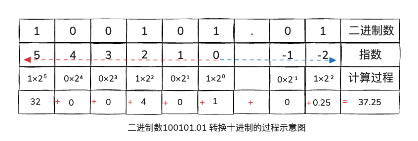

例2.2 将八进制数(307.6)₈转换成十进制数

解题：
```
(307.6)₈ = (3×8² + 0×8¹ + 7×8⁰ + 6×8⁻¹)₁₀ = （192 + 0 + 7 + 0.75） = (199.75)₁₀
```

例2.3 将十六进制数(3A.C)₁₆转换成十进制数。

解题：
```
(3A.C)₁₆ = (3×16¹ + A×16⁰ + C×16⁻¹)₁₀
(3A.C)₁₆ = (3×16¹ + A×16⁰ + C×16⁻¹)₁₀
(3A.C)₁₆ = (3×16¹ + 10×16⁰ + 12×16⁻¹)₁₀
(3A.C)₁₆ = (48 + 10 + 0.75)₁₀
(3A.C)₁₆ = (58.75)₁₀
```

#### 习题

1、下列数中最大的数是（<span style="color:red;">C</span>）

* A：(98)₁₆
* B：(227)₈
* C：(10011001)₂
* D：(152)₁₀

解答：
```
都换算成十进制，再比较大小
A：(98)₁₆ = 9×16¹ + 8×16⁰ = 144 + 8 = 152
B：(227)₈ = 2×8² + 2×8¹ + 7×8⁰ = 128 + 16 + 7 = 151
C：(10011001)₂ = 1×2⁷ + 0×2⁶ + 0×2⁵ + 1×2⁴ + 1×2³ + 0×2² + 0×2¹ + 1×2⁰ = 128+0+0+16+8+0+0+1 = 153
D：152
C选项最大
```

2、下列数中最小的数是（<span style="color:red;">A</span>）

* A：(101001)₂
* B：(52)₈
* C：(1010001)BCD
* D：(233)₁₆

解题：
```
都换算成十进制，再比较大小
A：(101001)₂ = 1×2⁵ + 0×2⁴ + 1×2³ + 0×2² + 0×2¹ + 1×2⁰ = 32 + 0 + 8 + 0 + 0 + 1 = 41
B：(52)₈ = 5×8¹ + 2×8⁰ = 40 + 2 = 42
C：(1010001)BCD 不足位时在高位（左侧）补零得到：01010001，分组为：0101 和 0001，分别进行二进制转十进制
0101 = 0×2³ + 1×2² + 0×2¹ + 1×2⁰ = 4 + 1 = 5
0001 = 0×2³ + 0×2² + 0×2¹ + 1×2⁰ = 1
组合起来：0101 & 0001 = 5 & 1 = 51
D：(233)₁₆ = 2×16² + 3×16¹ + 3×16⁰ = 512 + 48 + 3 = 563
A选项最小
```

3、下列数中最大的是（<span style="color:red;">D</span>）

* A：(11001)₂
* B：(150)₈
* C：(110)₁₀
* D：(70)₁₆

解题：

```
换算成十进制再比较大小
A：(11001)₂ = 25
B：(150)₈ = 104
C：110
D：(70)₁₆ = 112
D选项是最大的
```

### 考点四、十进制数转换成R进制数

R进制数：二进制、八进制、十六进制

任何一个**十进制**数转换成**R进制**数时，要将<span style="color:red;">****整数****</span>和<span style="color:blue;">**小数**</span>部分分别进行转换。

* <span style="color:red;">整数</span>部分的转换
    * 转换方法：<span style="color:red;">**除基商0**</span>，<span style="background-color:yellow;"><span style="color:red;">**逆向取余**</span></span>
    * 除基数（2、8、16），当商为0时，逆向取余数
* <span style="color:green;">小数</span>部分的转换
    * 转换方法：<span style="color:green;">**乘基积0**</span>，<span style="background-color:yellow;"><span style="color:green;">正向取整</span></span>
    * 乘基数（2、8、16），当积为0时（<span style="color:red;">**小数部分=0时**</span>），正向取整数

#### 例2.4 将十进制整数135分别转换成八进制数和二进制数。

解题思路：整数部分的转换方法：<span style="color:red;">除基商0，逆向取余</span>（没有小数部分，所以忽略）  

`(135)₁₀ = (207)₈ = (10000111)₂`

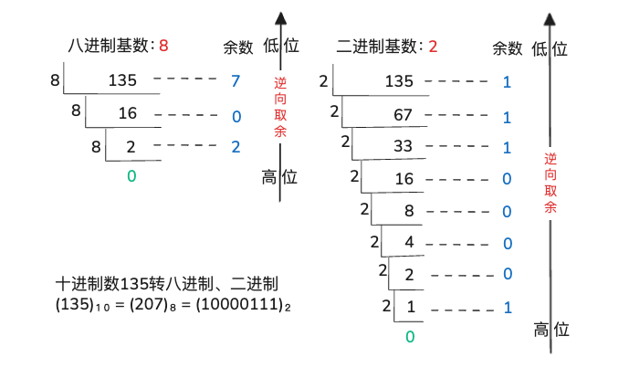

#### 例2.5 将十进制小数0.6875分别转换成二进制数和八进制数

解题思路：小数部分的转换方法：<span style="color:red;">乘基积0，正向取整</span>（没有整数部分，所以忽略）

1)转二进制数

```
十进制转二进制，所以基数就是2
0.6875 × 2 = 1.375  取整：整数部分=1 高位
0.375  × 2 = 0.75   取整：整数部分=0 ↓
0.75   × 2 = 1.5    取整：整数部分=1 ↓
0.5    × 2 = 1.0    取整：整数部分=1 低位

正向取整：1011
```

2)转八进制数

```
十进制转八进制，所以基数就是8
0.6875 × 8 = 5.5    取整：整数部分=5 高位
0.5    × 8 = 4.0    取整：整数部分=4 低位

正向取整：54
```

`(0.6875)₁₀ = (54)₈ = (1011)₂`

#### 例2.6 将十进制数0.63转换成二进制数。

解题思路：
```
十进制转二进制，所以基数就是2
0.63 × 2 = 1.26  取整：整数部分=1 高位
0.26 × 2 = 0.52  取整：整数部分=0  ↓
0.52 × 2 = 1.04  取整：整数部分=1  ↓
0.4  × 2 = 0.08  取整：整数部分=0 低位
...乘积的小数部分总的不到0，得到希望的位数后即暂停，取得近似值...
所以(0.63)₁₀ = (1010)₂
```

> 转换过程中，可能乘积的小数部分总的不到0，即：转换得到希望的位数后还有余数，这种情况下得到的是<span style="color:red;">**近似值**</span>


#### 例2.7 将十进制数135.6875分别转换成二进制数和八进制数

解题思路：
```
十进制数135.6875 分成两部分：整数部分135和小数部分0.6875
例2.4、例2.5已经将整数135、小数0.6875 转换成了二进制数和八进制数

(135)₁₀ = (207)₈ = (10000111)₂
(0.6875)₁₀ = (54)₈ = (1011)₂

所以组合即可，整数部分放在整数部分、小数部分放在小数部分
(135.6875)₁₀ = (207.54)₈ = (10000111.1011)₂
```

> 带小数的十进制数在转换时，先进行分组：整数和小数部分，然后分别进行转换，最后组合在一起


### 考点五、二八十六进制数的相互转换

#### 1、二进制数 和 八进制数 之间的相互转换

**关键数<span style="color:red;">3</span>：2<span style="color:red;">³</span>=8**

* 大（8）转小（2）要拆
* 小（2）转大（8）要合

一一对应关系：

| 八进制 | 二进制 |
|--------|--------|
| 0      | 000    |
| 1      | 001    |
| 2      | 010    |
| 3      | 011    |
| 4      | 100    |
| 5      | 101    |
| 6      | 110    |
| 7      | 111    |

##### 1）八进制数 转 二进制数 

转换思路：<span style="color:red;">**一拆三**</span>

例2.8、将(13.724)₈转换成二进制数。

解题思路：
```
大（8）转小（2） 那就一拆三
(13.724)₈
(001 011.111 010 100)₂ 一拆三的结果，然后舍去：高位、低位的0
(1 011.111 010 1)₂
(1011.1110101)₂

最终得到(13.724)₈ = (1011.1110101)₂
```
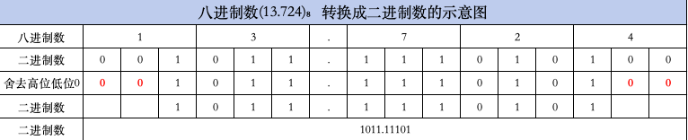

##### 2）二进制数 转 八进制数 

转换思路：<span style="color:red;">**三合一**</span>

> 注意📢：  
> 小数点左边←.：从低位开始合，不够三位，在高位补0  
> 小数点右边.→：从高位开始合，不够三位，在低位补0

例题：将二进制数(1011.1110101)₂转换成八进制数

解题思路：

```
小（2）转大（8）那就三合一
(1011.1110101)₂

1011     // .小数点左边是1011，低位开始合，也就是方向向左←开始合
001 011  // 三位合一，不够三位的补0
1 3      // 分别对应的八进制数是：1和3

1110101      // .小数点右边是1110101，高位开始合，也就是方向向右→开始合
111 010 100  // 三位合一，不够三位的补0
7 2 4        // 分别对应的八进制数是：7、2、4

最后左右两边的转换结果组合起来
13.724

(1011.1110101)₂ = (13.724)₈
```
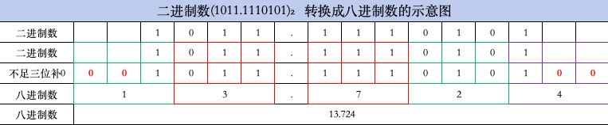

#### 2、二进制数 和 十六进制数 之间的相互转换

**关键数<span style="color:red;">4</span>：2<span style="color:red;">⁴</span>=16**

* 大（16）转小（2）要拆
* 小（2）转大（16）要合

对应关系

| 十六进制 | 二进制 |
|------|--------|
| 0    | 0000   |
| 1    | 0001   |
| 2    | 0010   |
| 3    | 0011   |
| 4    | 0100   |
| 5    | 0101   |
| 6    | 0110   |
| 7    | 0111   |
| 8    | 1000   |
| 9    | 1001   |
| A    | 1010   |
| B    | 1011   |
| C    | 1100   |
| D    | 1101   |
| E    | 1110   |
| F    | 1111   |

##### 1）十六进制数 转 二进制数 

转换思路：<span style="color:red;">**一拆四**</span>

例2.9、将十六进制数(2B.5E)₁₆转换成二进制数。

解题思路：

```
大（16）转小（2） 那就一拆四

(2B.5E)₁₆
(0010 1011.0101 1110)₂      // 一拆四的结果，然后舍去：高位、低位的0
(10 1011.0101 111)₂
(101011.0101111)₂

最终得到(2B.5E)₁₆ = (101011.0101111)₂
```

##### 2）二进制数 转 十六进制数 

转换思路：<span style="color:red;">**四合一**</span>

将二进制数(101011.0101111)₂转换成十六进制数

解题思路：

```
小（2）转大（16） 那就四合一

(101011.0101111)₂

101011     // .小数点左边是101011，低位开始合，也就是方向向左←开始合
0010 1011  // 四位合一，不够四位的补0
2 B        // 分别对应的八进制数是：2和B

0101111      // .小数点右边是0101111，高位开始合，也就是方向向右→开始合
0101 1110    // 四位合一，不够四位的补0
5 E          // 分别对应的八进制数是：5、E

2B.5E        // 最后左右两边的转换结果组合起来

(101011.0101111)₂ = (2B.5E)₁₆
```

#### 习题

1、简述计算机内部和外部需要进行数制转换的原因。

```
计算机内部所有信息都采用二进制编码表示。但在计算机外部大部分都采用八进制、十进制或十六进制表示形式。
因此，计算机在数据输入后或输出前都必须实现这些进制数和二进制数之间的转换。
```

### 考点六、定点数的编码表示

<span style="color:green;">**定点数编码表示方法**</span>主要有以下四种：

* <span style="color:red;">**原码**</span>
* <span style="color:red;">**补码**</span>
* <span style="color:red;">**反码**</span>
* <span style="color:red;">**移码**</span>：等于<span style="color:red;">**补码**</span> **符号位** 取反

通常将**数值数据**在计算机内部编码表示的数称为：<span style="color:red;">**机器数**</span>

比如：`0000 0101`

<span style="color:red;">**机器数真正的值**</span>（即现实世界中带有正负号的数）称为机器数的<span style="color:red;">**真值**</span>。

比如：`5`

### 考点七、原码和反码表示法

**原码是什么？**
> 👉 原码 = 符号位 + 数值的二进制

**原码**：<span style="color:blue;">**符号**</span>-**数值** 表示法（<span style="color:red;">0-正</span>；<span style="color:green;">1-负</span>）

比如：<span style="color:red;">0</span>000 0101

**十进制数 转8位原码的步骤：**

* 第一步：确定符号位 0-正 1-负
* 第二步：十进制数的绝对值：| 十进制数| 转二进制数&补足8位
* 第三步：符号位、二进制数拼接成原码

```
+13
1、确定符号位：+13是正数，所以符号位是0
2、+13的绝对值：13，转成二进制数是：1101
3、拼接8位原码：+13 原码 = 00001101

-13
1、确定符号位：-13是负数，所以符号位是1
2、-13的绝对值：13，转成二进制数是：1101
3、拼接8位原码：-13 原码 = 10001101
```

原码0有两种表示形式：

* [+0]原 = 0 00···0
* [-0]原 = 1 00···0


对于真值-10       （-1010 B），用8位原码表示的机器数为：<span style="color:red;">1</span>000 1010 B（8A<span style="color:red;">H</span>或<span style="color:red;">0x</span>8A）
> 1000 1010  
> 符号<span style="color:red;">1</span>表示负数，数值部分000（不够8位原码的补000） 1010表示10
> 1000 对应十六进制的8  
> 1010对应十六进制的A  
> 所以1000 1010 B对应十六进制的8A
> H或0x 是十六进制数的标识

> 对于真值-0.625（-0.101 B），用8位原码表示的机器数为：1101 0000 B （D0H或0xD0）

**<span style="color:red;">反码</span>：1 → 0；0→1**

* 👉 正数：不变
* 👉 负数：符号位不变，其余位取反

举例：

| 十进制数 | 原码（8位原码机器数）                                                                  | 反码                                            |
|---|------------------------------------------------------------------------------|-----------------------------------------------|
| +5 | <span style="color:red;">**0**</span><span style="color:green;">000</span> 0101 | <span style="color:red;">**0**</span>000 0101 |
| -5 | <span style="color:red;">**1**</span>000 0101                                | <span style="color:red;">**1**</span>111 1010  |

> 十进制数5 转换成二进制数 是101  
> 8位原码机器数，不足8位需要补000得到：0000 0101

反码存在的问题<span style="color:red;">bug</span>：不允许两个 0！

```
0 有两个表示：
+0 → 00000000
-0 → 11111111
```

#### 习题

1、负零的原码表示为（<span style="color:red;">A</span>）

* A：1 00 ···0
* B：0 00 ···0
* C：1 11 ···1
* D：0 11 ···1

### 考点八、补码表示法

补码：实现<span style="color:red;">加减法统一</span>，即用<span style="color:red;">**加法**</span>来实现<span style="color:green;">**减法**</span>运算。

**模运算**

“钟表”是一个典型的模运算系统，其模数为<span style="background-color:yellow;"><span style="color:red;">12</span></span>。

假定现在钟表时针指向10点，要将它拨回6点，则有两种拨法：

* 1、倒拨4个数：10-4=6
* 2、顺拨8个数：10+8=18

所以在模12系统中，10<span style="color:red;">-4</span>≡10+(<span style="color:red;">12-4</span>)≡10+8(mod12)，即<span style="color:red;">-4≡8(mod12)</span>

例2.10、假定在“钟表”上只能顺拨时针，则如何用顺拨的方式实现将10点倒拨4格，拨动后钟表上是几点？

解：  
“钟表”是一个模运算系统，其模为12。因为10-4≡10+(12-4)≡10+8≡6（mod12），所以可从10点顺拨8个来实现倒拨4格，最后拨到了6点。

例2.11、假定算盘只有4档，且只能做加法，则如何用该算盘计算9828-1928的结果？

解：  
算盘是一个“4位的十进制数”模运算系统，其模也就是10⁴
9829-1928≡9829+(10⁴ - 1928)≡9829+8072≡7900(mod10⁴)

9829+8072=17900 → 9829+8072≡7900

以上发生了“<span style="color:red;">溢出</span>”现象

#### 习题：

1、计算机系统中采用补码运算的目的是（<span style="color:red;">**D**</span>）

* A：与手工运算方式保持一致
* B：提高运算速度
* C：提高运算精度
* <span style="background-color:red;"><span style="color:yellow;">D：简化计算机的设计</span></span>

**解析：**
> 补码：实现<span style="color:green;">加减法统一</span>，即用加法来实现减法运算。  
> 补码允许加法和减法使用相同的硬件电路（**减法变加法**，无需单独减法电路）

### 考点九、真值求补码

<span style="color:red;">**正数**</span>的补码是它**本身**  
<span style="color:red;">**负数**</span>的补码等于 **模与该负数绝对值之差**

> 当X为正数时，[Xₜ]补 = Xₜ = M + Xₜ(mod M)  
> 当X为负数时，[Xₜ]补 = M - |Xₜ| = M + Xₜ(mod M)

例2.12、分别求出补码的位数为n和n+1时，“-2ⁿ⁻¹”的补码表示

解：
```
当补码的位数为n时，其模为2ⁿ，“-2ⁿ⁻¹”的补码：
[-2ⁿ⁻¹]补 = M-|Xₜ|
[-2ⁿ⁻¹]补 = 2ⁿ - 2ⁿ⁻¹
[-2ⁿ⁻¹]补 = 2 × 2ⁿ⁻¹ - 2ⁿ⁻¹
[-2ⁿ⁻¹]补 = 2ⁿ⁻¹
[-2ⁿ⁻¹]补 = 10...（1后面跟n-1个0）

2ⁿ⁻¹为什么是1后边跟n-1个0呢？
2ⁿ在二进制数中 = 1后面跟n个0

2⁰ = 1        → 1
2¹ = 2        → 10
2² = 4        → 100
2³ = 8        → 1000
2⁴ = 16       → 10000

当补码的位数为n+1时，其模为2ⁿ⁺¹，“-2ⁿ⁻¹”的补码：
[-2ⁿ⁻¹]补 = M - |Xₜ|
[-2ⁿ⁻¹]补 = 2ⁿ⁺¹ - 2ⁿ⁻¹
[-2ⁿ⁻¹]补 = 3 × 2ⁿ⁻¹
[-2ⁿ⁻¹]补 = 110...(1后面跟n-1个0)
```

例2.13、假设补码的位数为n，求“-1”的补码表示

解：
```
当补码的位数为n时，其模为2ⁿ，“-1”的补码表示
[-1]补 = 2ⁿ - 1
[-1]补 = 11...(n个1)
```

例2.14、求0的补码表示。

解：
```
根据补码的定义，有：
[+0]补 = [-0]补 
= 2ⁿ ± 0 
= 2ⁿ 
= 100...（1后面跟n个0）(mod 2ⁿ)
```

例2.15、假设补码的位数为8，求110 1100和-110 1100的补码表示。

解：
```
当补码的位数为8时，其模为2⁸，“110 1100”的补码表示
[110 1100]补 = 110 1100 // 正数的补码等于它本身
[110 1100]补 = 2⁸ + 110 1100(mod 2⁸)
[110 1100]补 = 10000 0000 + 110 1100

 1 0000 0000
+0 0110 1100
--------------
 1 0110 1100   （这是 9 位结果，mod 2⁸只保留8位）

[110 1100]补 = 0110 1100(mod 2⁸)

“-110 1100”的补码表示
[-110 1100]补 = 2⁸ - 110 1100
[-110 1100]补 = 10000 0000 - 110 1100
```

**真值求补码的简便方法为：**

* 1）若：<span style="color:red;">**正数**</span>，则<span style="color:red;">符号位</span>取<span style="color:red;">0</span>，**数值部分**：<span style="color:red;">**不变**</span>；
* 2）若：<span style="color:green;">**负数**</span>，则<span style="color:red;">符号位</span>取<span style="color:red;">1</span>，**数值部分**：<span style="color:green;">**各位取反，末位加1**</span>

例2.16、假设补码位数为8，用简便方法求数-110 0011的补码表示。

解：
```
-110 0011 为负数，则-110 0011的补码表示
[-110 0011]补 = 1001 1100 // 符号位为1 各位取反
[-110 0011]补 = 1001 1100 + 1
[-110 0011]补 = 1001 1101
```
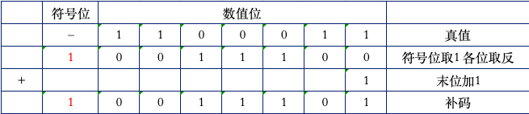

**习题：**

1、负数的补码等于（模）与该负数绝对值之（差）

解析：
```cassandraql
正数的补码是它本身，负数的补码等于模与该负数的绝对值之差。
```

### 考点十、补码求真值

<span style="color:red;">**补码求真值**</span>的简便方法：

* 1）若<span style="color:red;">**符号位**</span>为<span style="color:red;">0</span>，则真值的符号为<span style="color:green;">正数</span>，**数值部分**：<span style="color:red;">**不变**</span>
* 2）若<span style="color:red;">**符号位**</span>为<span style="color:red;">1</span>，则真值的符号为<span style="color:green;">负数</span>，**数值部分**：<span style="color:yellow;">**各位取反，末位加1**</span>

例2.17、已知[Xₜ]补 = `1 011 0100`，求真值Xₜ

解析：
```
符号位为1，则真值为负数，Xₜ = -（1 011 0100） = - 1 011 0100
数值部分：各位取反，末位加1
Xₜ = -（1 011 0100） 
Xₜ = - 011 0100） 
Xₜ = - 100 1011
Xₜ = - 100 1011 + 1
Xₜ = - 100 1100
```
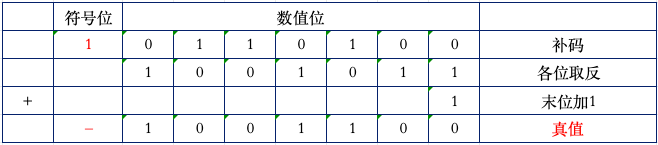

### 考点十一、补码求原码相反数的补码

原码相反数
> 就是在原码的前面 加一个 负号（﹣）

解题思路：（<span style="color:red;">**符号位**</span>+**数值位**）：<span style="color:green;">**各位取反、末位加1**</span>

**备注：**
> 与考点9（真值求补码）和考点10（补码求真值）比较，不同点在于：
> > 1、**真值求补码** 和 **补码求真值** 都是：**只有【数值位】各位取反、末位加1**  
> > 2、**补码求原码相反数的补码** 则是：<span style="color:red;">符号位 与 数值位 <span style="background-color:yellow;">**都要取反**</span>，末位加1</span>

例2.18、已知[Xₜ]补 = 1 011 0100，求[﹣Xₜ]补

解析：
```
[Xₜ]补 = 1 011 0100
[﹣Xₜ]补 = 0 100 1011 // 符号位、数值位 均取反
[﹣Xₜ]补 = 0 100 1011 + 1 // 末位加1
[﹣Xₜ]补 = 0 100 1100
```
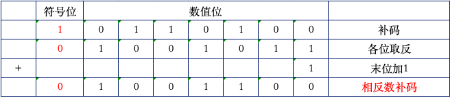

### 考点十二、二进制整数

二进制整数分为以下两种：
* 1）<span style="color:red;">**无符号整数**</span>（默认数的符号为<span style="background-color:yellow;"><span style="color:red;">正</span></span>）
  * n位<span style="color:red;">无符号</span>整数可表示的数的范围为：`0 ~ (2ⁿ-1)`
  * 例如：3位无符号整数的表示范围为：`0 ~ (2³-1) —> 0 ~ 7`
  * 3位无符号整数：正数、最大时为111（转换成十进制数就是7）
* 2）<span style="color:red;">**带符号整数**</span>（用<span style="background-color:yellow;"><span style="color:red;">补码</span></span>来表示）
  * n位<span style="color:red;">带符号</span>整数可表示的数的范围为：`-2ⁿ⁻¹ ~ 2ⁿ⁻¹-1`
  * 例如：3位带符号整数的表示范围为：`-2³⁻¹ ~ 2³⁻¹-1 —> -2² ~ 2²-1 —> -4 ~ 3`

```
3位无符号二进制整数（正数）的表示范围：0 ~ 7
二进制数  十进制数
000  →   0      最小
001  →   1
010  →   2
011  →   3
100  →   4       ↓
101  →   5
110  →   6
111  →   7      最大    

3位带符号二进制整数的表示范围：-4 ~ 3
二进制数  十进制数
000  →   0
001  →   1
010  →   2
011  →   3
100  →  -4   ← 补码求真值简便方法: 100 → -00 → -11 → -11 + 01 → -100 → -(1×2² + 0×2¹ + 0×2⁰) = -4
101  →  -3
110  →  -2
111  →  -1
```

习题

1、在两个同号数相加时，当相加得到的（<span style="color:red;">**和或结果**</span>）超过了n位数可表示的范围时出现这种情况，此时发生了（<span style="color:red;">**溢出**</span>）
现象。

### 考点十三、IEEE754浮点数标准

在这个标准中，提供了两种基本浮点格式：

* 1）<span style="color:red;">**32位单精度**</span>（<span style="color:red;">**1**</span> + <span style="color:green;">**8**</span> + <span style="color:yellow;">**23**</span>）
* 2）64位双精度（1 + 11 + 52）

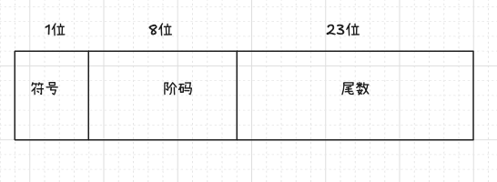

<span style="background-color:yellow;"><span style="color:red;">**解题思路**</span></span>：（**以32位单精度为准**）

1. 先转为二进制
2. 转为二进制的**科学计数法**，格式：1.<span style="color:red;">**F**</span> × 2<span style="color:blue;">**ⁿ**</span>
   3. <span style="color:red;">1011.011</span> →1.<span style="background-color:yellow;">011011</span> × 2<span style="color:blue;">**³**</span>
   4. 【**指数助记**：<span style="color:red;">左移正</span>、<span style="color:blue;">右移负</span>】
3. 确定<span style="color:red;">符号</span>（<span style="color:red;">**1**</span>位）：<span style="color:red;">0-正</span> <span style="color:blue;">1-负</span>
4. 确定<span style="color:red;">阶码</span>（<span style="color:green;">**8**</span>位）：
   5. <span style="color:blue;">**n**</span>+<span style="color:red;">**127**</span>【**偏置常数**=<span style="color:red;">2ⁿ⁻¹-1</span>=2⁷-1=127】，
   6. 转位**二进制数**【<span style="color:red;">阶</span>用<span style="color:red;">**移码**</span>表示】
5. 确定<span style="color:red;">尾数</span>（**<span style="color:yellow;">23</span>位**）：<span style="color:red;">**F**</span>，后面补0，补够**23**位
6. 结合 3、4、5 **步骤** 得出IEEE754单精度浮点数的机器数
7. 四合一，转为<span style="color:red;">十六进制</span>（<span style="background-color:blue;">如果题目有要求</span>）

例2.21、将十进制数-0.75转换位IEEE754的单精度浮点数格式表示。

解析：
```
1、十进制数-0.75转换位二进制数

0.75 × 2 = 1.5 ... 1 ↓
0.5  × 2 = 1.0 ... 1 ↓
（自上而下）正向得到：11

组合起来：-0.11

2、转为二进制的科学计数法：
-0.11 = -1.1 × 2⁻¹

3、确定符号1位
为负数所以是1

4、确定阶码8位，转二进制数
=n+127
=-1+127
=126

126转二进制数
126 ÷ 2 = 63 ... 0 ↑
63  ÷ 2 = 31 ... 1 ↑
31  ÷ 2 = 15 ... 1 ↑
15  ÷ 2 = 7  ... 1 ↑
7   ÷ 2 = 3  ... 1 ↑
3   ÷ 2 = 1  ... 1 ↑
1   ÷ 2 = 0  ... 1 ↑
（自下而上）逆向得到：1111110

不足8位，补足8位=0111 1110

5、确定尾数23位
F=1 后面补0 补够23位
10000000000000000000000

6、结合3、4、5步骤，得到IEEE754单精度浮点数
IEEE754单精度浮点数 = 1 01111110 10000000000000000000000

7、四合一、转位十六进制
 10111111010000000000000000000000
=1011 1111 0100 0000 0000 0000 0000 0000
=B D 4 0 0 0 0 0
=BD40 0000H
```

### 考点十四、机器数的IEEE754浮点数转真值

机器数的IEEE754浮点数转真值 ==》 IEEE754的单精度浮点数的<span style="color:red;">**逆运算**</span>

<span style="background-color:red;"><span style="color:yellow;">**解题思路：**</span></span>

1. 先转为二进制，比如：<span style="color:red;">1</span><span style="color:blue;">10000001</span>01000000000000000000000  【32位】
   1. 第 1 位是符号 `1`
   2. 第2 ~ 9 位是阶码 `10000001`
   3. 第10位开始到结尾是尾数 `01000000000000000000000`
2. 确定<span style="color:red;">符号</span>：<span style="color:red;">0-正</span> <span style="color:blue;">1-负</span>
3. 确定<span style="color:red;">阶码</span>：8位二进制阶码 **转十进制**，再<span style="color:red;"> - 127</span>【<span style="color:green;">指数</span>】
4. 确定<span style="color:red;">尾数</span>：求得F
   1. 23位二进制尾数 转小数部分 转换为0.F格式【二进制尾数 = F（小数部分） + 000… 】
      1. 01000000000000000000000 转小数部分= 0.01
   2. 小数部分转换为十进制
      1. 0.01转十进制数：0.25
5. 结合2、3、4步骤得出真值：<span style="color:red;">1</span>.<span style="background-color:yellow;">F</span> × 2<span style="color:green;">**ⁿ**</span>

例2.22、求机器数为C0A0 0000H 的IEEE754单精度浮点数的值。

解析：
```
1、C0A0 0000H转为二进制数，十六进制数  转 二进制数 ，一拆四
= C 0 A 0 0 0 0 0
= 1100 0000 1010 0000 0000 0000 0000 0000

2、确定符号
第一位是1，所以符号是负，﹣

3、确定阶码 8位二进制阶码 转 十进制数
第2 ~ 9位 是阶码：10000001
10000001 转十进制数
=1×2⁷ + 0×2⁶ + 0×2⁵ + 0×2⁴ + 0×2³ + 0×2² + 0×2¹ + 1×2⁰
=128 + 1
=129
减去➖127 得到 指数
=129-127
=2

4、确定尾数，23位尾数（01000000000000000000000）转小数部分0.01

0.01 转十进制数 得F
F= 0 × 2⁻¹ + 1 × 2⁻²
F= 0 + 1/4
F= 0.25

5、结合2、3、4 得出真值
= -1.25 × 2²
= -5.0
```

### 考点十五、C语言中的浮点数类型

<span style="background-color:red;"><span style="color:yellow;">**解题思路**</span></span>：int → float → double 表示的范围越来越大

* <span style="color:red;">**int**</span>
    * -<span style="color:red;">2³¹</span> ~ <span style="color:red;">2³¹</span>-1（-2147483648 ~ 2147483647）
* <span style="color:red;">**float**</span>
    * -3.4 × <span style="color:red;">10³⁸</span> ~ 3.4 × <span style="color:red;">10³⁸</span>，**精度**约为<span style="color:green;">**6 ~ 7**</span>位有效数字
* <span style="color:red;">**double**</span>
    * -1.7 × <span style="color:red;">10³⁰⁸</span> ~ 1.7 × <span style="color:red;">10³⁰⁸</span>，**精度**约为<span style="color:green;">**15 ~ 16**</span>位有效数字

#### 1、<span style="color:red;">int</span> → <span style="color:red;">float</span>

小到大，不会溢出，但是因为float精度有效位数少，有可能<span style="color:red;">**舍入**</span>。
比如：
> int b = <span style="color:red;">123456789</span>; float fb = b; fb = <span style="color:green;">1234567</span><span style="background-color:purple;">92</span>.000000(舍入后<span style="color:green;">精度丢失</span>)

#### 2、<span style="color:red;">int</span> → <span style="color:red;">double</span> 或 <span style="color:red;">float</span> → <span style="color:red;">double</span>

因为double类型的有效位数更多，故能保留精确值。  

比如：
> int a  = <span style="color:red;">1234567890</span>; double da = a;da = <span style="color:red;">1234567890</span>.000000(无舍入)

比如：
> float b = <span style="color:red;">123.456787</span>; double db = b;db = <span style="color:red;">123.456787</span>109375(无新增舍入)

#### 3、<span style="color:red;">double</span> → <span style="color:red;">float</span>

因为float类型表示范围更小，可能<span style="color:red;">舍入</span>，由于有效位数变少，可能<span style="color:red;">舍入</span>。

比如：
> double a = <span style="color:red;">1.234567</span>890123456; float fa = a; fa = <span style="color:red;">1.234567</span>9

#### 4、<span style="color:red;">double</span> → <span style="color:red;">int</span> 或 <span style="color:red;">float</span> → <span style="color:red;">int</span>

因为int没有小数部分，所以可能会截断

比如：`double d = 1.999; int a = d; a = 1`  
1.999被转换为1，因为int表示的范围更小，超出int范围则溢出，可能溢出

比如：`float f = 1.999; int a  = f; a = 1;`  
1.999被转换为1，因为int表示的范围更小，超出int范围则溢出，可能溢出

**总结:**

小 → 大，不会溢出，可能<span style="color:red;">**舍入**</span>  
大 → 小，可能<span style="color:red;">溢出</span>、可能<span style="color:red;">舍入</span>，也可能<span style="color:red;">截断</span>

例2.23、假定变量I、f、d的类型分别是int、float、double，它们可以取除+∞、﹣∞和NaN 以外的任意值。请判断下列每个C语言关系表达式在32位机器上运行时是否永真。（<span style="color:red;">C、D、F</span>）

* A：i == (int)(float) i
* B：f == (float)(int) f
* C：i == (int)(double) i
* D：f == (float)(double) f
* E：d == (float) d
* F：f == -(-f)
* G：（d+f）-d == f

解析
```
A：不是永真，i → float 可能丢精度，再转回int 已经变了
B：不是永真，f → int 会截断小数再转回 float，信息已经丢了
C：永真，double 精度足够，int → double 再转回来 精度不丢失
D：永真，float → double：不会丢精度，double → float：回到原来的精度
E：不是永真，double → float 会丢精度
F：永真，数学上：-(-f) = f
D：不是永真，浮点数不满足结合律（精度丢失）
```


### 考点十六、非数值数据的编码表示

非数值数据分为以下：

1）<span style="color:red;">**逻辑值**</span>

**核心**只有两个值：真（1）和假（0）按<span style="background-color:green;">位</span>进行

2）<span style="color:red;">**西文字符**</span>

目前计算机中使用<span style="color:red;">最广泛</span>的西文字符集及其编码是<span style="color:red;">**ASCII码**</span>  
每个<span style="color:red;">字符</span>由<span style="background-color:yellow;"><span style="color:red;">7</span></span>个二进位，<span style="color:red;">**b₆b₅b₄**</span><span style="color:SkyBlue;">**b₃b₂b₁b₀**</span>表示  

例如：
> <span style="color:red;">011</span><span style="color:skyblue;">0111</span> → 左边是<span style="color:red;">高位</span>，右边是<span style="color:skyblue;">低位</span>

3）<span style="color:red;">**汉字字符**</span>

汉字的<span style="color:skyblue;">输入码</span>，又称<span style="color:skyblue;">外码</span>  

字符集与<span style="color:skyblue;">汉字内码</span>   （<span style="color:red;">ASCII码</span>）

汉字的<span style="color:skyblue;">字模点阵码</span>和<span style="color:skyblue;">轮廓描述</span>

**习题**

1、指令所处理的非数值数据主要包括（ <span style="color:red;">**逻辑**</span> ）数据和（ <span style="color:red;">**字符**</span> ）数据。

### 考点十七、数据的宽度和单位

1）<span style="color:red;">**比特**</span>：也叫：位，用<span style="background-color:purple;">b</span>表示

2）<span style="color:red;">**字节**</span>：一个字节等于<span style="color:red;">**8**</span>位，用<span style="color:red;">**B**</span>表示， 1<span style="color:red;">B</span> = 8<span style="background-color:purple;">b</span>

3）<span style="color:red;">**字**</span>：一般情况下，可以理解位<span style="color:skyblue;">**双字节**</span>，<span style="color:red;">16位</span>

> 用来表示被处理信息的单位  
> 用来度量各种数据类型的宽度

4）<span style="color:red;">**字长**</span>：CPU内部用于整数运算的数据通路的宽度
例如：
> 平常所说的机器是32位还是64位，指的就是<span style="color:skyblue;">**字长**</span>

存储容量单位如下：
> 1B  = 8b  
> 1KB = 1024B  = 2¹⁰B  
> 1MB = 1024KB = 2¹⁰KB  
> 1GB = 1024MB = 2¹⁰MB  
> 1TB = 1024GB = 2¹⁰GB  

#### 习题

1、简述字和字长概念

解答
```
字，一般情况下，可以理解为双字节，16位。用来表示被处理信息的单位，用于度量各种数据类型的宽度。
字长就是CPU内部用于整数运算的数据通路的宽度，比如说机器是32位还是64位，指的就是字长
```

### 考点十八、数据的存储和排列顺序

两种存储方式：**大端方式**、**小端方式**

如下图所示，假定**int**类型的变量**i**的地址为<span style="color:red;">**0800**</span>**H**（`低地址`），地址都是从<span style="color:red;">低→高</span>排列  

机器数为<span style="color:skyblue;">**01234567**</span>**H**(<span style="background-color:red;"><span style="color:yellow;">左高右低</span></span>)左边是高位、右边是低位  
<span style="color:red;">**01**</span>H为<span style="color:red;">**MSB**</span>：表示<span style="color:red;">最高</span>有效字节  
<span style="color:skyblue;">**67**</span>H为<span style="color:skyblue;">**LSB**</span>：表示<span style="color:skyblue;">最低</span>有效字节

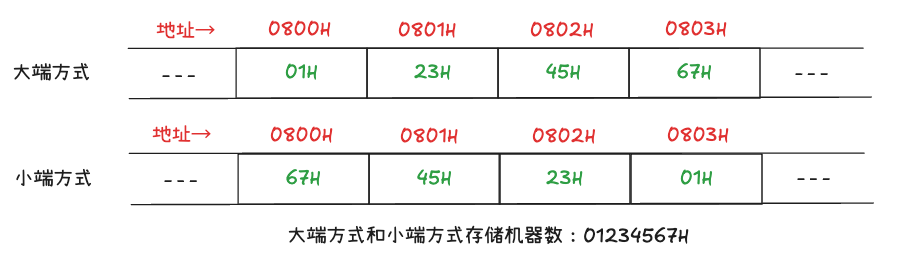

**<span style="color:red;">大端方式</span>：**

机器数<span style="color:red;">顺序</span>排列，01H、23H、45H、67H   「<span style="color:red;">正</span>着装」  
**核心**：数据的 `高位字节` 存在内存的 `低地址` 里面  
<span style="background-color:purple;">助记</span>：高大（大端方式 高位字节存储在低地址）

**<span style="color:skyblue;">小端方式</span>：**

机器数<span style="color:skyblue;">逆序</span>排列，67H、45H、23H、01H  「<span style="color:skyblue;">反</span>着装」  
**核心**：数据的 `低位字节` 存在内存的  `低地址` 里面  
<span style="background-color:purple;">助记</span>：低小 （小端方式 低位字节存储在低地址）

### 考点十九、加法器和算术逻辑部件

全加器的两个加数为<span style="color:greenyellow;">**A**</span>和<span style="color:greenyellow;">**B**</span>，低位进位为<span style="color:greenyellow;">Cin</span>，相加的和为<span style="color:red;">**F**</span>，向高位的进位为<span style="color:red;">**Cout**</span>

**加法器**实际上是<span style="color:Chartreuse;">**无符号数**</span>的加法器

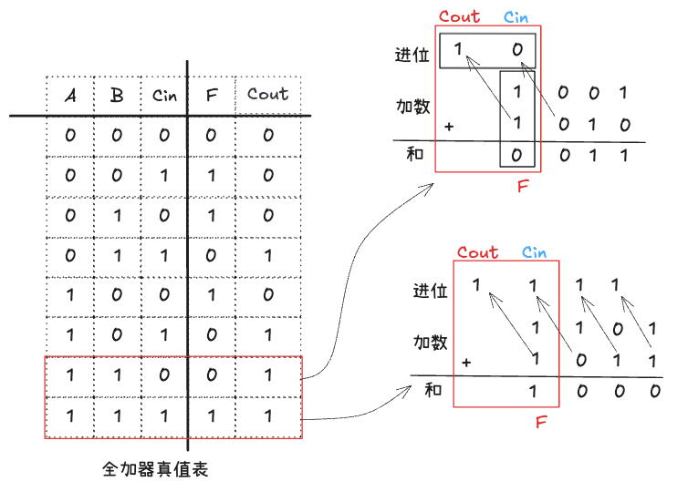

#### 习题

1、简述算术逻辑部件的工作原理

```
用来完成基本的逻辑运算和定点数加减运算，各类定点乘除运算和浮点数运算可利用加法器、ALU和移位器来实现，
因此基本的运算部分是加法器、ALU和移位器，
ALU的核心部件是加法器。
```

### 考点二十、带标志加法器

#### 1）溢出标志

表示<span style="color:red;">**有符号数**</span>运算时，结果超出了当前位数能表示的范围。

`OF = Cₙ ⊕ Cₙ₋₁`

> ⊕：是<span style="color:red;">异或</span>运算符  
> Cₙ：是**最高位**（<span style="color:red;">符号位</span>）的进位  
> Cₙ₋₁：是**次高位**的进位  

比如：以4为有符号数为例，4为有符号数能表示的范围：`-8 ~ +7`，计算`+6 ＋ +3`

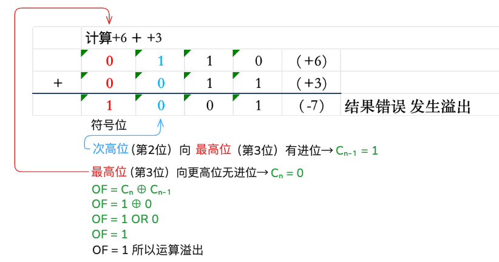

次高位（第2位）向最高位（第3位）有进位→Cₙ₋₁ = 1  
最高位（第3位）向更高位无进位→Cₙ = 0  
所以 `OF = Cₙ ⊕ Cₙ₋₁ = 1 ⊕ 0 = 1 OR 0 = 1` 所以<span style="background-color:red;"><span style="color:yellow;">运算溢出</span></span>

#### 2）符号标志

表示<span style="color:red;">**有符号数**</span>运算结果的符号，直接等于结果的<span style="color:red;">最高位</span>（<span style="color:red;">符号位</span>）  

**SF = Fₙ₋₁** ，是结果的最高位（<span style="color:red;">**0-正**</span> <span style="color:greenyellow;">1-负</span>）

比如：以<span style="color:red;">4</span>位<span style="color:red;">有符号数</span>为例，范围是`-8 ~ +7`

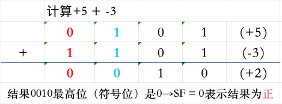

`SF = 0`表示结果为<span style="color:red;">**正**</span>

#### 3）零标志

**运算结果**为0时，`ZF = 1`，否则：`ZF = 0`

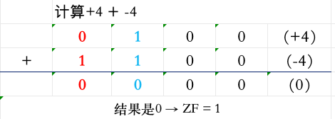

结果是0 → ZF = 1

#### 4）进位/借位标志

<span style="color:yellowgreen;">无符号数</span>运算时的进位（加法）或借位(减法)标志。

* 当Cin = 0（<span style="background-color:purple;">加法</span>），CF = Cout（直接取最高位的进位）
* 当Cin = 1（减法，可看做加负数），CF = ¬Cout（对<span style="color:red;">最高位的进位取反</span>）

计算1111 + 0001（4位<span style="background-color:green;">无符号数</span>，范围`0 ~ 15`）

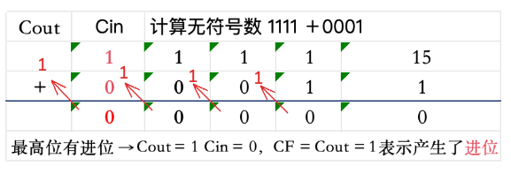

最高位有进位 →Cout = 1  
因为Cin = 0，所以CF = Cout = 1，表示产生了<span style="color:red;">进位</span>

### 考点二十一、补码加减运算器

公式：

`[x+y]补 = [x]补 + [y]补（mod 2ⁿ）`  
`[x-y]补 = [x]补 + [-y]补（mod 2ⁿ）`

例2.24、用4位补码计算“-7-6”和“-3-5”的值

解析：

```
先求得各数的补码
7 =》 111 ,[-7]原 = 1111 ,[-7]补= 1000（数值部分各位取反） = 1001（末位加1）
6 =》 110 ,[-6]原 = 1110 ,[-6]补= 1001（数值部分各位取反） = 1010（末位加1）
3 =》 011 ,[-3]原 = 1011 ,[-3]补= 1100（数值部分各位取反） = 1101（末位加1）
5 =》 101 ,[-5]原 = 1101 ,[-3]补= 1010（数值部分各位取反） = 1011（末位加1）

[-7-6]补 = [-7]补 + [-6]补
[-7-6]补 = 1001 + 1010
[-7-6]补 = 0011(+3)  // 符号位：0-正 1-负

[-3-5]补 = [-3]补 + [-5]补
[-3-5]补 = 1101 + 1011
[-3-5]补 = 1000(-8)  // 符号位：0-正 1-负

因为是4位补码，所以可表示的范围：-8 ~ +7
[-7-6]补 = 0011(+3) 不在可表示范围内，一定发生了溢出，是一个错误的值
[-3-5]补 = 1000(-8) 在可表示范围内，因而没有发生溢出，是一个正确的值
```

### 考点二十二、浮点数加减运算

浮点数<span style="color:red;">**加减**</span>运算过程中，需要经过以下步骤：

1. <span style="color:red;">**对阶**</span>
2. <span style="color:red;">**尾数加减**</span>
3. <span style="color:red;">**规格化**</span>
4. <span style="color:red;">**舍入**</span>
5. <span style="color:skyblue;">**溢出判断**</span>和<span style="color:skyblue;">**溢出处理**</span>

1）<span style="color:red;">**对阶的原则**</span>

<span style="color:red;">**小阶向大阶看齐**</span>，**阶小的那个数**的<span style="color:red;">**尾数右移**</span>，右移的位数等于两个阶的差的<span style="color:skyblue;">绝对值</span>。

> 阶小那个数的尾数是小阶数（<span style="color:blue;">转二进制数科学计数法后</span>）的<span style="color:red;">**整个数，不是小数部分**</span>  
> 比如：1.32 的尾数是这一整个数1.32，而不是小数部分0.32

`Eₓ、Ey分别是浮点数x和y的阶`  
`[Eₓ-Ey]补 = [Eₓ]移 + [-[Ey]移]补（mod 2ⁿ）`

例2.29、若x和y为float变量，x=1.5，y=-125.25，请给出计算x+y过程中的对阶结果。

解：

```
先把x，y转换为IEEE754的单精度浮点数

1)转二进制

x = 1.5
(1.5)₁₀ = 1 + 0.5
整数部分（除2取余 逆向排序）：
1 ÷ 2 = 0 余1
小数部分（乘2积0，正向排序）：
0.5 × 2 = 1.0 整1
x = (1.5)₁₀ = (1.1)₂
 
y = -125.25
(-125.25)₁₀ 的绝对值:125.25 = 125 + 0.25
整数部分（除2取余 逆向排序）：
125 ÷ 2 = 62 余1
62  ÷ 2 = 31 余0
31  ÷ 2 = 15 余1
15  ÷ 2 = 7  余1
7   ÷ 2 = 3  余1
3   ÷ 2 = 1  余1
1   ÷ 2 = 0  余1

1111101

小数部分（乘2积0，正向排序）：
0.25 × 2 = 0.5 整0
0.5  × 2 = 1.0 整1

01

(-125.25)₁₀ = (-1111101.01)₂

2)转科学计数法
1.1 = 1.1 × 2⁰ // 指数n=0  F=1
-1111101.01 = -1.11110101 × 2⁶ // 指数n=6 F= 11110101 小数点左移6为6 如果是右移的话就是负的-6

3）确定符号：0-正 1-负
1.1 符号位 0
-1111101.01 符号位 1

4）确定8位阶码
1.1 的阶码：n+127 = 0 + 127 = 127 再转二进制得到：01111111  // 前面补一个0
-1111101.01 的阶码：n+127 = 6 + 127 = 133 再转二进制得到：10000101

5）确定23位尾数：F后面补0 补够23位
1.1 的尾数：10000000000000000000000
-1111101.01 的尾数：11110101000000000000000

6）结合3、4、5 得到IEEE754单精度浮点数的机器数
机器数 = 符号位 + 8位阶码 + 23位尾数
1.1 的机器数 = 0 01111111 100 0000 0000 0000 0000 0000
-1111101.01 的机器数 = 1 10000101 111 1010 1000 0000 0000 0000

小阶 向 大阶 看齐，所以阶小的那个数的尾数右移：两个阶的差的绝对值 |6-0| = 6
x的阶码也就变成了：10000101 // y的阶码

x的尾数（x转换成的二进制数这一整个数1.1而不是0.1）右移6位，x 尾数变化过程：
1.1
→ 0.11
→ 0.011
→ 0.0011
→ 0.00011
→ 0.000011
→ 0.0000011

对阶后结果：
x = 0.0000011  × 2⁶
y = -1.11110101 × 2⁶
```

例2.30、用IEEE754单精度浮点数加减运算计算0.5+（-0.4375）=？

解：
```
先把0.5，-0.4375转换为IEEE754的单精度浮点数

1)0.5，-0.4375转二进制数

(0.5)₁₀ 转二进制数
0.5 × 2 = 1.0 取整1
(0.5)₁₀ = (0.1)₂

(-0.4375)₁₀ 转二进制数
0.4375 × 2 = 0.875 取整0
0.875  × 2 = 1.75  取整1
0.75   × 2 = 1.5   取整1
0.5    × 2 = 1.0   取整1
(-0.4375)₁₀ = (-0.0111)₂

2)转科学计数法
(0.5)₁₀ = (0.1)₂ = 1.0 × 2⁻¹ // 小数点右移 为负-
(-0.4375)₁₀ = (-0.0111)₂ = -1.11 × 2⁻² // 小数点右移 为负-

3）确定符号：0-正 1-负
(0.5)的1位符号：0
(-0.4375)的1位符号：1

4）确定8位阶码：n+127
(0.5)的阶码：-1 + 127 = 126 再转二进制得到：01111110
(-0.4375)的阶码：-2 + 127 = 125 再转二进制得到：01111101

5）确定23位尾数：F后面补0 补够23位
(0.5)的23位尾数：00000000000000000000000
(-0.4375)的23位尾数：11000000000000000000000

6）结合3、4、5 得到IEEE754单精度浮点数的机器数
机器数 = 符号位 + 8位阶码 + 23位尾数
(0.5)的机器数：0 01111110 00000000000000000000000
(-0.4375)的机器数：1 01111101 11000000000000000000000

对阶

对阶的目的是让两个数的指数相同，这样尾数才能直接相加

小阶向大阶看齐，阶小的尾数右移，右移位数=两数阶差的绝对值=|-2-（-1）|=|-1|=1 右移位数1
1.11
→ 0.111

对阶后结果：
(0.5)=》1.0 × 2⁻¹
(-0.4375)=》-0.111 × 2⁻¹
```

2）<span style="color:red;">**尾数加减**</span>

现在两个数的指数相同，可以直接把尾数相加，<span style="color:skyblue;">符号参与运算</span>：

```
（0.5）=》1.000 × 2⁻¹
(-0.4375)=》-0.111 × 2⁻¹

= 0.5+（-0.4375） 
= 1.000+（-0.111）
= 0.001

1.000
- 0.111
-------
0.001

0.001 × 2⁻¹
```

3）<span style="color:red;">**规格化**</span>

格式化要求尾数是1.F的形式（隐藏整数位1）

当前尾数0.001，需要向左移3位变成1.000，即：0.001 = 1.000 × 2⁻³

新指数=126（-1+127） -3 = 123，新的尾数（隐含1恢复形式）：1.000…0，尾数部分23位全是0

4）<span style="color:red;">**舍入**</span>

我们的尾数在规格化后是1.000，没有多余的位需要舍入，所以尾数保持1.000

5）<span style="color:skyblue;">溢出判断</span>和<span style="color:skyblue;">溢出处理</span>

指数范围：IEEE754单精度的指数范围是-126 ~ +127。
我们得到的指数是-3，在有效范围内，所以没有溢出。

原来指数是126（对齐后的指数=-1+127），新指数=126（-1+127）-3 = 123
最终结果：

二进制表示：<span style="color:red;">0</span> <span style="color:skyblue;">01111011</span> 00000000000000000000000  

转换为十进制：`1.0×2¹²⁶⁻¹²⁷⁻³=0.0625`，所以0.5 +(-0.4375) = 0.0625  
或  
转换为十进制：`1.0×2¹²³⁻¹²⁷=0.0625`，所以0.5 +(-0.4375) = 0.0625

**指数 = 阶码 - 127【偏置常数】**

#### 习题

1、对阶时，使小阶向大阶看齐，使小阶的（<span style="color:red;">**尾数**</span>）向右偏移，移动的位数等于两个阶的（<span style="color:red;">**差**</span>）的绝对值

2、浮点数加减运算过程中，需要经过（<span style="color:red;">**对阶**</span>）、尾数加减、（<span style="color:red;">**规格化**</span>）、和舍入4个步骤。

3、浮点数加减运算过程中，需要经过对阶、（<span style="color:red;">**尾数**</span>）加减、（<span style="color:red;">**规格化**</span>）、和舍入4个步骤。

### 考点二十三、浮点数乘除运算

浮点数<span style="color:skyblue;">乘除</span>运算过程中，需要经过以下步骤：

#### 1）<span style="color:red;">尾数相乘、阶码相加</span> or <span style="color:skyblue;">尾数相除、阶码相减</span>

= 0.123 × 10⁵ × 0.456 × 10²  
= 0.123 × 0.456 × 10<span style="color:red;">⁵⁺²</span>

= 0.123 × 10⁵ / 0.456 × 10²  
= 0.123 / 0.456 × 10<span style="color:red;">⁵⁻²</span>

#### 2）<span style="color:red;">尾数规格化</span>

#### 3）<span style="color:red;">尾数舍入处理</span>

#### 4）<span style="color:red;">阶码溢出判断</span>

#### 习题

1、下列关于浮点运算器的描述，正确的是（<span style="color:red;">**A**</span>）

* A：浮点运算器可用阶码部件和尾数部件来实现
* B：阶码部件可实现加、减、乘、除四种运算
* C：阶码部件可进行阶码相加、相减和相乘操作
* D：尾数部件只进行乘法和除法运算

解析：
> 浮点运算中，<span style="color:red;">**阶码表示范围**</span>，<span style="color:skyblue;">尾数表示精度</span>
> 
> <span style="color:red;">阶码部件</span>主要进行<span style="color:red;">阶码相加</span>、<span style="color:red;">减</span>和<span style="color:red;">比较</span>操作
> 
> <span style="color:skyblue;">尾数部件</span>能实现<span style="color:skyblue;">加、减、乘和除</span>四种基本算术运算

### 原码、反码、补码、移码总结

1、原码：  
符号位（<span style="color:red;">0-正</span> <span style="color:skyblue;">1-负</span>） + 数值的二进制

2、反码：在 **原码** 基础上  
正数：<span style="color:red;">不变</span>  
负数：<span style="color:red;">符号位</span>不变，<span style="color:skyblue;">其余位取反</span>（0→1、1→0）

3、补码： 在 **反码** 基础上  
正数：<span style="color:red;">不变</span>  
负数：<span style="color:red;">反码 + 1</span>

4、移码：在 **补码** 基础上  
正数：补码的<span style="color:red;">符号位</span>-<span style="color:blue;">取反</span>  
负数：补码的<span style="color:red;">符号位</span>-<span style="color:blue;">取反</span>

**举例说明：**

| 真值 | 原码 | 反码 | 补码 | 移码 |
|------|------|------|------|------|
| +5 | 0000 0101 | 0000 0101 | 0 000 0101 | 1000 0101 |
| -5 | 1000 0101 | 1111 1010 | 1 111 1011 | 0111 1011 |
| +0 | 0000 0000 | 0000 0000 | 0 000 0000 | 1000 0000 |
| -0 | 1000 0000 | 1111 1111 | 1 000 0000 | 0111 1111 |


### 进制转换总结

* 1、R 进制 →转→ 十进制：按权展开
* 2、十进制 →转→ R 进制：除基取余、乘基取整

#### 1、任意(R)进制（二、八、十六）转十进制通用公式

对于一个带小数的n进制数：(aₖ···a₀<span style="color:red;">**.**</span>b₁···bₘ)ₙ

转十进制计算过程：  
`(aₖ × nᴷ + ··· + a₁ × n¹ + a₀ × n⁰) + (b₁ × n⁻¹ + b₂ × n⁻² +  ··· + bₘ × n⁻ᵐ)`

LaTeX语法：  
$$
(a_k \cdots a_0 . b_1 \cdots b_m)_n = \sum_{i=0}^{k} a_i × n^i + \sum_{j=1}^{m} b_j × n^{-j}
$$

👉 每一位 ×（进制的幂）再相加

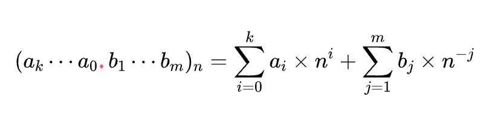

| 进制         | 公式                         |
| ---------- |----------------------------|
| 二进制 → 十进制  | $$( \sum a_i \cdot 2^i )$$ |
| 八进制 → 十进制  | $$( \sum a_i \cdot 8^i )$$ |
| 十六进制 → 十进制 | $$( \sum a_i \cdot 16^i )$$ |


#### 2、十进制 →转→ R 进制（二、八、十六）通用公式

对于一个带小数的n进制数：(aₖ···a₀.b₁···bₘ)ₙ

转二进制：

* 整数部分：(aₖ···a₀） 不断 ÷ 2 取余数逆向排列
* 小数部分：(b₁···bₘ) 不断 × 2 取整数正向排列

转八进制：

* 整数部分：(aₖ···a₀） 不断 ÷ 8 取余数逆向排列
* 小数部分：(b₁···bₘ) 不断 × 8 取整数正向排列

转十六进制：

* 整数部分：(aₖ···a₀） 不断 ÷ 16 取余数逆向排列
* 小数部分：(b₁···bₘ) 不断 × 16 取整数正向排列

| 转换         | 方法                          |
| ---------- |-----------------------------|
| 十进制 → 二进制  | **整数**部分除 2 取余 <br/> **小数**部分乘 2 取整 |
| 十进制 → 八进制  | **整数**部分除 8 取余 <br/> **小数**部分乘 8 取整 |
| 十进制 → 十六进制 | **整数**部分除 16 取余 <br/> **小数**部分乘 16 取整 |


👉整数： “除基取余，逆序排列” （一直“除以 n，取余数”，倒着写）
👉小数： “乘基取0，正向取整”  （一直“乘以n，取整数”，正着写）

| 部分     | 方法   | 顺序     |
| ------ | ---- | ------ |
| 整数 (I) | 除基取余 | **倒序** |
| 小数 (f) | 乘基取整 | **正序** |

**举例说明**

十进制数10.625 → 二进制

```
整数部分：10
               取余
10 ÷ 2 = 5 ... 0 ↑
5  ÷ 2 = 2 ... 1 ↑
2  ÷ 2 = 1 ... 0 ↑
1  ÷ 2 = 0 ... 1 ↑
（自下而上）逆向得到：1010

小数部分：0.625
                     取整
0.625 × 2 = 1.25 ... 1 ↓
0.25  × 2 = 0.5  ... 0 ↓
0.5   × 2 = 1.0  ... 1 ↓
（自上而下）正向得到：101

组合起来：1010 . 101
(10.625)₁₀ = (1010.101)₂
```

### 原码、反码、补码、移码总结

#### 1、原码：

**符号位**（<span style="color:red;">0-正</span> <span style="color:green;">1-负</span>） + 数值的二进制

#### 2、反码：

<span style="background-color:red;">在原码基础上</span>  
* 正数：与原码保持一致，不变
* 负数：**符号位不变**，**其余位取反**（0→1、1→0）

#### 3、补码：

<span style="background-color:red;">在反码基础上</span>    
* 正数：与反码保持一致，不变
* 负数：**反码 + 1**

#### 4、移码：

<span style="background-color:red;">在补码基础上</span>  
* 正数：补码的**符号位取反**
* 负数：补码的**符号位取反**

**举例说明：**

| 真值 | 原码                                                                            | 反码                                            | 补码                                          | 移码                                        |
|----|-------------------------------------------------------------------------------|-----------------------------------------------|---------------------------------------------|-------------------------------------------|
| +5 | <span style="color:red;">**0**</span>000 0<span style="color:green;">101</span> | <span style="color:red;">**0**</span>000 0101 | 0 000 0101                                  | <span style="color:red;">1</span>000 0101 |
| -5 | <span style="color:red;">**1**</span>000 0<span style="color:green;">101</span> | <span style="color:red;">**1**</span>111 1010 | 1 111 101<span style="color:blue;">1</span> | <span style="color:red;">0</span>111 1011 |
| +0 | <span style="color:red;">**0**</span>000 0000                                 | <span style="color:red;">**0**</span>000 0000 | 0 000 0000                                  | <span style="color:red;">1</span>000 0000 |
| -0 | <span style="color:red;">**1**</span>000 0000                                 | <span style="color:red;">**1**</span>111 1111 | 1 000 0000                                  | <span style="color:red;">0</span>111 1111 | 

> 红色是符号位，绿色是数值部分，其余0是补位0

正数的原码、反码、补码、都是一样的，移码是对（原码、反码、补码）的符号位进行取反操作

负数的原码、反码、补码、移码都不一样，转换规则如下：

| 转换         | 方法                      |
| ---------- |-------------------------|
| 原码 → 反码  | 符号位不变，其余数值部分取反（0→1、1→0） |
| 反码 → 补码  | 反码 + 1                  |
| 补码 → 移码  | 补码的符号位取反，其余数值部分不变       |

