# 第二章、程序的转换及机器级表示

---
## 目录

- [一、指令](#考点一指令)
- [二、寄存器传送语言（Register Transfer Language, RTL）](#考点二寄存器传送语言register-transfer-language-rtl)
- [三、指令系统设计](#考点三指令系统设计)
- [四、生成机器代码的过程](#考点四生成机器代码的过程)
- [五、Intel和AT&T格式指令区别](#考点五intel和att格式指令区别)
- [六、数据类型及格式](#考点六数据类型及格式)
- [七、定点寄存器组](#考点七定点寄存器组)
- [八、条件标示](#考点八条件标示)
- [九、定点算术运算指令](#考点九定点算术运算指令)
- [十、寻址方式](#考点十寻址方式)
- [十一、浮点寄存器栈和多媒体扩展寄存器组](#考点十一浮点寄存器栈和多媒体扩展寄存器组)
- [十二、通用数据传送指令](#考点十二通用数据传送指令)
- [十三、地址传送指令](#考点十三地址传送指令)
- [十四、移位指令](#考点十四移位指令)
- [十五、程序执行流控制指令](#考点十五程序执行流控制指令)
- [十六、过程调用](#考点十六过程调用)
- [十七、值传递和地址传递](#考点十七值传递和地址传递)
- [十八、选择语句](#考点十八选择语句)
- [十九、循环语句](#考点十九循环语句)
- [二十、数组](#考点二十数组)
- [二十一、数据的对齐方式](#考点二十一数据的对齐方式)
- [二十二、x86-64的基本特点](#考点二十二x86-64的基本特点)
- [二十三、x86-64的数据传送指令](#考点二十三x86-64的数据传送指令)
- [二十四、x86-64的算术逻辑运算指令](#考点二十四x86-64的算术逻辑运算指令)

---

### 考点一、指令

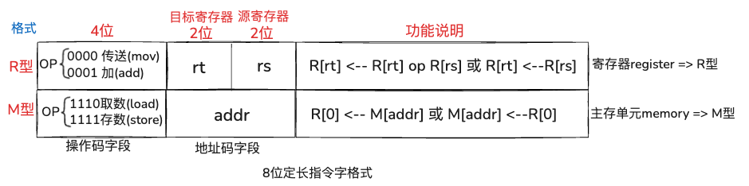

**8位R型指令**

```
[ op(4位) | rt(2位)  | rs(2位) ]  
[ 操 作 码 | 目标寄存器 | 源寄存器 ]
```
> <span style="color:red;">**rt**</span>（<span style="color:red;">t</span>arget <span style="color:red;">r</span>egister）：目标寄存器（被操作对象/目标、参与运算 / 有时也作为结果）
> 
> <span style="color:red;">**rs**</span>（<span style="color:red;">s</span>ource <span style="color:red;">r</span>egister）：源寄存器（提供数据、数据来源）

**OP为操作码字段：**

**1)R型指令**  
+ op为 <span style="color:red;">0000</span> 定义为<span style="color:red;">传送</span>（<span style="color:red;">mov</span>）操作  
+ op为 <span style="color:Aqua;">0001</span> 定义为<span style="color:Aqua ;">加</span>（<span style="color:Aqua ;">add</span>）操作

比如：
> 指令 <span style="color:DodgerBlue;">0001</span> <span style="color:red;">00</span><span style="color:Aqua;">01</span> 的功能为R[0]←R[0] <span style="color:DodgerBlue;">+</span> R[1]，表示将0号寄存器和1号寄存器内容相加的结果送到0号寄存器。

**2）M型指令**

+ op为<span style="color:red;">1110</span>定义为<span style="color:red;">取数</span>（<span style="color:red;">load</span>）操作
+ op为<span style="color:Aqua ;">1111</span>定义为<span style="color:Aqua ;">存数</span>（<span style="color:Aqua;">store</span>）操作

比如：
> 指令 <span style="color:red;">1110</span> <span style="color:aqua;">0110</span> 的功能为R[0]←<span style="background-color:yellow;"><span style="color:red;">M</span></span>[0110]，表示将6号主存单元（地址为0110）中的内容取到0号寄存器

### 考点二、寄存器传送语言（Register Transfer Language, <span style="color:red;">RTL</span>）

<span style="color:red;">R[r]</span>：表示寄存器r的内容  
<span style="color:dodgerblue;">M[addr]</span>：表示存储单元addr的内容  
<span style="color:dodgerblue;">M[PC]</span>：表示PC所指存储单元的内容  
M[<span style="color:red;">R[r]</span>]：表示寄存器r的内容所指的存储单元的内容  

* <span style="color:red;">**AT&T**</span>格式指令：<span style="color:red;">源</span>、<span style="color:dodgerblue;">目的</span> <span style="color:red;">**顺序**</span>（<span style="background-color:yellow;">本教材使用</span>）
* <span style="color:dodgerblue;">Intel</span>格式指令：<span style="color:dodgerblue;">目的</span>、<span style="color:red;">源</span>   <span style="color:skyblue;">**逆序**</span>

传送方向用<span style="background-color:yellow;"><span style="color:red;">**←**</span></span>表示，右：传送<span style="color:red;">源</span>，左：传送<span style="color:dodgerblue;">目的</span>

例如：

> 对于<span style="color:red;">AT&T</span>格式指令“mov<span style="color:red;">w 4(%ebp)</span>, <span style="color:dodgerblue;">%ax</span>”，其功能为R[ax]←M[R[ebp]+4]

### 考点三、指令系统设计风格

按指令格式的**复杂度**分以下两种：

1）<span style="color:red;">**CISC**</span>风格指令系统（<span style="color:red;">复杂</span>指令集计算机，Complex Instruction Set Computer）

例如：本书介绍的Intel x86指令系统就是典型的CISC架构

2）<span style="color:dodgerblue;">RISC</span>风格指令系统(<span style="color:dodgerblue;">精简</span>指令集计算机，Reduced Instruction Set Computer)

**特点：**
1. 指令数目少
2. 指令格式规整，采用定长指令字方式
3. 只有Load/Store指令中的数据需要访存
4. 采用大量通用寄存器

指令的<span style="color:red;">操作数</span>有以下三种：

* 1）立即数（<span style="color:red;">I</span>） 例如：movI <span style="background-color:yellow;">$80</span>, -8(%ebp)            # <span style="color:red;">M</span>[R[ebp]-8] ← 80
* 2）通用寄存器（<span style="color:red;">R</span>） 例如：movI $80, -8(<span style="background-color:yellow;">%ebp</span>)   # <span style="color:red;">M</span>[R[ebp]-8] ← 80
* 3）存储单元（<span style="color:red;">S</span>） 例如：movI $80, <span style="background-color:yellow;">-8(%ebp)</span>       # <span style="color:red;">M</span>[R[ebp]-8] ← 80

指令类型可以是：<span style="color:red;">**RR、RS、SI、SS**</span> 等

**习题**

1、简述RISC指令集的主要特点，并写出它的全称。

```
RISC的全称是：精简指令集计算机
RISC指令系统的主要特点：
- 指令数目少
- 指令格式规整，采用定长指令字方式，操作码和操作数地址等字段的长度固定
- 只有load、store指令中的数据需要访存
- 采用大量通用寄存器
```

### 考点四、生成机器代码的过程


一个C语言程序转换为可执行目标代码的过程分为以下4个步骤

#### 1）预处理

使用命令：`prog1.c`是C语言程序源文件
`gcc -E prog1.c -o prog1.i`

#### 2）编译

使用命令：生成汇编语言源程序（文本文件）
`gcc -S prog1.i -o prog1.s`
或者可以跳过【预处理】生成prog1.s
`gcc -E prog1.c -o prog1.s`

#### 3)汇编

使用命令：生成可重定位目标程序（二进制）不可读
`gcc -c prog1.s -o prog1.o`

#### 4)链接

使用命令：生成可执行目标程序（二进制）
`gcc prog1.o prog2.o -o prog`

也可以用命令<span style="color:red;">**一步到位**</span>生成最终的可执行文件：

`gcc -O1 prog1.c prog2.c -o prog`

例3.1 在IA-32+Linux平台上，对下列源程序test.c使用GCC命令进行相应的处理，以分别得到与处理后的文件test.i、汇编代码文件test.s和可重定位目标文件test.o。这些输出文件中，那些是可显示的文本文件？那些是不能显示的二进制文件？请给出可显示文本文件的输出结果。

```
// test.c

int add(int i, int j){
    int x = i + j;
    return x;
}
```

解答：
```
可显示的文本文件有：预处理后的文件（test.i） 和 汇编代码文件（test.s）
不可显示的二进制文件：可重定位目标文件 test.o
```

### 考点五、Intel和AT&T格式指令区别

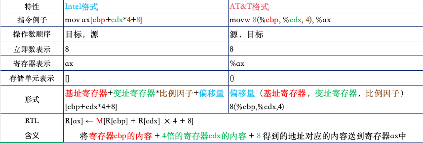

汇编格式指令为：  
`op src, dst  // op：操作 src：源 dst：目标`  

含义为：  
`dst ← dst op src // 目标 与 源 进行操作 然后送到目标`

**例如：**
```
addl (,%ebx,2),%eax
的含义为：
R[eax] ← R[eax]+M[R[ebx]×2]
```

### 考点六、数据类型及格式

C语言基本数据类型和IA-32操作数类型的对应关系

| C语言声明                                                | Intel操作数类型       | 汇编指令长度后缀 | 存储长度/位 |
|------------------------------------------------------|-----------------------|------------------|-------------|
| <span style="color:red;">(unsigned) char</span>      | 整数/字节             | b                | 8           |
| <span style="color:red;">(unsigned) short </span>    | 整数/字               | w                | 16          |
| <span style="color:red;">(unsigned) int </span>      | 整数/双字             | l                | 32          |
| <span style="color:red;">(unsigned) long int </span> | 整数/双字             | l                | 32          |
| (unsigned) long long int                             | -                     | -                | 2×32        |
| <span style="color:red;">char*</span>                     | 整数/双字             | l                | 32          |
| float                                                | 单精度浮点数          | s                | 32          |
| double                                               | 双精度浮点数          | l                | 64          |
| long double                                          | 扩展精度浮点数        | t                | 80/96       |

### 考点七、定点寄存器组

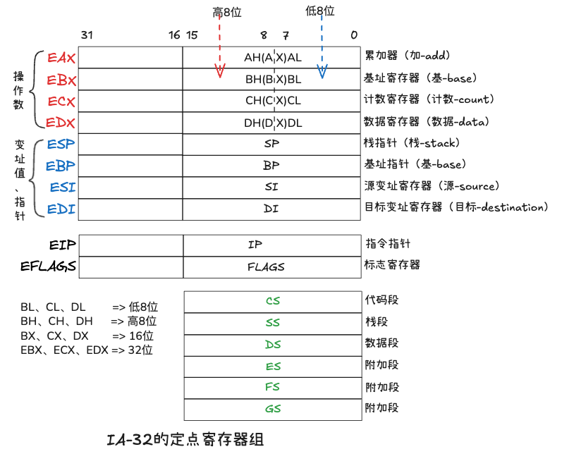

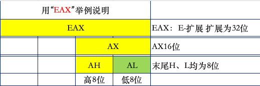

<span style="background-color:yellow;">**助记**</span>：<span style="color:red;">2字母16位，3字母32位，末尾</span><span style="color:dodgerblue;">**L**</span>、<span style="color:dodgerblue;">**H**</span><span style="color:red;">都是</span><span style="color:dodgerblue;">**8**</span><span style="color:red;">位</span>

**同理：**
> B<span style="color:dodgerblue;">L</span>、C<span style="color:dodgerblue;">L</span>、D<span style="color:dodgerblue;">L</span> => 低8位  
> B<span style="color:dodgerblue;">H</span>、C<span style="color:dodgerblue;">H</span>、D<span style="color:dodgerblue;">H</span> => 高8位  
> BX、CX、DX => 16位  
> EBX、ECX、EDX => 32位  

IA-32的定点寄存器组分为三大块：

* 一、8个通用寄存器(通用寄存器组前四个存放：操作数，通用寄存器组后四个存放：变址值、指针)
    * <span style="color:red;">EAX</span>：累加器
    * <span style="color:red;">EBX</span>：基址寄存器
    * <span style="color:red;">ECX</span>：计数寄存器
    * <span style="color:red;">EDX</span>：数据寄存器
    * <span style="color:dodgerblue;">ESP</span>：栈指针寄存器
    * <span style="color:dodgerblue;">EBP</span>：基址指针寄存器
    * <span style="color:dodgerblue;">ESI</span> ：源变址寄存器
    * <span style="color:dodgerblue;">EDI</span> ：目标变址寄存器
* 二、2个专用寄存器
    * EIP：指令指针
    * EFLAGS：标志寄存器
* 三、6个段寄存器
    * CS：代码段
    * SS：栈段
    * DS：数据段
    * ES：附加段
    * FS：附加段
    * GS：附加段

> 通用寄存器组-前四个存放：<span style="color:red;">操作数</span>  
> 通用寄存器组-后四个存放：<span style="color:dodgerblue;">变址值、指针</span>

<span style="color:red;">EAX、EBX、ECX、EDX</span> 主要用来存放<span style="color:red;">**操作数**</span>  
<span style="color:dodgerblue;">ESP、EBP、ESI、EDI</span> 主要用来存放<span style="color:dodgerblue;">**变址值**</span>或<span style="color:dodgerblue;">**指针**</span>

### 考点八、条件标示

#### 1)<span style="color:red;">OF</span>(Overflow Flag)：<span style="color:red;">溢出标示</span>

反映<span style="color:red;">带符号数</span>的运算结果是否超过了相应<span style="background-color:purple;">数值范围</span>。

例如：  
> 对于8位带符号整数，其表示范围是-128 ~ +127，如果计算结果超出了这个范围，就发生了溢出，此时OF=1；否则OF=0
> 
> n位的带符号数，其表示范围是：-2ⁿ⁻¹ ~ 2ⁿ⁻¹ -1  
> n位无符号整数，其表示范围是：0 ~ 2ⁿ-1

#### 2)<span style="color:red;">SF</span>(Sign Flag)：<span style="color:red;">符号标示</span>

反映<span style="color:red;">带符号数</span>运算结果的<span style="background-color:purple;">符号</span>。

负数时，SF=1；否则OF=0

#### 3)<span style="color:red;">ZF</span>(Zero Flag)：<span style="color:red;">零标示</span>

反映运算结果<span style="background-color:purple;">是否为0</span>。若结果位0，ZF=1；否则ZF=0

#### 4)<span style="color:red;">CF</span>(Carry Flag)：<span style="color:red;">进/错位标示</span>

反映<span style="color:red;">无符号整数</span>加（减）运算后的<span style="background-color:purple;">进（借）位情况</span>。

有进（借）位则CF=1；否则CF=0

例如：  
> 在二进制加法中，两个1相加，结果为0并向更高位进位1（1+1=10）,CF=1

例3.4、假设R[ax]=FFFAH，R[bx]=FFF0H，则执行Intel格式指令"add ax，bx"后，AX、BX中的内容各是什么？标志CF、OF、ZF、SF各是什么？要求分别将操作数作为无符号整数和带符号整数来解释并验证指令执行结果。

解析：

```
因为Intel格式指令是：先目标 后源，所以Intel格式指令"add ax，bx"中可知：ax是目标，bx是源
Intel格式指令"add ax，bx" = R[ax]←R[ax] + R[bx]。
R[ax] = R[ax] + R[bx]
R[ax] = FFFAH + FFF0H  // H结尾是16进制数

A（10）+ 0     = A，写 A，进位 0
F（15）+ F（15） = 1E（满16进1=》16+14），写 E，进位 1
F（15）+ F（15） + 进位1 = 15 + 15 + 1 = 31 = 1F，写 F，进位 1
F（15）+ F（15） + 进位1 = 15 + 15 + 1 = 31 = 1F，写 F，进位 1

R[ax] = 1FFEAH // 1-进位 不保留

所以执行Intel格式指令"add ax，bx"后，AX中的内容是1FFEAH，X中的内容（不变）还是FFF0H

标志CF是：进/错位标示，无符号整数加减运算后，是否存在进/借位情况
标志OF是：溢出标示，带符号数运算后是否超出了相应的数值范围
标志ZF是：零标示，运算后运算结果是否为零
标志SF是：符号标示，无符号数运算后的运算结果的符号，0-正 1-负

1、无符号整数

R[ax] = FFFAH = 65530（16进制转10进制）
R[bx] = FFF0H = 65520，
R[ax] + R[bx] = 65530 + 65520 = 131050

n位无符号整数的范围：0 ~ 2ⁿ-1

所以，16位无符号数最大值2¹⁶-1=65535
计算结果：131050比65535大，所以计算结果溢出了，
计算结果1FFEAH有进位，所以进错位标示CF=1
计算结果1FFEAH，不是0，所以零标示ZF=0

至于“溢出标示”和“符号标示” 是反映有符号数的计算结果的，所以无值

2、有符号整数（补码表示）

求R[ax] = FFFAH的真值

先转二进制（一拆四）
FFFAH = 1111 1111 1111 1010
符号位是1，则为负数
补码求真值的简便方法：数值部分：各位取反、末位+1
= 1111 1111 1111 1010
= -000 0000 0000 0101
= -000 0000 0000 0101 + 1
= -000 0000 0000 0110
转十进制数
= -（1×2² + 1×2¹ + 0×2⁰）
= -（4 + 2 + 0）
= -6

求R[bx] = FFF0H的真值
先转二进制（一拆四）
FFF0H = 1111 1111 1111 0000
符号位是1，所以是负数-
补码求真值的简便方法：数值部分：各位取反、末位+1
= 1111 1111 1111 0000
= -000 0000 0000 1111
= -000 0000 0000 1111 + 1
= -000 0000 0001 0000
转十进制数
= -（1×2⁴ + 0×2³ + 0×2² + 0×2¹ + 0×2⁰）
= -（16 + 0 + 0 + 0 + 0）
= -16

R[ax] + R[bx] = -6 + (-16) = -22

n位带符号整数的范围：-2ⁿ⁻¹ ~ (2ⁿ⁻¹ - 1)
16位带符号整数的范围就是：-2¹⁵ ~ (2¹⁵ - 1) => -32768 ~ 32767

计算结果-22在范围内，所以没有发生溢出，溢出标示OF=0

计算结果-22是负数，所以符号标示SF=1

计算结果-22不是零，所以零标示ZF=0

进/错位标示是反映无符号整数加减运算后计算结果是否有进借位情况的，所以无效。
```

### 考点九、定点算术运算指令

* 1)<span style="color:red;">加/减</span>运算指令 例如：`ADD(+) SUB(-)`
* 2)<span style="color:red;">增/减</span>运算指令 例如：`INC(++) DEC(--)`
* 3)<span style="color:red;">取负</span>指令  例如：`NED(-)`
* 4)<span style="color:red;">比较</span>运算指令  例如：`CMP(<,<=,>,>=)`
* 5)<span style="color:red;">乘/除</span>运算指令

例如：
```
MUL(*)	无符号整数
IMUL(*)  带符号整数
DIV(/,%)  无符号整数
IDIV(/,%)  无符号整数
```

定点算术运算指令汇总

| 指令 | 显式操作数 | 影响的标志 | 操作数类型 | AT&T指令助记符         | 对应C运算符 |
|------|------------|------------|------------|-------------------|-------------|
| ADD | 2个 | OF、ZF、SF、CF | 无/带符号整数 | addb、 addw、 addl  | ＋ |
| SUB | 2个 | OF、ZF、SF、CF | 无/带符号整数 | subb、subw、subl    | － |
| INC | 1个 | OF、ZF、SF | 无/带符号整数 | incb、incw、incl    | ＋＋ |
| DEC | 1个 | OF、ZF、SF | 无/带符号整数 | decb、decw、decl    | －－ |
| NEG | 1个 | OF、ZF、SF、CF | 无/带符号整数 | negb、negw、negl    | － |
| CMP | 2个 | OF、ZF、SF、CF | 无/带符号整数 | cmpb、cmpw、cmpl    | <,<=,>,>= |
| MUL | 1个 | OF、CF | 无符号整数 | mulb、 mulw、mull   | * |
| IMUL | 1个 | OF、CF | 带符号整数 | imulb、imulw、imull | * |
| IMUL | 2个 | OF、CF | 带符号整数 | imulb、imulw、imull | * |
| IMUL | 3个 | OF、CF | 带符号整数 | imulb、imulw、imull | * |
| DIV | 1个 | 无 | 无符号整数 | divb、divw、divl    | /,% |
| IDIV | 1个 | 无 | 带符号整数 | idivb、idivw、idivl | /,% |

**习题**

1、下列不属于IA-32定点算术运算指令的是（<span style="color:red;">B</span>）

* A：ADD/SUB
* B：<span style="color:red;">IN/OUT</span>
* C：MUL/IMUL
* D：INC/DEC

例3.5、假设R[eax]=0000 00B4H，R[ebx]=0000 0011H，M[0000 00F8H]=0000 00A0H，
请问：
1、执行指令"mulb%bl"后，哪些寄存器的内容会发生变化?与执行"imulb%bl"指令所发生的变化是否一样？为什么？
两条指令得到的CF和OF标志各是什么？请用该例给出的数据验证你的结论。

2、执行指令"imull $-16，(%eax，%ebx，4)，%eax"后哪些寄存器和存储单元发生了变化？乘积的机器数和真值各是多少？

解析：

```
1、
指令"mulb %bl" 是无符号整数 乘法运算
mul：无符号乘法
b：8位（byte）
隐含操作数：
 乘数：BL
 被乘数：AL
结果存放：AX(AH:AL)
指令mulb %bl 
= R[ax] ←R[al] × R[bl] 
= AL × BL → AX

R[eax]=0000 00B4H 可得：
AL = B4H
十六进制数转十进制数：B4H = B × 16¹ + 4 × 16⁰  = 11 × 16 + 4 = 180

R[ebx]=0000 0011H 可得：
BL = 11H
十六进制数转十进制数：11H = 1 × 16¹ + 1 × 16⁰  = 16 + 1 = 17

所以执行指令"mulb %bl"后，内容会发生变化的寄存器是AX

R[ax] = B4H × 11H = 0BF4 // 补0
   B4
×  11
-----
   B4
  B4
------
 0BF4 

R[ax] = 180 × 17 = 3060 // 十进制数

AX = 0BF4
AH = 0B
AL = F4

AH = 0B ≠ 0，高位（AH）≠ 0 → 溢出，所以：CF=1，OF=1

指令"imulb %bl" 是有符号整数 乘法运算
= R[ax] ←R[al] × R[bl] 
= AL × BL → AX

R[eax]=0000 00B4H 可得：
AL = B4H // 一拆四转二进制数
AL = 1011 0100 // 求真值 1-负 so 数值位取反 末位+1
AL = 1100 1011 + 1
AL = 1100 1100
AL = -(1×2⁶ + 1×2³ + 1×2²)
AL = -(64 + 8 + 4)
AL = -(76)

R[ebx]=0000 0011H 可得：
BL = 11H
BL = 0001 0001 // 求真值 0-正 所以 直接转二进制不取反
BL = (1×2⁴ + 1×2⁰)
BL = （16 + 1）
BL = 17

−76×17=−1292
乘积结果被存入 16 位寄存器 AX，并且按照有符号数的补码形式存储，所以需要通过真值得到16位的补码
真值求补码：负数，符号位取1，数值部分：各位取反，末位加1

1292转十六位的二进制数：
0000 0101 0000 1100
1111 1010 1111 0011 // 取反
1111 1010 1111 0011 + 1 // 末位+1
1111 1010 1111 0100 // 四合一 转十六进制

FAF4H

AX = FAF4
AH = FA
AL = F4

CF = OF = 1

执行指令"mulb %bl"和执行"imulb %bl"指令都会修改寄存器AX的内容，但是变化是不一样的，mulb 产生无符号乘积 0BF4H，而 imulb 产生有符号乘积 FAF4H，二者数值不同，所以 EAX 的结果不同。

2、指令"imull $-16，(%eax，%ebx，4)
的功能：R[eax]←(-16) × M[R[eax] + 4×R[ebx]] // -16为立即数

M[R[eax] + 4×R[ebx]]所在的存储单元地址为：
R[eax] + 4×R[ebx]
=B4H + 4×11H
=B4H + 44H
=F8H
=0000 00F8H

题目给出：M[0000 00F8H]=0000 00A0H
M[0000 00F8H]
=0000 00A0H
=（A×16¹ + 0×16⁰）
=(10×16¹ + 0×16⁰)
=（160 + 0）
=160

(-16) × M[R[eax] + 4×R[ebx]]
= （-16） × 160
= -2560

相乘后的运算结果是一个负数 ，所以乘积的符号为负（0-正 1-负）

2560转十六进制数：2560 ÷ 16 = 160 余 0，160 ÷ 16 = 10 余 0，10 ÷ 16 = 0 余 10（A），即：A00
32位：0000 0A00H

对其各位取反 末位+1
0000 0A00H
0000 0000 0000 0000 0000 1010 0000 0000 // 一拆四 转二进制
1111 1111 1111 1111 1111 0101 1111 1111 // 各位取反
1111 1111 1111 1111 1111 0101 1111 1111 + 1 // 末位+1
1111 1111 1111 1111 1111 0110 0000 0000
F F F F F 6 0 0 H// 转换为十六进制数
FFFF F600H

eax = FFFFF600H
机器数：FFFFF600H 真值：-2560

寄存器eax发生了变化，内存不变，ebx不变
```

### 考点十、寻址方式

根据指令给定信息得到 `操作数` 或者 `操作数地址` 的方式称为**寻址方式**。

* 1） <span style="color:red;">**立即寻址**</span>
  * 立即寻址：指令中直接给出操作数
* 2）<span style="color:red;">**寄存器寻址**</span>
  * 指令中给出操作数所存放的寄存器的编号
* 3）<span style="color:red;">**存储器寻址**</span>
  * <span style="background-color:yellow;"><span style="color:red;">操作数都在存储单元中</span></span>，称为存储器操作数
  * 两种工作模式：
    * 1、实地址模式
    * 2、保护模式

IA-32采用<span style="color:red;">**段页式**</span>虚拟存储管理方式

### 考点十一、浮点寄存器栈和多媒体扩展寄存器组

IA-32的浮点处理架构有两种：

1）**浮点协处理器** <span style="color:red;">**x87架构**</span>
> 它是一种<span style="color:red;">**栈**</span>结构

2）**由MMX发展而来的**<span style="color:red;">**SSE架构**</span>
> 采用 **单指令多数据**（Single Instruction Multi Data, <span style="color:red;">SIMD</span>）技术

### 考点十二、通用数据传送指令

**MOV**：一般的传送指令，包括：mov<span style="color:red;">b</span>(字节传送-8位)、mov<span style="color:red;">w</span>(字传送-16位)、mov<span style="color:red;">l</span>(双字传送-32位)

**MOV**<span style="color:red;">**S**</span>：<span style="color:dodgerblue;">**符号**</span><span style="color:red;">**扩展传送指令**</span>，将<span style="color:red;">短</span>的<span style="color:red;">源数据</span>高位**符号扩展**后传送到目的地址 【<span style="background-color:yellow;"><span style="color:red;">带</span></span><span style="color:red;">**符号**</span>】
> 例如：  
> movs<span style="color:red;">b</span><span style="color:dodgerblue;">w</span> %al, %ax：表示把一个<span style="color:red;">字节</span>进行**符号扩展**后送到一个<span style="color:dodgerblue;">16</span>位寄存器中  
> movs<span style="color:red;">b</span><span style="color:dodgerblue;">l</span> %al, %eax：表示把一个<span style="color:red;">字节</span>进行**符号扩展**后送到一个<span style="color:dodgerblue;">32</span>位寄存器中

**MOV**<span style="color:red;">Z</span>：<span style="background-color:yellow;"><span style="color:red;">**零**</span></span><span style="color:red;">**扩展传送指令**</span>，将<span style="color:red;">短</span>的<span style="color:red;">源数据</span>高位**零扩展**后传送到目的地址  【<span style="color:dodgerblue;">**无**</span><span style="color:red;">**符号**</span>】
> 例如：  
> movz<span style="color:red;">w</span><span style="color:dodgerblue;">l</span> %ax, %eax：表示把一个<span style="color:red;">字</span>的高位进行**零扩展**后送到一个<span style="color:dodgerblue;">32</span>位寄存器中

**注意：**
> MOV<span style="color:red;">S</span> 和 MOV<span style="color:red;">Z</span> 指令的<span style="color:red;">目的地址</span>只能是<span style="color:red;">寄存器编号</span>

| 情况    | 用什么          | 原因     |
| ----- | ------------ | ------ |
| 无符号数据 | `MOVZ`（零扩展）  | 高位补0   |
| 有符号数据 | `MOVS`（符号扩展） | 高位补符号位 |

XCHG：数据交换指令，将两个寄存器内容互换。
> 例如：xchg<span style="color:red;">b</span>：表示字节交换

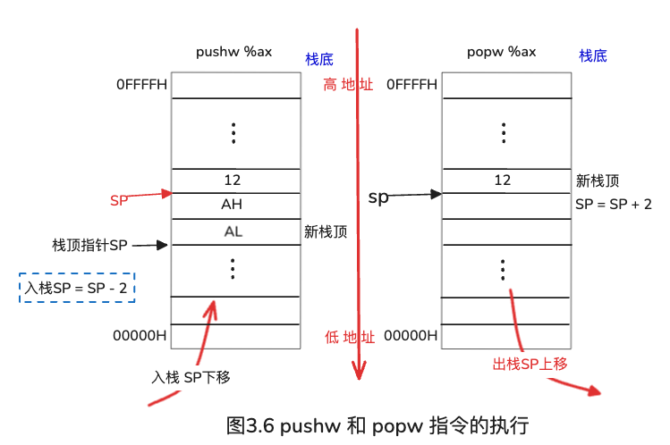

**PUSH**：`入栈`

1. 先执行 **R[sp]←R[sp]**<span style="color:red;">-2</span> （16位的就是-2）或 **R[esp]←R[esp]**<span style="color:red;">-4</span>（32位的就是-4）
2. 然后将一个 <span style="color:red;">字(2)</span>或<span style="color:red;">双字(4)</span>从指定寄存器送到SP或ESP指示的栈单元中

例如：
> push<span style="color:red;">l</span> 表示<span style="color:red;">双字</span>压栈，push<span style="color:red;">w</span> 表示字压栈

**POP**：【PUSH的<span style="background-color:red;">反操作</span>】 `出栈`

1. 将一个<span style="color:red;">字</span>或<span style="color:red;">双字</span>从SP或ESP指示的栈单元送入指定寄存器
2. 再执行**R[sp]←R[sp]**<span style="color:red;">+2</span> 或 **R[esp]←R[esp]**<span style="color:red;">+4</span>

例如：
> pop<span style="color:red;">l</span> 表示<span style="color:red;">双字</span>出栈，pop<span style="color:red;">w</span> 表示<span style="color:red;">字</span>出栈

<span style="background-color:yellow;"><span style="color:red;">**栈**</span></span>（**Stack**）是一种采用“<span style="color:red;">先进后出</span>”方式进行访问的一块存储区，在处理过程调用时非常有用。
大多数情况下，栈是从<span style="color:red;">高地址</span>向<span style="color:red;">低地址</span>增长的。

**习题**

1、下列说法不正确的是（<span style="color:red;">C</span>）

A：变址寻址时，有效数据存放在内存中
B：数据交换指令，将两个寄存器内容互换
C：堆栈指针SP的内容表示当前堆栈内所存储的数据的个数
D：内存中指令的寻址和数据的寻址是交替进行的

解析：
`堆栈指针SP指向栈顶，并不是存储的数据个数`

2、栈是一种采用（先进先出）方式进行访问的一块存储区，在执行pushw% ax指令之后，SP指向存放有AX内容的单元，即当前刚入栈的（数据）。

3、简述栈在处理过程调用时的作用，并列举16位架构下可用的栈相关指令。

```
栈是一种采用“先进后出”方式进行访问的一块存储区，在处理过程调用时非常有用。大多数情况下，栈是从高地址向低地址增长的。
16位架构下有pushw 和 popw 指令分别表示入栈合并出栈。
```

例3.3、假设变量val和ptr的类型声明如下：
```
val_type val;
contofptr_type *ptr;
```
已知上述类型val_type和contofptr_type是用typedef声明的数据类型，且val存储在累加器AL/AX/EAX中，ptr存储在EDX中。现有以下两条C语言语句：
```
1 val=(val_type) *ptr;
2 *ptr=(contofptr_type) val;
```
当val_type和contofptr_type是表3.3中给出的组合类型时，应分别使用什么样的MOV指令来实现这两条C语言？要求用GCC默认的AT&T形式写出。

表3.3 例3.3中val_type和contofptr_type的类型

| val_type【寄存器】 | contofptr_type【内存】 |
|----------|----------------|
| char | char |
| int | char |
| unsigned | int |
| int | unsigned char |
| unsigned | unsigned char |
| unsigned short | int |

**解析：**

**非常重要**：绝大多数<span style="color:red;">AT&T</span>格式的指令后缀，就是由「<span style="color:red;">**寄存器**</span>」决定宽度。

由题目：<span style="color:red;">val</span>存储在累加器AL/AX/EAX中  
可知：<span style="color:red;">val</span> 存储在累加器 AL/AX/EAX中 对应的位数：8位/16位/32位  
从<span style="color:red;">寄存器</span>取值，**AT&T** 用%AL%AX%EAX

由题目：ptr存储在EDX中  
可知：<span style="color:red;">ptr</span>存储在EDX（数据寄存器）中，对应的位数：32位

<span style="background-color:yellow;"><span style="color:red;">*（指针）</span></span>可以看做是<span style="color:red;">取值</span>操作，从<span style="color:red;">主存</span>取值  
AT&T格式的指令从<span style="color:red;">主存</span>取值用<span style="color:red;">小括号()</span>：AT&T<span style="color:red;">(</span>%EDX<span style="color:red;">)</span>

```
1、第一条C语言语句：val=(val_type) *ptr;
解读为：*ptr指针 强制转换为 val_type 类型 并赋值给val

序号1：char => char 都是8位，用字节传送：movb
movb(%edx), %al  # 传送

序号2：char（8） => int（32） ，没有unsigned修改默认是符号扩展的用MOVS
movsbl(%edx), %eax # 符号扩展，传送

序号3：int（32） => unsigned (32) 都是32位的【unsigned 也就是 unsigned int】，直接用双字传送movl传送即可
movl(%edx), %eax # 传送

序号4：unsigned char(8) => int(32) 无符号的8位char类型转到有符号32位int类型，由小到大要扩展，用零扩展
movzbl(%edx), %eax # 零扩展 传送

序号5：unsigned char(8) => unsigned(32) 无符号的8位char类型转到无符号32位int类型，由小到大要扩展，用零扩展
movzbl(%edx), %eax # 零扩展 传送

序号6：int（32） => unsigned short(16) 有符号32位int类型转到无符号的16位short类型，直接截断传送,16位用ax
movw(%edx), %ax

2、第二句C语言语句：*ptr=(contofptr_type) val;
解读为：val 强制转换为 contofptr_type 类型 并赋值给指针*ptr

序号1：char => char 都是8位，用字节传送：movb
movb %al, (%edx) # 传送

序号2：int（32） => char(8) 有符号的32位int转到有符号的8位char，截断传送 char是8位，传送时int32位 只截取低8位 al即可 
movb %al, (%edx) # 截断 传送

序号3：unsigned(32) => int(32), unsigned就是unsigned int 也就是无符号的32位 转到有符号的32位int
movl %eax, (%edx) # 直接传送

序号4：int(32) => unsigned char(8位) 由有符号的32位int转到无符号的8位char 截取低8位然后传送
movb %al, (%edx)

序号5：unsigned(32) => unsigned char(8) 由无符号的int（32）转到无符号的8位char 截取低8位然后传送
movb %al, (%edx)

序号6：unsigned short（16） => int(32) 由无符号的16位short 转到 有符号的32位int，不能直接扩展到32位直接传送，因为：【扩展指令：符号扩展指令movs和零扩展指令movz的目的地址只能是寄存器编号，指针ptr是主存】所以分两步：1、需要先扩展到32位 2、再传送
movzwl %ax, %eax # 先零扩展到32位
movl %eax, (%edx) # 再传送
```

扩展指令：符号扩展指令movs和零扩展指令movz的**目的地址**只能是**寄存器编号**，指针ptr是主存

| 序号 | val_type | contofptr_type | 语句1对应的指令及操作contofptr_type=>val_type | 语句2对应的指令及操作val_type=>contofptr_type |
|------|----------|----------------|---------------------------------------------|---------------------------------------------|
| 1 | char | char | movb(%edx), %al  # 传送 | movb %al, (%edx) # 传送 |
| 2 | int | char | movsbl(%edx), %eax # 符号扩展，传送 | movb %al, (%edx) # 截断 传送 |
| 3 | unsigned | int | movl(%edx), %eax # 传送 | movl %eax, (%edx) # 直接传送 |
| 4 | int | unsigned char | movzbl(%edx), %eax # 零扩展 传送 | movb %al, (%edx) |
| 5 | unsigned | unsigned char | movzbl(%edx), %eax # 零扩展 传送 | movb %al, (%edx) |
| 6 | unsigned short | int | movw(%edx), %ax | movzwl %ax, %eax # 先零扩展到32位<br>movl %eax, (%edx) # 再传送 |

### 考点十三、地址传送指令

**LEA**(<span style="color:red;">L</span>oad <span style="color:red;">E</span>ffect <span style="color:red;">A</span>ddress)：加载<span style="color:red;">有效</span>地址

例如：

> leal 8(%ecx, %edx, 4), %eax    # R[eax]←R[ecx] + R[edx] × 4 + 8      <span style="color:red;">传地址</span>  
> movl 8(%ecx, %edx, 4), %eax    # R[eax]←<span style="color:red;">M[</span>R[ecx] + R[edx] × 4 + 8<span style="color:red;">]</span>   <span style="color:red;">传值</span>

例3.2、将以下Intel格式的汇编指令转换位GCC默认的AT&T格式汇编指令。说明每条指令的含义。

```
1 push ebp
2 mov  ebp, esp
3 mov  edx,DWORD PTR [ebp+8]
4 mov  bl,255
5 mov  ax,WORD PTR[ebp+edx*4+8]
6 mov  WORD PTR [ebp+20], dx
7 lea  eax, [ecx+edx*4+8]
```

**解析：**

* Intel格式指令是：目的、源
* AT&T格式指令是：源、目的

<span style="background-color:yellow;"><span style="color:red;">**非常重要**</span></span>：绝大多数**AT&T**指令后缀，就是由【<span style="color:red;">**寄存器**</span>】决定宽度。

```
1、push ebp 
push操作分两步：
第一步：预留空间，入栈时高地址向低地址移动， ebp是基址寄存器 32位，所以预留空间：栈指针esp - 4
第二步：把基址寄存器压到栈里面实现入栈，此时栈顶就是基址寄存器 内存操作M[](栈内存)
32位用双字压栈pushl

push ebp => pushl %ebp  # R[esp]←R[esp]-4 预留空间 M[R[esp]]←R[ebp] 双字压栈

2、mov  ebp, esp
AT&T格式指令与Intel格式指令（源、目的）正好相反，且是32位 双字

mov  ebp, esp => movl %esp, %ebp # R[ebp]←R[esp]

3、mov  edx,DWORD PTR [ebp+8]   
edx32位的  用双字传送movl
双字指针DWORD PTR 
Intel格式指令中中括号[]表示是内存操作，在AT&T格式指令中是小括号()
+8 是偏移量


mov  edx,DWORD PTR [ebp+8] => movl 8(%ebp), %edx # R[edx]←M[R[ebp]+8] 双字

4、mov  bl,255
bl 8位寄存器 所以用字节传送 movb
255是个立即数，立即数AT&T格式指令中前面用$

mov  bl,255 => movb $255, %bl #R[bl]←255， 字节

5、mov  ax,WORD PTR[ebp+edx*4+8]
ax 16位 目标 后缀看寄存器位数 所以用字传送movw
WORD PTR 一个字 指针 16位

mov  ax,WORD PTR[ebp+edx*4+8] => movw 8(%ebp,%edx,4), %ax #R[ax]←M[R[ebp]+R[EDX]×4+8]

6、mov  WORD PTR [ebp+20], dx
dx 16位寄存器 所以用字传送movw
WORD PTR 一个字 指针 16位

mov  WORD PTR [ebp+20], dx => movw %dx, 20(%ebp) # M[R[ebp]+20]←R[dx] 字传送

7、lea  eax, [ecx+edx*4+8]
lea 加载有效地址，传地址
eax 32位寄存器 目标 用leal 
[ecx+edx*4+8] 源

lea  eax, [ecx+edx*4+8] => leal 8(%ecx,%edx,4), %eax #R[eax]←R[ecx]+R[edx]×4+8 双字
```

| 序号 | Intel格式的汇编指令 | AT&T格式的汇编指令 | AT&T指令说明 |
|------|-------------------|-------------------|--------------|
| 1 | push ebp | pushl %ebp | R[esp]←R[esp]-4,M[R[esp]]←R[ebp] |
| 2 | mov  ebp, esp | movl %esp, %ebp | R[ebp]←R[esp] |
| 3 | mov  edx,DWORD PTR [ebp+8] | movl 8(%ebp), %edx | R[edx]←M[R[ebp]+8] |
| 4 | mov  bl,255 | movb $255, %bl | R[bl]←255 |
| 5 | mov  ax,WORD PTR[ebp+edx*4+8] | movw 8(%ebp,%edx,4), %ax | #R[ax]←M[R[ebp]+R[EDX]×4+8] |
| 6 | mov  WORD PTR [ebp+20], dx | movw %dx, 20(%ebp) | M[R[ebp]+20]←R[dx] |
| 7 | lea  eax, [ecx+edx*4+8] | leal 8(%ecx,%edx,4), %eax | R[eax]←R[ecx]+R[edx]×4+8 |

### 考点十四、移位指令

<span style="color:red;">**左**</span>**移：**

1）<span style="color:red;">**SHL：逻辑左移**</span>，每左移一位，最高位送入CF，并在低位补0。<span style="background-color:yellow;">**【<span style="color:red;">无</span>符号数】**</span>

例如：

> 原数：0000<span style="color:red;">1010</span>(十进制10)左移1位(x<span style="color:red;">2¹</span>)，低位补0，最高位(0)送入CF  【<span style="color:dodgerblue;">左移2位(x2²) </span>】
> 结果：000<span style="color:red;">1010</span><span style="color:blue;">0</span>(十进制20)：10 × 2¹ = 20  
> 标志位变化：CF=0

2）<span style="color:red;">**SAL：算术左移**</span>，每左移一位，最高位送入CF，并在低位补0。<span style="background-color:yellow;">**【<span style="color:red;">带</span>符号数】**</span>  
如果移位前后<span style="color:red;">符号位发生变化</span>，则OF=1，表示左移后结果溢出。**这是SAL与SHL的不同之处**。

例如：

> 原数：0000<span style="color:red;">1010</span>(十进制+10)左移1位(x<span style="color:red;">2¹</span>)，低位补0，最高位(0)送入CF  
> 结果：000<span style="color:red;">1010</span><span style="color:blue;">0</span>(十进制+20)  
> 标志位变化：CF=0，OF=0(移位前符号位是0，移位后还是0，无变化 → 不溢出)

<span style="color:dodgerblue;">**右**</span>**移：**

1）<span style="color:blue;">**SHR：逻辑右移**</span>，每右移一次，最低位送入CF，并在高位补0。<span style="background-color:yellow;">**【<span style="color:red;">无</span>符号数】**</span>

例如：

> 原数：1101001<span style="color:red;">1</span>（十进制 211）→右移一位（÷<span style="color:red;">2¹</span>），高位补0，最低位（<span style="color:red;">1</span>）送入CF  
> 结果：<span style="color:blue;">0</span>1101001（十进制 105） 211/2¹=105 取整  
> 标志位变化：CF = <span style="color:red;">1</span>

2）<span style="color:blue;">**SAR：算术右移**</span>，每右移一次，操作数的最低位送入CF，并在高位<span style="color:red;">补符号位</span>。<span style="background-color:yellow;">**【<span style="color:red;">带</span>符号数】**</span>

例如：

> 原数：1101001<span style="color:red;">1</span>（十进制 -45）→右移一位（÷<span style="color:red;">2¹</span>），高位补0，最低位（<span style="color:red;">1</span>）送入CF  
> 结果：<span style="color:blue;">1</span>1101001（十进制 -23）  -45/2¹=-23 取整  
> 标志位变化：CF = <span style="color:red;">1</span>

<span style="background-color:yellow;"><span style="color:red;">注意：</span></span>  
211/2=105、-45/2<span style="color:red;">向下取整</span>（符合有符号数除法逻辑）

> 向下取整（floor）是取小于或等于该数的最大整数  
> -45/2=-22.5 向下取整为-23

例3.6、假设short型变量x被编译器分配在寄存器AX中，R[ax] = FF80H，则以下汇编代码段执行后变量x的机器数和真值分别是多少？

```
movw    %ax, %dx
salw    $2, %ax
addw    %dx, %ax
sarw    $1, %ax
```

解析：

这里的汇编代码段默认是AT&T格式的指令，即操作数顺序：源 目标
$2、$1 分别表示立即数2和立即数1

```
1、movw    %ax, %dx => R[dx] ← R[ax]  
字传送指令movw R[ax] 传递给 R[dx] 将AX寄存器的值复制到 DX 寄存器中。传送后，AX 的内容保持不变，DX 的内容被更新为与 AX 相同的值。R[dx] = FF80H

2、salw    $2, %ax    
算术左移 宽度为word（16位） $2 立即数，表示移动位数是2 %ax是目标操作数 ax寄存器（16位）
将ax寄存器内容采用 算术左移2位，空出的低位补0
R[ax] = FF80H  // 一拆四转二进制
R[ax] = 1111 1111 1000 0000  // 执行算术左移2位，高位丢弃11 低位补0
R[ax] = 1111 1110 0000 0000  // 四合一转二进制数
R[ax] = FE00H

3、addw    %dx, %ax 
addw是16位的加运算（操作数宽度为word 16位） R[ax] = R[ax] + R[dx] dx寄存器值 加 AX寄存器，结果存回 AX 寄存器中
R[ax] = R[ax] + R[dx]
R[ax] = FE00H + FF80H
R[ax] = 1FD80H //产生进位CF=1
R[ax] = FD80H

4、sarw    $1, %ax
sarw 是算术右移，操作数宽度为word（16位）
$1 是立即数，表示右移1位
%ax是目标寄存器

该指令的意思是将ax寄存器的内容算术右移1位，最低位送入CF 最高位补 符号位
R[ax] = FD80H // 一拆四 转二进制数
R[ax] = 1111 1101 1000 0000 // 右移1位
R[ax] = 1111 1110 1100 0000 // 四合一转十六进制
R[ax] = F E C 0
R[ax] = FEC0H

机器数：FEC0H (对应的二进制数：1111 1110 1100 0000）

若符号位为1，则真值的符号为负数，数值部分：各位取反，末位加1

真值 = 1111 1110 1100 0000
真值 = 1000 0001 0011 1111 // 数值部分各位取反
真值 = 1000 0001 0011 1111 + 1 // 末位+1
真值 = 1000 0001 0100 0000
真值 = -（1 × 2⁸ + 1 × 2⁶）
真值 = -（256 + 64）
真值 = -320
```

这里假设R[ax] = FF80H = x
指令1：movw    %ax, %dx =》 R[dx]←R[ax]

ax寄存器内容值传送到dx寄存器，此时R[ax] =R[dx]= x

指令2：salw    $2, %ax =》R[ax]←R[ax]<<2（或 R[ax]←R[ax] × 2²）

sal 算术左移 salw左移宽度为word（16位），$2立即数表示左移2位，
R[ax]  = R[ax] × 2²
R[ax] = 4x

指令3：addw    %dx, %ax =》R[ax] ← R[ax] + R[dx]

addw是16位的加运算，dx寄存器内容值+ax寄存器内容值 的结果放到 ax寄存器中
R[ax] = R[ax] + R[dx]
R[ax] = 4x + x
R[ax] = 5x

指令4：sarw    $1, %ax =》R[ax]←R[ax]>>1 (算术右移，高位补符号位)放入ax寄存器中

sarw算术右移1位，意味着 R[ax]=R[ax]/2=5x/2

上述指令中的后缀w表示：操作数的长度为一个字，16位

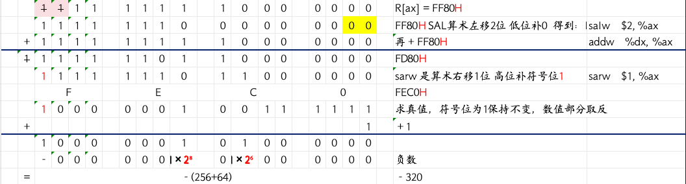

### 考点十五、程序执行流控制指令

#### 1）无条件跳转指令

<span style="background-color:yellow;">JMP</span>的执行结果就是<span style="color:red;">直接跳转</span>到目标地址处执行。

例如：  
`jmp * . L8(,%eax,4)    # R[eip]←M[.L8+R[eax]×4]`

#### 2）条件跳转指令

以<span style="color:red;">标志位</span>或<span style="color:red;">标志组合</span>作为跳转依据。

例如：  
`CF=1 AND ZF=0`

表3.6 条件跳转指令

| 序号 | 指令            | 跳转条件 | 说明 |
|------|---------------|----------|------|
| 1 | jc label      | CF=1 | 有进位/错位 |
| 2 | jnc label     | CF=0 | 五无进位/借位 |
| 3 | je/jz label   | ZF=1 | 相等/等于零 |
| 4 | jne/jnz label | ZF=0 | 不相等/不等于零 |
| 5 | js label      | SF=1 | 是负数 |
| 6 | jns label     | SF=0 | 是非负数 |
| 7 | jo label      | OF=1 | 有溢出 |
| 8 | jno label     | OF=0 | 无溢出 |
| 9 | ja/jnbe label | CF=0 AND ZF=0 | 无符号整数A>B |
| 10 | jae/jnb label | CF=0 OR ZF=1 | 无符号整数A≥B |
| 11 | jb/jnae label | CF=1 AND ZF=0 | 无符号整数A<B |
| 12 | jbe/jna label | CF=1 OR ZF=1 | 无符号整数A≤B |
| 13 | jg/jnle label | SF=OF AND ZF=0 | 带符号整数A>B |
| 14 | jge/jnl label | SF=OF OR ZF=1 | 带符号整数A≥B |
| 15 | jl/jnge label | SF≠OF AND ZF=0 | 带符号整数A<B |
| 16 | jle/jng label | SF≠OF OR ZF=1 | 带符号整数A≤B |

#### 3)条件设置指令

用来将条件标志组合得到的<span style="color:red;">条件值</span>设置到一个8通用寄存器中

例如：  
`setc %dl, 含义：若CF=1，则R[dl] = 1；否则R[dl]=0`

| 指令  | 跳转条件  | 说明  |
|---|---|---|
|  jc label | CF=1  |  有进位/借位 |

#### 4）条件传送指令

如果<span style="color:red;">符合条件</span>就进行传送操作
* 格式：<span style="color:red;">CMOVcc</span> DST, SRC  <span style="background-color:yellow;">【Intel】</span>
* 格式：<span style="color:red;">CMOVcc</span> SRC, DST  <span style="background-color:yellow;">【AT&T】</span>

例如：  
`cmovc %eax, %edx, 含义：若CF=1，则R[edx]←R[eax]; 否则什么都不做`

|  指令 |  跳转条件 |  说明 |
|---|---|---|
| jc label  |  CF=1 |  有进位/借位 |

#### 5）调用和返回指令

1. 调用指令CALL
2. 返回指令RET

#### 6）陷阱指令

重要作用之一：<span style="color:red;">**系统调用**</span>

例3.7、以下各组指令序列用于将变量x和y的某种比较结果记录到CL寄存器。根据以下各组指令序列，分别判断变量x和y在C语言程序中的数据类型，并说明指令序列的功能。

第一组：
```asm
cmpl    %eax, %edx    # R[eax]=x,R[edx]=y
setb    %cl
```

第二组：
```asm
cmpl    %eax, %edx    # R[eax]=x,R[edx]=y
setne   %cl
```

第三组：
```asm
cmpw    %ax, %dx    # R[ax]=x,R[dx]=y
setl    %cl
```

第四组：
```asm
cmpb    %al, %dl    # R[al]=x,R[dl]=y
setae   %cl
```

解：

setcc 的分类

| 指令    | 含义                | 类型   |
| ----- | ----------------- | ---- |
| setb  | below（小于）         | 无符号  |
| setae | above or equal（≥） | 无符号  |
| setl  | less（小于）          | 有符号  |
| setne | not equal（≠）      | 无关符号 |

CMP指令通过执行 <span style="color:red;">减法</span> 来设置条件标志位，每组中的第二条SETcc指令中使用的条件标志都是由x和y相减后设置的。

AT&T格式的cmp比较指令，操作数顺序：源，目的

```asm
第一组指令：cmpl l就代表是32位的
setb：无符号整数比较 小于（below）
变量x和y的类型：unsigned int、unsigned long或指针型数据
指令序列的功能：判断无符号变量x、y的小于比较

第二组指令：cmpl l就代表是32位的
setne 不相等比较，和符号无关
变量x和y的类型：int、unsigned int、long、unsigned long或指针型数据
指令序列的功能：判断变量x、y不相等比较

第三组指令：cmpw w就表示是16位的
setl 是有符号小于（less）
变量x和y的类型：short 16位的有符号就是short
指令序列的功能：带符号16位整数的小于比较

第四组指令：cmpb b就表示是8位
setae 是无符号的≥比较
变量x和y的类型：unsigned char、char(C语言标准没有明确规定char是带符号还是无符号整数，因此，编译器将char型变量作为无符号整数类型处理)
指令序列的功能：无符号8位整数大于等于比较
```

例3.8、以下各组指令序列用于测试变量x的某种特性，并将测试结果记录到CL寄存器。根据以下各组指令序列，分别判断数据x在语言中的数据类型，并说明指令序列的功能。

第一组：
```asm
testl    %eax, %eax    # R[eax]=x
sete     %cl
```

第二组：
```asm
testl    %eax, %eax    # R[eax]=x
setge    %cl
```

第三组：
```asm
testw    %ax, %ax    # R[ax]=x
setns    %cl
```

第四组：
```asm
testb    %al, $15    # R[al]=x
setz     %cl
```

解：
test = 按位与（AND）运算 + 不保存结果 + 只改标志位
test指令执行后，不会发生溢出，不会发生进/借位，所以OF=CF=0，零标志ZF和符号标志SF则看两个操作数相“与”的结果来设置，若按位与的结果为0，则ZF=1；若最高位为1，则SF=1

| 标志位              | 含义         |
| ---------------- | ---------- |
| ZF (Zero Flag)   | 结果是否为0     |
| SF (Sign Flag)   | 结果最高位（符号位） |
| CF               | 永远清0       |
| OF               | 永远清0       |

第一、二、三组的test指令执行后，x与x自身相与后，就是x本身。

第一组指令
> testl    %eax, %eax l说明是32位的test指令    
> 指令sete对应表3.6中的3号指令，设置条件为ZF=1，因此是对位串x判断是否等于0  
> 变量x的数据类型：int、unsigned int、long、unsigned long、或指针型数据

第二组指令
> testl  l就说明是32位的  
> 指令setge对应表3.6中的14号指令，设置条件为SF=OF OR ZF=1，因为OF=0，所以设置条件转为：SF=0 OR ZF=1  
> SF=0(符号标志，最高位是1SF=1，否则SF=0，说明是非负数)  
> 判断变量x是否为非负数 或者 是否为0，说明是带符号整数大于等于0的比较  
> 变量x的数据类型：int、long

第三组指令
> testl  w就说明是16位的  
> 指令setns对应表3.6中的6号指令，设置条件为SF=0  
> 说明是带符号整数是否为非负数比较，即判断变量x是否大于等于0  
> 变量x的数据类型：short

第四组指令  

> testb  b就说明是8位的  
> test指令对变量x和立即数15 进行按位与运算，析取x的低4位，x为8位数据  
> 指令setz对应表3.6中的3号指令，设置条件为ZF=1，因而是对test指令析取出的4位位串判断是否为0  
> 即判断x的低4位是否为0  
> 变量x的数据类型：char、unsigned char、signed char  

### 考点十六、过程调用

过程P调用过程Q，P为<span style="color:red;">**调用者**</span>（Caller），Q为<span style="color:red;">**被调用者**</span>（Callee）

过程调用的执行步骤如下：

* 1）P将入口<span style="color:red;">参数（实参）</span>放到Q能访问到的地方
* 2）P将<span style="color:red;">返回地址</span>存到特定的地方，然后将控制转移到Q
* 3）Q保存P的现场，并为自己的<span style="color:red;">非静态局部变量分配空间</span>
* 4）<span style="color:red;">执行</span>Q的过程体（函数体）
* 5）Q恢复P的现场，并<span style="color:red;">释放局部变量所占空间</span>
* 6）Q<span style="color:red;">取出返回地址</span>，将控制转移到P

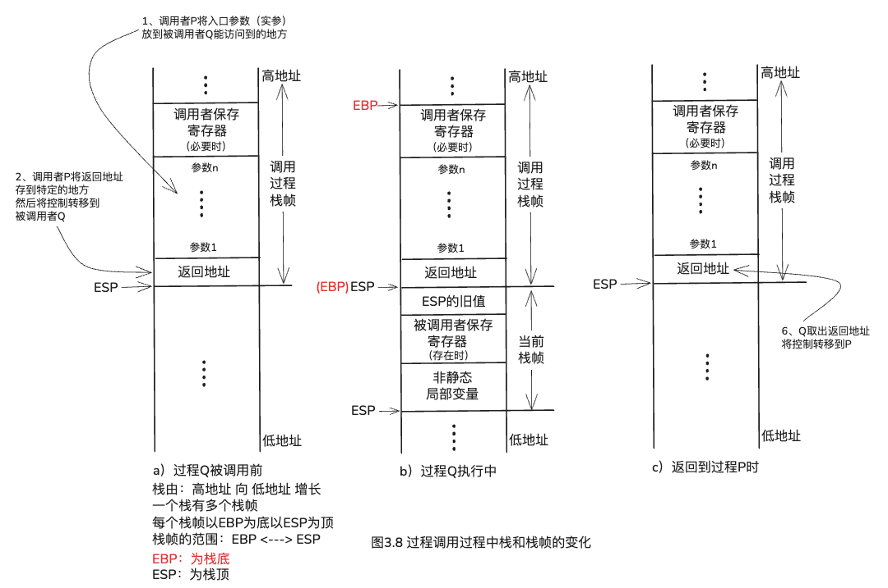

下面以一个最简单的例子来说明过程调用的机器级实现。假定有一个函数add实现两个数相加，另一个过程caller调用add，以计算125+80的值，对应的C语言程序如下：
```
int add(int x, int y){
    return x+y;
}

int caller(){
    int temp1 = 125;
    int temp2 = 80;
    int sum = add(temp1, temp2);
    return sum;
}
```
经GCC编译后caller过程对应的代码如下（# 后面的文字是注释）
```asm
caller:
    pushl    %ebp              #压栈
    movl     %esp,%ebp         #ebp内容 放到 esp中
    subl     $24,%esp          #esp = esp-24(4*6=24)
    movl     $125,-12(%ebp)    #M[R[ebp]-12]125,即 templ=125
    movl     $80,-8(%ebp)      #M[R[ebp]-8]80,即temp2=80
    movl     -8(%ebp),%eax     #R[eax]←M[R[ebp]-8],即R[eax]=temp2
    movl     %eax,4(%esp)      #M[R[esp]+4]←R[eax],即temp2入栈
    movl     -12(%ebp),%eax    #R[eax]←M[R[ebp]-12],即R[eax]=templ
    movl     %eax,(%esp)       #M[R[esp]]←R[eax],即templ入栈
    call     add               #调用add，将返回值保存在EAX中
    movl     %eax,-4(%ebp)     #M[R[ebp]-4]←R[eax],即add返回值送sum
    movl     -4(%ebp),%eax     #R[eax]←M[R[ebp]-4],即sum作为caller返回值
    leave                      
    ret                        #返回caller的调用者
```

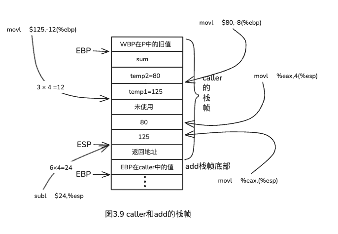

### 考点十七、值传递和地址传递

总体来说分为两种：

* 1）按<span style="color:red;">**值传递**</span>
  * 当形参是**基本类型**变量名时，采用<span style="color:red;">按值传递</span>方式
* 2）按<span style="color:red;">**地址传递**</span>
  * 当形参是**指针类型**变量名或**构造类型**变量名时，采用<span style="color:red;">按地址传递</span>方式

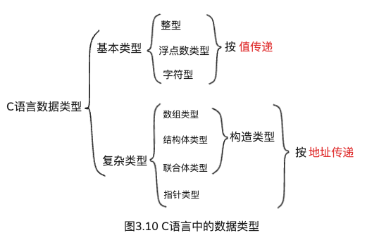

### 考点十八、选择语句

例3.9、以下是一个C语言函数：

```asm
int get_lowaddr_content(int *p1, int *p2){
    if(p1 > p2)
        return *p2;
    else
        return *p1;
}
```
已知形式参数p1和p2对应的实参已压入调用过程的栈帧，<span style="color:red;">p1</span>和<span style="color:blue;">p2</span>对应实参的<span style="color:red;">存储地址</span>分别为：<span style="color:red;">R[ebp]+8</span>、<span style="color:blue;">R[ebp]+12</span>，
这里，EBP指向当前栈<span style="color:red;">帧底</span>部，**返回结果**存放在<span style="background-color:yellow;">EAX</span>中，请写出上述函数体对应的汇编代码，要求用GCC默认的AT&T格式书写。

```asm
    movl    8(%ebp),%eax      #R[eax]←M[R[ebp]+8]，即R[eax]=p1
    movl    12(%ebp),%edx     #R[edx]←M[R[ebp]+12]，即R[edx]=p2
    cmpl    %edx,%eax         #比较p1和p2，即根据p1-p2的结果设置标志
    jbe     .L1               #若p1≤p2，则跳转L1处执行
    movl    (%edx),%eax       #R[eax]←M[R[ebp]]，即R[eax]=M[p2]
    jmp     .L2               #无条件跳转到L2处执行
.L1:
    movl    (%eax),%eax       #R[eax]←M[R[eax]]，则R[eax]=M[p1]
.L2
```

### 考点十九、循环语句

C语言中的循环结构有三种：

#### **1）do~while 语句**

先执行loop_body_statement 再判断cond_expr是否满足，满足继续执行loop_body_statement，不满足直接跳出

```
do{
  loop_body_statement
} while (cond_expr)
```

#### **2）while 语句**

判断cond_expr是否满足，满足就执行loop_body_statement，不满足直接跳出
```
while（cond_expr）
  loop_body_statement
```

#### **3）for 语句**

```
for（begin_expr;cond_expr;update_expr）
  loop_body_statement
```

大多数编译程序将这三种循环结构都转换为<span style="color:red;">**do~while**</span>形式结构来<span style="background-color:yellow;"><span style="color:red;">产生机器级代码</span></span>。

例3.10、一个C语言函数被GCC编译后得到的过程体对应的汇编代码如下：

```asm
1    movl    8(%ebp), %ebx
2    movl    $0, %eax
3    movl    $0, %ecx
4  .L12:
5    leal    (%eax,%eax), %edx
6    movl    %ebx, %eax
7    andl    $1, %eax
8    orl     %edx, %eax
9    shrl    %ebx
10   addl    $1 , %ecx
11   cmpl    $32, %ecx
12   jne     .L12
```
该C语言函数的整体框架结构如下：
```c
int func_test(unsigned x) {
    int result=0;
    int i;
    for(__①__;__②__;__③__){
        __④__
    }
    return result;
}
```
请根据对应的汇编代码填写函数中缺失的部分①②③④。

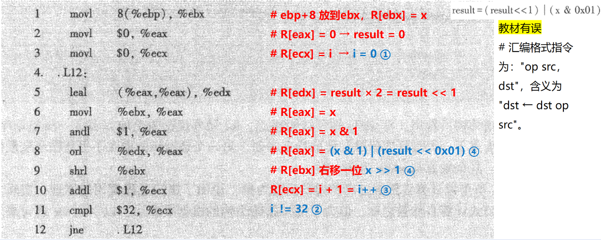

解题：

先逐行解释汇编代码

1    movl    8(%ebp), %ebx

>%ebx 是基址寄存器  
%ebp是基址指针寄存器，%ebp 通常用作帧指针  
从【寄存器ebp的值为基址，加上偏移量8字节得到的地址】中的取出32位的值 传送到 ebx寄存器中  
指令用于将函数的第一个参数的值复制到ebx寄存器中，以便后续使用  
对应C语言函数中的【unsigned x】

2    movl    $0, %eax

> 将数值0传送到%eax寄存器中  
%eax通常用于存放函数的返回值  
对应C语言函数中的【int result=0;】  

3    movl    $0, %ecx

> %ecx 是计数寄存器，常用于循环计数或暂存数据，作为循环计数器初始化、或将某个临时变量初始化为 0  
将数值0传送到%ecx寄存器中，即设置计数寄存器%ecx的值为0  
对应C语言函数中的【i=0】  

4  .L12:

> 一个汇编标签（label）一个地址标记，用于指示程序中的某个位置  
.L12 是标签的名字（通常以点开头表示是局部标签，不会导出到目标文件的符号表）  
冒号 : 表示标签的定义   
代表其所在位置的内存地址，供其他指令（如跳转指令 jmp、条件跳转 je、jne 等）作为目标地址使用。  
对应C语言函数中.L12 是一个循环的开始点  

5    leal    (%eax,%eax), %edx

> leal 是加载有效地址，是地址传递指令，l意味着是32位的  
(%eax, %eax)：比例变址寻址模式，计算eax + eax 即：2 * eax    
%edx：数据寄存器  
将 eax 寄存器的值乘以 2，结果存入 edx 数据寄存器中  

6    movl    %ebx, %eax

> movl 是传送指令，传送的是32位数据  
%ebx是源操作数，%eax是目的操作数  
将寄存器ebx中的值传送到寄存器eax中，执行后%eax和%ebx的内容相同  

7    andl    $1, %eax

> andl 是按位与（AND）运算，操作数是32位的  
$1是立即数  
将 eax 寄存器的值与 1 进行按位与运算，结果存回 eax 即：eax = eax & 1

8    orl     %edx, %eax

> orl：按位逻辑“或”（OR）操作，操作数大小为 32 位  
%edx 是源操作数 %eax是目的操作数  
将 eax 和 edx 的值进行按位或运算，结果存回 eax 寄存器。即：eax = eax | edx

9    shrl    %ebx

> shrl 是移位指令：逻辑右移  
但该指令是不完整的，因为移位指令需要明确指定移位次数（立即数或 %cl 寄存器）  

10   addl    $1 , %ecx

> addl 是加法指令，操作数为 32 位长字  
$1：立即数 1。%ecx：目标寄存器  
将寄存器 ecx 的值加上 1，结果存回 ecx 即：ecx = ecx + 1  
常用作：循环计数器递增、计数累加

11   cmpl    $32, %ecx

> cmpl：比较指令，对两个 32 位整数进行减法操作（%ecx - 32），但不保存结果，只根据结果设置标志位  
$32是立即数  
%ecx：寄存器，作为被减数  
计算 ecx - 32，并根据结果设置标志位（ZF、SF、OF、CF 等），用于后续的条件跳转（如je、jl、jg等）。  

12   jne     .L12

> jne是条件跳转指令，不相等或不等于零，当不相等时跳转（即上一条比较结果中 ZF = 0）  
.L12：目标标签地址  
检查上一条 cmpl 指令设置的零标志（ZF），如果 ecx 不等于 32（即 ZF = 0），则跳转到标签 .L12 处执行；如果相等（ZF = 1），则顺序执行下一条指令。  

* ①：`i=0`
* ②：`i<32`
* ③：`i++`
* ④：`result = (x & 1) | (result << 1); x >>= 1;`

### 考点二十、数组

<span style="color:red;">**数组**</span>可以**定义**为以下四种：

* 1）静态存储型（static） 分配在<span style="background-color:yellow;">静态数据区</span>中
* 2）外部存储型（extern）  分配在<span style="background-color:yellow;">静态数据区</span>中
* 3）自动存储型（auto）  分配在<span style="background-color:yellow;"><span style="color:red;">栈</span></span>中
* 4）全局静态区数组  分配在<span style="background-color:yellow;">静态数据区</span>中

**习题**

1、数组可以定义为（<span style="color:red;">静态存储型</span>）、（<span style="color:red;">外部存储型</span>）、自动存储型或者定义为全局静态区数组。

### 考点二十一、数据的对齐方式

<span style="color:red;">**对齐**</span>的两条**核心规则**：

**1）成员对齐**

结构体中每个成员的偏移量（相对于<span style="color:red;">首地址</span>的距离），必须是该成员自身大小的整数倍

例如：

> short（2字节 16位） 首地址必须是2的倍数  
> int(4字节 32位) 首地址必须是4的倍数

**2）整体对齐**

结构体的总大小，必须是其内部<span style="background-color:yellow;">最大成员大小</span>的整数倍（保证数组存储时每个元素都对齐）

例如：

> short（2字节）  
> int（4字节）  
> 首地址必须是（4+4）的倍数

例3.11、假定C语言程序中定义了以下结构体数组：
```c
struct {
    char a;
    int b;
    char c;
    short d;
} record[100]
```
在对齐方式下该结构体数组record占用的存储空间为多少字节？每个成员的偏移量为多少？如何调整成员变量的顺序使得record占用空间最少?

解析：

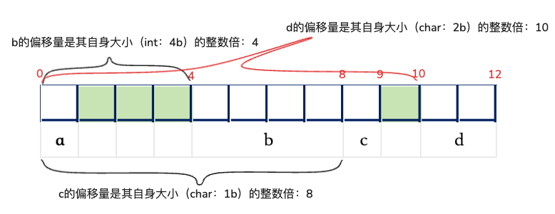

该结构占用的存储空间：12字节
该结构体数组record占用的存储空间：12 × 100 =1200字节

每个成员的偏移量：
* 成员a的偏移量=1×0=0
* 成员b的偏移量=4×1=4
* 成员c的偏移量=1×8=8
* 成员d的偏移量=2×5=10

为了使得record占用空间最小，就可以按照从短→长（或从长→短）来调整成员变量的声明顺序。

按照从短→长调整后的声明如下：

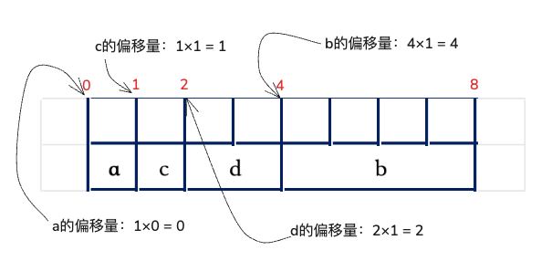

调整后该结构体占用的存储空间是8字节，该结构体数组record占用的存储空间：8 × 100 = 800字节

### 考点二十二、x86-64的基本特点

1. 比IA-32具有<span style="color:red;">更多的通用寄存器个数</span>。
2. 比IA-32具有<span style="color:red;">更长的通用寄存器位数</span>，从32为扩展到64位
3. <span style="color:red;">字长从32为变为64位</span>，因而逻辑地址从32位变为64位
4. 对于long double型数据，虽然还是采用与IA-32相同的80位扩展精度格式，但是，所分配的<span style="color:red;">存储空间从IA-32的12字节大小扩展为16字节大小</span>。
5. 过程调用时，对于整型<span style="color:red;">入口参数只有6个以内的情况，用通用寄存器而不是用栈来传递</span>，因而，很多过程可以不访问栈，使得大多数情况下<span style="color:dodgerblue;">执行时间比IA-32代码更短</span>
6. <span style="color:red;">128位的XMM寄存器从原来的8个增加到16个</span>，浮点操作采用基于SSE的面向XMM寄存器的指令集，浮点数存在128位的XMM寄存器中。

### 考点二十三、x86-64的数据传送指令

汇编指令中指令助记符结尾处的“<span style="color:red;">**q**</span>” 表示操作数长度为<span style="color:red;">**四字**</span>（<span style="background-color:yellow;"><span style="color:red;">64位</span></span>）

在x86-64中，提供了一些<span style="color:red;">在IA-32中没有的数据传送指令</span>，如下：

1）<span style="color:red;">mov</span><span style="color:dodgerblue;">abs</span><span style="background-color:yellow;"><span style="color:red;">q</span></span> 指令用于将一个64位立即数送到一个64位通用寄存器中

2）<span style="color:red;">mov</span><span style="background-color:yellow;"><span style="color:red;">q</span></span> 指令用于传送一个64位的四字

3）<span style="color:red;">mov</span><span style="color:dodgerblue;">s</span><span style="color:red;">b</span><span style="background-color:yellow;"><span style="color:red;">q</span></span>、<span style="color:red;">mov</span><span style="color:dodgerblue;">s</span><span style="color:red;">w</span><span style="background-color:yellow;"><span style="color:red;">q</span></span>、<span style="color:red;">mov</span><span style="color:dodgerblue;">s</span><span style="color:red;">l</span><span style="background-color:yellow;"><span style="color:red;">q</span></span> 用于将源操作数进行符号扩展并传送到一个64位寄存器中

4）<span style="color:red;">mov</span><span style="color:dodgerblue;">z</span><span style="color:red;">b</span><span style="background-color:yellow;"><span style="color:red;">q</span></span>、<span style="color:red;">mov</span><span style="color:dodgerblue;">z</span><span style="color:red;">w</span><span style="background-color:yellow;"><span style="color:red;">q</span></span>用于将源操作数进行零扩展后传送到一个64位寄存器中

5）<span style="color:red;">lea</span><span style="background-color:yellow;"><span style="color:red;">q</span></span> 用于将有效地址加载到64位寄存器

6）<span style="color:red;">push</span><span style="background-color:yellow;"><span style="color:red;">q</span></span> 和 <span style="color:red;">pop</span><span style="background-color:yellow;"><span style="color:red;">q</span></span> 分别是四字压栈和四字出栈指令。

<span style="background-color:yellow;"><span style="color:red;">**重要：**</span></span>

> 在x86-64中，`movl` 指令的功能 与 在IA-32中不同，它在传送32位寄存器内容的同时，还会将 <span style="color:dodgerblue;">**目的寄存器的高32位自动清0**</span>，因此，在x86-64中，`movl` 指令的功能相当于 `movzlq` 指令，因而在x86-64中不需要 `movzlq` 指令。

【<span style="color:red;">movl = </span><span style="color:red;">mov</span><span style="color:dodgerblue;">z</span><span style="color:red;">lq</span>】

例3.12、以下是一个C语言函数，其功能是将类型位source_type的参数转换位dest_type类型的数据并返回。
```
dest_type_convert(source_type x){
    dest_type y = (dest_type)x;
    return y;
}
```
根据过程调用时的参数传递约定可知，x存放在寄存器RDI对应的适合宽度的寄存器（入RDI、EDI、DI和DIL）中，y存放在RAX对应的寄存器（RAX、EAX、AX和AL）中，填写表3.10中的汇编指令，以实现convert函数中的赋值语句。
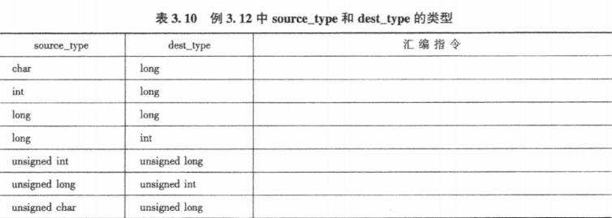

**解析：**

解题核心规则：

小→ 大（扩展）

| 类型            | 用什么扩展                 |
| ------------- | --------------------- |
| 有符号（signed）   | **符号扩展（sign extend）** |
| 无符号（unsigned） | **零扩展（zero extend）**  |


大→小（截断）

> 直接截断（高位丢弃）


x存放的寄存器：
* RDI：64位
* EDI：32位
* DI：16位
* DIL：8位

y存放的寄存器：
* RAX：64位
* EAX：32位
* AX：16位
* AL：8位

| source_type | dest_type | 汇编指令                                                | 说明 |
|-------------|-----------|-----------------------------------------------------|------|
| char（8位） | long（64位） | movsbq %dil, %rax                                   | 小→大 扩展 char是有符号 所以使用符号扩展<br>8位用b |
| int（32位） | long（64位） | movslq %edi, %rax                                   | 小→大 扩展 int是有符号 所以使用符号扩展<br>32位用l |
| long（64位） | long（64位） | movq %rdi, %rax                                     | long → long 都是64位，不需要转换和扩展 |
| unsigned int（32位） | unsigned long（64位） | movl %edi, %eax                                     | 小→大 扩展 unsigned int是无符号 所以使用零扩展<br>在 x86-64：写 EAX 会自动把高32位清零，零扩展到 64 位，不需要 movzlq |
| unsigned long（64位） | unsigned int（32位） | movl %edi, %eax<br><span style="color:red;">~~movzlq %edi, %rax~~</span> | 大→小，直接截断（高位丢弃）只取低32位，自动丢掉高32位 |
| unsigned char（8位） | unsigned long（64位） | movzbq %dil, %rax                                   | 小→大 扩展 unsigned char是无符号 所以使用零扩展 |

### 考点二十四、x86-64的算术逻辑运算指令

例3.13、以下是C语言赋值语句“x=a*b+c*d”，对应的x86-64汇编代码，已知x、a、b、c和d分别在寄存器RAX、RDI、RSI、RDX和RCX对应宽度的寄存器中。根据以下汇编代码，推测变量x、a、b、c和d的数据类型。

```sam
1    movslq %ecx, %rcx
2    imulq %rdx, %rcx
3    movsbl %sil, %esi
4    imull %edi, %esi
5    movslq %esi, %rsi
6    leaq (%rcx, %rsi), %rax
```

**解析：**

* x 在寄存器 RAX 对应宽度的寄存器中
* a 在寄存器 RDI 对应宽度的寄存器中
* b 在寄存器 RSI 对应宽度的寄存器中
* c 在寄存器 RDX 对应宽度的寄存器中
* d 在寄存器 RCX 对应宽度的寄存器中

本题的关键：通过“扩展方式 + 运算位宽”反推出变量类型

| 64位 | 32位 | 16位 | 8位 |
|------|------|------|------|
| RAX | EAX | AX | AL / AH |
| RBX | EBX | BX | BL / BH |
| RCX | ECX | CX | CL / CH |
| RDX | EDX | DX | DL / DH |

| 64位 | 32位 | 16位 | 8位 |
|------|------|------|------|
| RSI | ESI | SI | SIL |
| RDI | EDI | DI | DIL |
| RBP | EBP | BP | BPL |
| RSP | ESP | SP | SPL |

分析指令1：movslq %ecx, %rcx

> movslq 用于将源操作数进行符号扩展并传送到一个64位寄存器中。  
> 把一个“32位有符号数”，扩展成64位  
> movs 是符号扩展  
> l是32位的  
> q是64位的  
> d在寄存器RCX对应宽度的寄存器中  
> 确定：d 是 32位有符号数（int）


分析指令2：imulq %rdx, %rcx

> imulq 是带符号的乘法  
> q是64位的，d 是 int（32位），被扩展成64位，用64位乘法  
> 确定：c 是 long（64位）


分析指令3：movsbl %sil, %esi

> movsbl  8位 → 32位 的符号扩展，8位 → 32位（带符号扩展）  
> b在寄存器RSI对应宽度的寄存器中  
> 确定：b是char(8位)

分析指令4：imull %edi, %esi

> imull 带符号的32位乘法  
> a在寄存器RDI对应宽度的寄存器中，a 在 32位寄存器 %edi  
> 确定：a是int（32位）

分析指令5：movslq %esi, %rsi

> movslq 用于将源操作数进行符号扩展并传送到一个64位寄存器中。  
> 32位 → 64位（符号扩展）  
> a*b 的结果要参与 64 位运算


分析指令6：leaq (%rcx, %rsi), %rax

> leaq 地址传递  
> 结果放入 %rax（64位）  
> rax = rcx + rsi 用64 位寄存器  
> x在寄存器RAX对应宽度的寄存器中  
> 确定：x是long(64位)

* 变量x的数据类型：long（64位）
* 变量a的数据类型：int（32位）
* 变量b的数据类型：char（8位）
* 变量c的数据类型：long（64位）
* 变量d的数据类型：int（32位）


