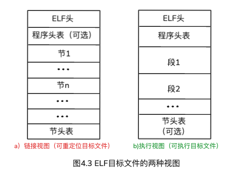
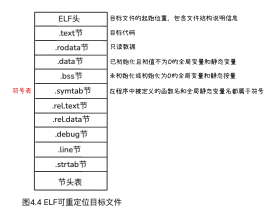
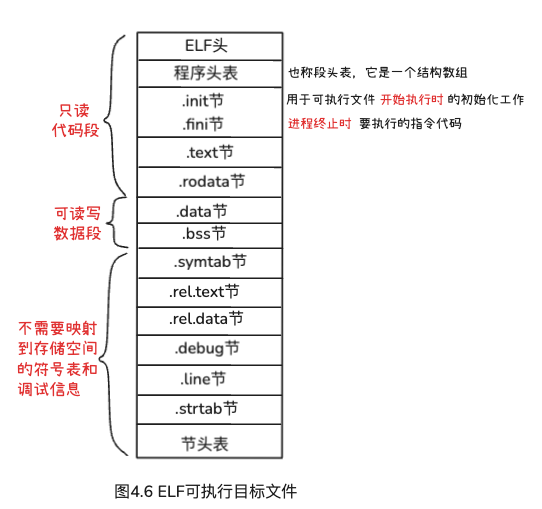
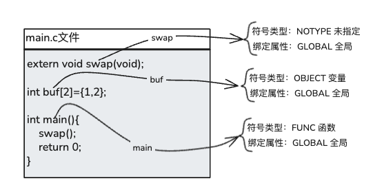
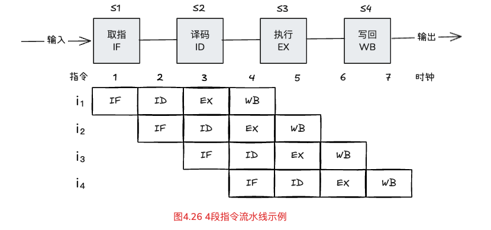

# 第四章、可执行文件的生成与加载执行

---
## 目录

- [一、可执行文件生成](#考点一可执行文件生成)
- [二、可重定位目标文件和可执行文件不同](#考点二可重定位目标文件和可执行文件不同)
- [三、链接器](#考点三链接器)
- [四、ELF目标文件格式](#考点四ELF目标文件格式)
- [五、堆栈内存](#考点五堆栈内存)
- [六、符号解析与重定位](#考点六符号解析与重定位)
- [七、符号类型、绑定属性和特殊伪节](#考点七符号类型绑定属性和特殊伪节)
- [八、符号解析规则](#考点八符号解析规则)
- [九、静态链接和动态链接](#考点九静态链接和动态链接)
- [十、程序和进程](#考点十程序和进程)
- [十一、CPU执行指令及功能](#考点十一CPU执行指令及功能)
- [十二、中断和异常](#考点十二中断和异常)
- [十三、指令流水线](#考点十三指令流水线)

---

**回顾第一章**


1、源程序文件到可执行目标文件的转换过程是什么？【<span style="color:red;">简答填</span>、<span style="color:red;">填空题</span>】

1）、<span style="color:red;">**预处理**</span>**阶段**：

> <span style="color:limegreen;">**预处理程序**</span>（<span style="color:red;">cpp</span>）对源程序中以 “#” 开头的命令进行处理，以<span style="color:red;">**.i**</span>为扩展名。   
> 预处理过源程序，是<span style="color:dodgerblue;">文本文件</span>

2）、<span style="color:red;">**编译**</span>**阶段**：

> <span style="color:limegreen;">**编译程序**</span>（<span style="color:red;">ccl</span>）对预处理后的源程序进行编译，生成一个汇编语言源程序文件，以<span style="color:red;">**.s**</span>为扩展名。  
汇编语言源程序，<span style="color:dodgerblue;">文本文件</span>

3）、<span style="color:red;">**汇编**</span>**阶段**：

> <span style="color:limegreen;">**汇编程序**</span>（<span style="color:red;">as</span>）对汇编语言源程序进行汇编，生成一个<span style="background-color:yellow;"><span style="color:red;">**可重定位**</span></span><span style="color:red;">**目标文件**</span>，以<span style="color:red;">**.o**</span>为扩展名。  
> 可重定位目标文件 <span style="color:dodgerblue;">二进制文件，打开是乱码</span>

4）、<span style="color:red;">**链接**</span>**阶段**：

> <span style="color:limegreen;">**链接程序**</span>（<span style="color:red;">ld</span>）将 `多个可重定位目标文件` 和 `标准库函数库` 中的 `可重定位目标文件` 合并成为一个<span style="background-color:yellow;"><span style="color:red;">**可执行**</span></span><span style="color:red;">**目标文件**</span>。  
> 可执行目标文件 <span style="color:dodgerblue;">二进制文件，打开是乱码</span>

<span style="background-color:red;"><span style="color:yellow;">扩展名助记词</span></span>：<span style="color:dodgerblue;">**I S O**</span>

### 考点一、可执行文件生成

**1）<span style="color:red;">预处理</span>阶段**

预处理命令是：<span style="color:red;">gcc -E</span> 或 <span style="color:red;">cpp</span>  

例如：

> 可用命令：`gcc -E main.c -o main.i` 或 `cpp main.c -o main.i`

将 `main.c` 转换为预处理后的文件 `main.i`

**2）<span style="color:red;">编译</span>阶段**

编译命令是：<span style="color:red;">gcc -S</span> 或 <span style="color:red;">ccl</span>

例如：

> 可用编译命令：`gcc -S main.i -o main.s` 或 `ccl main.i -o main.s`

对 `main.i` 进行编译并生成汇编代码文件 `main.s`

**3）<span style="color:red;">汇编</span>阶段**

汇编命令是：<span style="color:red;">gcc -c</span> 或 <span style="color:red;">as</span>

例如：

> 可用汇编命令：`gcc -c main.s -o main.o` 或 `as main.s -o main.o`

对 `main.s` 进行汇编，以生成<span style="background-color:red;"><span style="color:yellow;">可重定位</span></span><span style="color:red;">目标文件</span> main.o

**4）<span style="color:red;">链接</span>阶段**

链接命令是：<span style="color:red;">gcc -o</span> 或 <span style="color:red;">ld</span>（<span style="background-color:red;"><span style="color:yellow;">**静态链接器命令**</span></span>）

例如：

> 可用链接命令：gcc -o **test** main.o test.o 或 ld -o **test** main.o test.o

使用链接命令将 <span style="color:dodgerblue;">多个</span>可重定位目标文件、标准库函数库中的可重定位目标文件 合并生成<span style="color:dodgerblue;">一个</span>**<span style="color:red;">可执行文件</span>test**

这种将一个程序的 <span style="color:limegreen;">**所有关联模块**</span> 对应的目标代码文件结合在一起，以形成<span style="color:dodgerblue;">一个</span>可执行文件的过程称为：<span style="color:red;">**链接**</span>

由专门的链接程序（**Linker**，也称为<span style="color:limegreen;">**链接器**</span>）来实现。

### 考点二、可重定位目标文件和可执行文件不同

**可重定位目标文件**

* <span style="color:red;">单个模块</span>生成的
* 代码总是<span style="color:limegreen;">从0开始</span>

**可执行文件**

* <span style="color:red;">多个模块</span>组合而成
* 代码在ABI规范规定的虚拟地址空间中产生

（对于add函数的起始地址为:**0x80483d4**）

### 考点三、链接器

**名词解释题：<span style="color:red;">链接器</span>**

这种将一个程序的<span style="color:red;">**所有关联模块**</span>对应的目标代码文件结合在一起，以形成一个**可执行文件**的过程称为：<span style="color:red;">**链接**</span>。

由专门的链接程序（<span style="color:limegreen;">Linker</span>，也称为<span style="color:red;">**链接器**</span>）来实现。

链接器在将多个可重定位目标文件组合成一个可执行文件时，主要完成<span style="color:red;">**符号解析**</span>和<span style="color:red;">**重定位**</span>两个任务。

**1、符号解析**

目的是将每个<span style="color:limegreen;">**符号的引用**</span>与一个确定的<span style="color:limegreen;">**符号定义**</span>建立关联。

<span style="background-color:yellow;"><span style="color:red;">**重点：**</span></span>

符号包括<span style="color:red;">全局静态</span>变量名和函数名，而<span style="color:dodgerblue;">非静态局部</span>变量名则不是符号

**2、重定位（模块化、效率高）**

可重定位文件中的代码区和数据区都是从<span style="color:dodgerblue;">地址为0开始</span>的，链接器需要将<span style="color:limegreen;">不同模块</span>中<span style="color:limegreen;">相同的节</span>合并起来生成一个<span style="color:red;">**新的单独的节**</span>，集合ABI规范确定的虚拟地址空间划分来<span style="color:red;">**重新确定位置**</span>。

这种<span style="color:limegreen;">**重新确定 代码 和 数据 的地址**</span>并<span style="color:dodgerblue;">**更新指令中被引用符号地址**</span>的操作称为：<span style="color:red;">**重定位**</span>（名词解释题）

### 考点四、ELF目标文件格式

* **通用目标文件格式**→<span style="color:limegreen;">**COFF**</span>：Ststen V UNIX 的早期版本
* **可移植可执行格式**→<span style="color:limegreen;">**PE**</span>：Windows使用的是COFF的一个变种
* **可执行可链接格式**→<span style="color:limegreen;">**ELF**</span>（<span style="color:red;">本教材使用</span>）



**ELF目标文件的两种视图**

a）链接视图（<span style="color:dodgerblue;">可重定位目标文件</span>）

主要由不同的<span style="color:dodgerblue;">节</span>组成，<span style="color:dodgerblue;">节头表</span>，程序头表（可选）

b）执行视图（<span style="color:limegreen;">可执行目标文件</span>）

主要由不同的<span style="color:limegreen;">段</span>组成，<span style="color:limegreen;">程序头表</span>，节头表（可选）

**ELF目标文件的两种视图**

a）链接视图（<span style="color:red;">可重定位目标文件</span>）

主要由不同的节组成，节头表，程序头表（可选）

* ELF头：目标文件的起始位置，包含文件结构说明信息
* .text：目标代码
* .rodata节：只读数据
* .data节：<span style="color:red;">已</span>初始化<span style="color:blue;">且</span>初值<span style="color:green;">不为0</span>的**全局变量和静态变量**，例如：`int x = 10;`
* .bss节：<span style="color:red;">未</span>初始化<span style="color:blue;">或</span>初始化<span style="color:green;">为0</span>的**全局变量和静态变量**，例如：`int y; 或 int z = 0;`
* .symtab节：<span style="color:red;">符号表</span>，在程序中被定义的<span style="color:red;">**函数名**</span>和<span style="color:red;">**全局静态变量名**</span>都属于符号，与这些符号相关的信息被保存在符号表中。
* …
* 节头表



b)执行视图（<span style="color:red;">可执行目标文件</span>）

主要由不同的<span style="color:limegreen;">段</span>组成，<span style="color:limegreen;">程序头表</span>，节头表（可选）

* **程序头表**：也称<span style="color:blue;">**段头表**</span>，**它是一个结构数组**。
* .init节：用于可执行文件<span style="color:red;">开始执行时</span>的初始化工作，当程序开始执行时，系统会在进程进入主函数main之前，先执行这个节中的指令代码
* .fini节：<span style="color:red;">进程终止时</span>要执行的指令代码，当程序退出时，系统会执行这个节中的指令代码



<span style="color:red;">**注意：**</span>

> 对于auto型<span style="color:red;">**局部变量**</span>，它们再运行时被<span style="color:red;">分配在栈中</span>，因此既不出现在.data节，也不出现在.bss节

### 考点五、堆栈内存

#### 1）运行时堆（堆内存）

**低地址 → 高地址**

例如：
> C语言的malloc()库函数，Java语言的new函数

#### 2）用户栈（栈内存）

**高地址 → 低地址**

### 考点六、符号解析与重定位

main.c文件：

```c
extern void swap(void);

int buf[2]={1,2};

int main(){
    swap();
    return 0;
}
```

swap.c文件：

```c
extern int buf[];

int *bufp0 = &buf[0];
int *bufp1;

void swap(){
    int temp;
    bufp1 = &buf[1];
    temp = *bufp0;
    *bufp0 = *bufp1;
    *bufp1 = temp; 
}
```

**1）全局符号（Global Symbol）**

包括：<span style="color:red;">**非静态**</span>**函数名** 和 **全局变量名**

> main.c中：buf（全局变量名）、main（非静态函数名）  
> 
> swap.c中：bufp0(全局变量名)、bufp1(全局变量名)、swap(非静态函数名)

**2）外部符号（<span style="background-color:yellow;"><span style="color:red;">extern</span></span>）**

包括：引用在<span style="color:red;">**其他模块**</span>定义的<span style="color:red;">**外部函数名**</span>和<span style="color:red;">**外部变量名**</span>

> main.c中：swap(外部函数)
>
> swap.c中：buf(外部函数)

**3）本地符号**

包括：带<span style="color:red;">static属性</span>的**函数名**和**全局变量名**

<span style="color:red;">**特别注意**</span>：局部变量，不是符号，不在符号表中。

> swap.c中的<span style="color:dodgerblue;">**temp是局部变量，是在运行时动态分配的，因此，它不是符号，不在符号表**</span>。


### 考点七、符号类型、绑定属性和特殊伪节



#### 1）符号类型

* 未指定 => NOTYPE
* 变量 => OBJECT
* 函数 => FUNC
* 节 => SECTION

#### 2）绑定属性

* 本地 => LOCAL
* 全局 => GLOBAL
* 弱 => WEAK

> 通过GCC扩展的属性指示符，**了解**即可

#### 3）特殊伪节

* ABS => 表示该符号<span style="color:red;">**不会被重定位**</span>
* UNDEF => 表示<span style="color:red;">**未定义符号**</span>
* COMMON => 表示**未被分配位置**的<span style="color:red;">**未初始化的变量**</span>，称为COMMON符号
  * 比如：`int x;`

注意：<span style="background-color:yellow;">**.bss**</span> 和 <span style="background-color:yellow;">**COMMON**</span> 的区别

* .bss节：<span style="color:red;">未</span>初始化或初始化<span style="color:red;">为0</span>的**全局变量**和**静态变量**
* 符号冲突处理
    * .bss：<span style="color:red;">初始化为<span style="color:limegreen;">**0**</span>的变量是**强符号**</span>，如果有多处定义，链接时会报错
    * COMMON：**<span style="color:dodgerblue;">未初始化</span>的全局变量是<span style="color:red;">弱符号</span>**，允许多重定义，直到链接时才解决，能避免编译阶段错误。

### 考点八、符号解析规则

**符号解析**的目的是将每个模块中<span style="color:red;">**引用的符号**</span>与某个目标模块中的<span style="color:red;">**定义符号**</span><span style="background-color:yellow;">建立关联</span>。

**全局符号**

一个**全局符号**  
可能是<span style="color:dodgerblue;">**函数**</span>  
或者是<span style="color:limegreen;">.data</span>节中具有特定初始值的全局变量（`int a=1`）  
或者是<span style="color:limegreen;">.bss</span>节中被初始化为0的全局变量（int b=0）  
或者是说明位COMMON伪节的未初始化全局变量（COMMON符号）(int c)等等  

为便于说明<span style="color:red;">**全局符号的多重定义**</span>问题，本书将（<span style="color:dodgerblue;">函数</span>、<span style="color:dodgerblue;">.data</span>和<span style="color:dodgerblue;">.bss</span>节中的全局变量）统称为：<span style="color:limegreen;">**强符号**</span>

**GCC链接器处理多重定义的同名全局符号的规则是什么？**【简答题】

* 规则1：强符号不能多次定义，否则链接错误。
* 规则2：若出现一次强符号定义和多次COMMON符号或弱符号定义，则按强符号定义为准。
* 规则3：若同时出现COMMON符号定义和弱符号定义，则按COMMON符号定义为准。
* 规则4：若一个COMMON符号出现多次定义，则以其中占空间最大的一个为准。
* 规则5：若使用编译选项-fno-common，则不考虑COMMON符号，相当于将COMMON符号作为强符号处理。

**强符号**
> 定义：已经明确分配存储空间的符号  
> 一般：
> * 已初始化的全局变量
> * 函数
> 
> 举例：
>  ```c
>  int a = 10;
>  Void func(){}
>  ```
>  特点：
> * 必须唯一
> * 出现两个同名强符号，直接报错链接失败

**弱符号**
> 定义：可以被覆盖的符号  
> 一般：
> * 未初始化的全局变量  
> 
> 举例：  
> ```c   int a;```  
> 
> 特点：  
> * 可以和强符号同名
> * 如果有强符号，优先用强符号

**COMMON符号（重点！）**
> 定义：  
> 未初始化的全局变量，在目标文件中以COMMON形式存在，简单理解为：还没决定放哪儿的弱符号  
> 
> 举例：  
> ```c
> int a; // 在很多编译器中 → COMMON符号
> ```  
> 特点：
> * 不在.data/.bss里
> * 由链接器最终决定分配空间

main.c文件
```c
#include <stdio.h>
int y=100,z;
void p1(void);
int main(){
    z=1000;
    p1();
    printf("y=%d, z=%d\n", y,z);
    return 0;
}
```

p1.c文件
```c
int y;
short z;

void p1(){
    y=200;
    z=2000;
}
```

> 符号y在main.c中是强符号，而在p1.c中是COMMON符号  
> <span style="color:red;">规则2</span> 这两个y是同一个变量，即：main.c的y，最终y=200
> 
> 符号z在两个模块中都没有初始化，都是COMMON符号，根据<span style="color:red;">规则4</span>的，将占空间较大的符号作为唯一定义符号，即：main.c中的z，最终z=2000

**解决同名符号引起的问题？**（<span style="color:red;">简答题</span>）

> 
> * 1）可以定义为static属性的静态变量
> * 2）尽量要给全局变量赋初值使其变成强符号
> * 3）外部全局变量则尽量使用extern

### 考点九、静态链接和动态链接

**静态链接**

将**多个目标模块**打包成<span style="color:red;">**一个**</span>**单独的库文件**的机制就是<span style="color:red;">**静态链接**</span>，这个库文件就是<span style="color:dodgerblue;">**静态库**</span>。

<span style="color:limegreen;">**文件扩展名**</span>
> 类UNIX系统中共享库文件扩展名为：<span style="color:red;">**.a**</span>

**动态链接**

在可执行文件装入或<span style="color:red;">**运行时**</span>被<span style="color:red;">**动态地**</span>装入内存并<span style="color:red;">**自动被链接**</span>，这个过程称为<span style="color:red;">**动态链接**</span>

<span style="color:limegreen;">**文件扩展名**</span>
> 类UNIX系统中共享库文件扩展名为：<span style="color:red;">**.so**</span>  
> Windows 系统中共享库文件扩展名为：<span style="color:red;">**.dll**</span>

**静态链接和动态链接区别？**【<span style="background-color:red;"><span style="color:yellow;">简答题</span></span>】

> <span style="color:red;">**链接时机**</span>  
> > 静态链接：发生在形成可执行程序<span style="color:dodgerblue;">之前</span>，在编译过程中完成。  
> > 动态链接：发生在程序<span style="color:dodgerblue;">运行时</span>，<span style="color:dodgerblue;">动态</span>加载所需的模块。  
> 
> <span style="color:red;">**空间资源**</span>  
> > 静态链接：所有依赖的目标文件<span style="color:limegreen;">都会被包含</span>在最终的可执行文件中，这可能导致多个副本<span style="color:limegreen;">浪费空间</span>。  
> > 动态链接：多个程序可以<span style="color:limegreen;">共享</span>内存中的同一库文件，<span style="color:limegreen;">节省资源</span>  
> 
> <span style="color:red;">**更新升级**</span>  
> > 静态链接：若静态库更新，所有使用该库的程序<span style="color:dodgerblue;">都需要重新编译链接，不便于更新。</span>  
> > 动态链接：<span style="color:dodgerblue;">只需替换动态库文件</span>，程序再次运行时会自动加载新版本，<span style="color:dodgerblue;">简化了更新过程</span>

### 考点十、程序和进程

**程序**：代码和数据的集合，是<span style="color:red;">**静态**</span>的。

**进程**：程序的一次运行过程，是<span style="color:red;">**动态**</span>的，用正整数表示，简写为<span style="color:red;">PID</span>。

<span style="background-color:yellow;">注意</span>：一个程序可能对应多个不同的进程。

**Execve函数**：功能是在当前进行的上下文中加载并运行一个新程序。

例如：
```c
// 该函数用来加载并运行可执行目标文件filename
int execve(char *filename, char *argv[], *envp[]);
```

**fork函数**

在父进程中可通过fork函数创建一个子进程。

通过shell命令行输入可执行文件名a.out进行程序加载的过程（<span style="color:red;">简答题</span>）

> 1、shell命令行解释器输出一个命令行提示符（如：unix>），并开始接收用户输入的命令行。  
> 2、当用户在命令行提示符后输入命令行“./a.out[enter]”后，shell命令行程序开始对命令行进行解析，获得各个命令行参数并构造传递给函数execve的参数列表argv和参数个数argc。  
> 3、调用fork函数，创建一个子进程。  
> 4、以第2步命令行解析的得到的参数个数argc、参数列表argv以及全局变量environ作为参数，调用函数execve，从而实现在当前进程（用fork新创建的子进程）的上下文中加载并运行a.out程序。在函数execve中，通过启动加载器执行加载任务并启动程序运行。  

这里的“加载”实际上并没有将a.out文件中的代码和数据（除ELF头、程序头表等信息）从硬盘读入主存，而是根据可执行文件中的程序头表等，对当前进程描述符中的一些数据结构进行初始化，也即生成上述task_struct结构中vm_area_struct等信息。

### 考点十一、CPU执行指令及功能

**指令周期**（<span style="color:red;">名词解释题</span>）

> CPU取出并执行一条指令的时间。

**CPU执行一条指令的大致过程？**【<span style="color:red;">简答题</span>】

> 1、取指令  
> 2、指令译码  
> 3、计算源操作数地址并取操作数  
> 4、执行数据操作  
> 5、计算目的操作数地址并存结果  
> 6、计算下条指令地址

**指令功能的基本操作？**【<span style="color:red;">简答题</span>】

> 1、读取某存储单元内容，并将其装入某个寄存器。【<span style="color:dodgerblue;">读内存</span>】  
> 2、把某个寄存器中的数据存储到给定的存储单元中。【<span style="color:dodgerblue;">写内存</span>】  
> 3、把一个数据从某个寄存器<span style="color:red;">传送</span>到另一个寄存器或者ALU的输入端【<span style="color:dodgerblue;">传送</span>】  
> 4、在ALU中进行某个算术运算或逻辑运算，并将结果传送到某个寄存器。【<span style="color:dodgerblue;">运算写结果</span>】  

### 考点十二、中断和异常

**打断程序正常执行的事件**【<span style="color:red;">简答题</span>】

* 1、非法操作码
* 2、页故障
* 3、运算结果溢出或除0错误等
* 4、CPU收到外部中断请求信号

CPU除了能够正常地不断执行指令以外，还必须具有程序正常执行被打断时的处理机制，这种机制称为<span style="color:dodgerblue;">**异常控制**</span>，也称为<span style="color:red;">**中断机制**</span>。

打断程序正常执行的事件分为两大类：

* 1）内部异常：结果异常、除0等
* 2）外部中断：采样计时时间到、网络数据包到达等

**CPU对异常和中断的响应过程的步骤**【<span style="color:red;">简答题</span>】

* 1、保护断点和程序状态【<span style="background-color:yellow;">保护现场</span>】
  * 通过<span style="color:dodgerblue;">**程序状态字**</span>（<span style="color:red;">**PSW**</span>）保存运行程序的状态信息
* 2、关中断
  * 通常通过设置<span style="color:limegreen;">**中断使能位**</span>来实现，当置<span style="color:red;">**1**</span>，<span style="color:red;">**开中断**</span>，表示<span style="color:red;">允许响应中断</span>，反之，关中断。
* 3、识别异常和中断事件并转响应处理程序

### 考点十三、指令流水线



**指令的处理过程可以归纳为以下4个阶段**【<span style="color:red;">简答题</span>】

* 1、取指令<span style="color:red;">并</span>PC加1（**IF**）
* 2、译码<span style="color:red;">并</span>读寄存器（**ID**）
* 3、运算<span style="color:red;">或</span>读存储器（**EX**）
* 4、结果返回（**WB**）


* 指令add  => 4个阶段
* 指令load => 4个阶段
* 指令mov => （IF）（ID）和（WB）
* 指令store => （IF）（ID）和（WB）

<span style="color:red;">**ps**</span>作为**时间单位**，代表的是<span style="color:red;">皮秒</span>，即一万亿分之一秒（10⁻¹²秒）

* 指令译码——60ps
* 存储器读或写——200ps
* PC加1——40ps
* 寄存器读或写——50ps
* ALU——100ps

#### <span style="color:dodgerblue;">串行</span>（<span style="color:red;">助记：</span><span style="color:limegreen;">AL4 MS3</span>）

* add指令执行时间：IF + ID + EX + WB = 200+60+<span style="color:limegreen;">100</span>+50=410PS 【<span style="color:red;">运算ALU</span>】
* load指令执行时间：IF + ID + EX + WB = 200+60+<span style="color:limegreen;">200</span>+50=510PS 【<span style="color:red;">读存储器</span>】
* mov指令执行时间：IF + ID + WB = 200+60+50=310ps
* store指令执行时间：IF + ID + WB = 200+60+200=460ps

**以上加和总时间：410 + 510 + 310 + 460 = 1690ps**

#### <span style="color:dodgerblue;">流水线</span>

若流水段数为M，每个流水段的执行时间为T，则理想状态下，N条指令的执行总时间：

`(M-1+N)×T → （4-1+4）×200 = 1400ps`

例如：

> 对于4段流水线，假定某程序有N条指令，理想情况下，总时间为：（4-1+N）×200ps，  
> 当N很大时，流水线方式比串行执行方式要快很多。

**流水线CPU设计原则**

* 1）指令流水段个数以<span style="color:red;">最复杂指令所用的阶段数</span>为准【最复杂是load指令，所以<span style="color:limegreen;">M=4</span>】
* 2）流水段执行时间以<span style="color:red;">最复杂操作所用时间</span>为准【最复杂操作时间是200ps，所以<span style="color:limegreen;">T=200ps</span>】

在流水线CPU中，每条指令的执行时间为4×200=800ps，比串行最长的时间510ps还长，因此<span style="background-color:blue;">流水线方式并不能缩短一条指令的执行时间</span>。但是，对于整个程序而言，流水线方式可以大大<span style="color:dodgerblue;">增加指令执行的吞吐率</span>。


