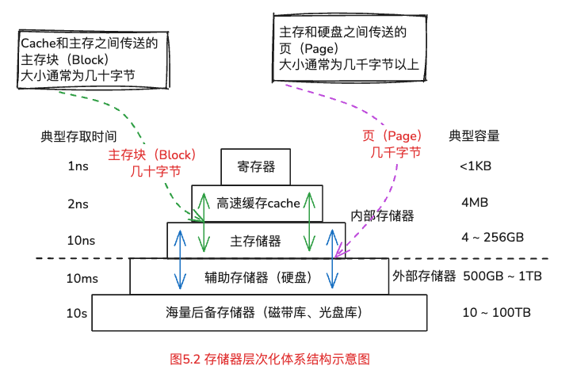
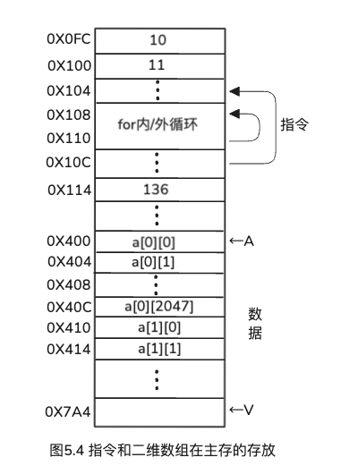
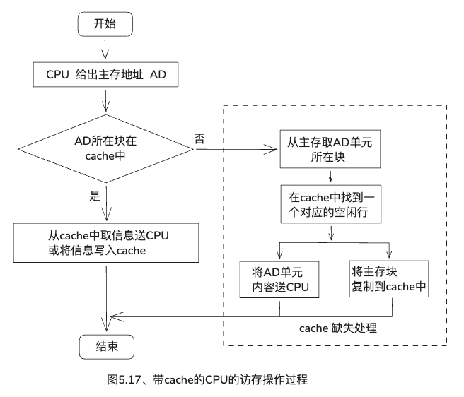
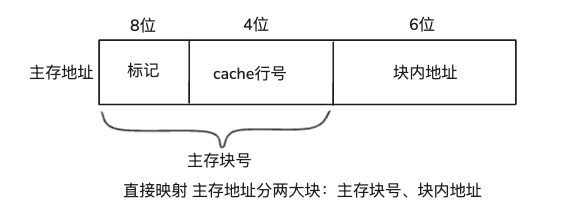

# 第五章、程序的存储访问

---
## 目录

- [一、存储器分类](#考点一存储器分类)
- [二、存储器的层次化结构](#考点二存储器的层次化结构)
- [三、程序访问的局部性](#考点三程序访问的局部性)
- [四、Cache高速缓冲存储器](#考点四Cache高速缓冲存储器)
- [五、直接映射](#考点五直接映射)
- [六、全相联映射](#考点六全相联映射)
- [七、组相联映射](#考点七组相联映射)
- [八、直接映射、全相联映射和组相联映射优缺点](#考点八直接映射全相联映射和组相联映射优缺点)
- [九、cache中主存块的替换算法](#考点九cache中主存块的替换算法)
- [十、cache的写策略](#考点十cache的写策略)
- [十一、cache和程序性能](#考点十一cache和程序性能)

---

### 考点一、存储器分类

**按信息的可更改性**

* <span style="color:red;">**读/写**</span>存储器
* <span style="color:red;">**只读**</span>存储器   → ROM

<span style="color:limegreen;">**按断电后信息的可保存性**</span>

* <span style="color:red;">**非易失性**</span>（不挥发）存储器【包括：ROM、磁盘、光盘】
* <span style="color:red;">**易失性**</span>（挥发）存储器【包括：主存、cache】

**主存**，由<span style="color:red;">**动态**</span>RAM芯片组成。  

**cache**，由<span style="color:red;">**静态**</span>RAM芯片组成，位于主存和CPU之间，存储速度接近CPU的工作速度，用来存放当前CPU经常使用到的指令和数据。

### 考点二、存储器的层次化结构



Cache和主存之间传送的 <span style="color:red;">**主存块**</span>（**Block**）大小通常为<span style="color:red;">几十字节</span>

主存和硬盘之间传送的<span style="color:red;">**页**</span>（**Page**）大小通常为<span style="color:red;">几千字节以上</span>

> 在层次结构存储系统中，CPU需要访问存储器时，  
> 先访问cache，若不在cache，  
> 再访问主存，若不在主存，  
> 则访问硬盘，  
> 此时，从硬盘中读出信息送到主存，  
> 然后再从主存送到cache。

### 考点三、程序访问的局部性

程序产生的访存地址往往集中一个很小的范围，这种现象称为<span style="color:limegreen;">**程序访问的局部性**</span>。

包括：
* 时间局部性：被访问的存储单元   在较短时间内  很可能被<span style="color:red;">**重复访问**</span>
* 空间局部性：被访问的存储单元的<span style="color:red;">**临近单元**</span>  在较短时间内  很可能被访问



例5.1、假定数组元素按行优先存放，以下两段伪代码程序段A和B中，
（1）对于数组a的访问，那一个空间局部性更好？哪一个时间局部性更好？
（2）变量sum的空间局限性和时间局限性各如何？
（3）对于指令访问来说，for循环体的空间局部性和时间局部性如何？

程序段A
```c
int sum_array_rows(int a[M][N])
{
    int i,j,sum=0;
    for (i=0;i<M;i++)
        for (j=0;j<N;j++)
            sum += a[i][j];
    return sum;
}
```

程序段B
```c
int sum_array_cols(int a[M][N])
{
    int i,j,sum=0;
    for (j=0;j<N;j++)
        for (i=0;i<M;i++)
            sum += a[i][j];
    return sum;
}
```

从图5.4可知，指令和二维数组在主存的存放，是<span style="color:limegreen;">**按照行**</span>存放的。

**解答：**

>（1）
> * 程序段A  
    * 空间局部性：访问顺序与存放顺序一致，故<span style="color:limegreen;">空间局部性好</span>。  
    * 时间局部性：<span style="color:red;">差</span>，因为每个数组元素都只被访问一次，【<span style="background-color:yellow;">无重复</span>】
>* 程序段B  
    * 空间局部性：访问顺序与存放顺序不一致，每次都要跳过M个元素，故<span style="color:dodgerblue;">没有空间局部性</span>  
    * 时间局部性：<span style="color:red;">差</span>，因为每个数组元素都只被访问一次【<span style="background-color:yellow;">无重复</span>】  
>
>（2）变量sum(程序段A、B都一样)
> * 空间局部性：单个变量没有意义
> * 时间局部性：<span style="color:red;">好</span>，因为每次循环都要被访问，【<span style="background-color:yellow;">重复访问</span>】
> 
>（3）for循环体（程序段A、B都一样）
> * 空间局部性：访问循环体内指令按序连续存放，所以<span style="color:red;">空间局部性好</span>
> * 时间局部性：因都是M×N次，所以<span style="color:red;">时间局部性好</span>


### 考点四、Cache高速缓冲存储器



整个访存过程如下：

判断信息是否在cache
* 若<span style="color:red;">是</span>，则直接从cache取信息
* 若<span style="color:dodgerblue;">否</span>，则从主存取一个主存块到cache，如果对应的cache行已满，则需要替换cache中的信息。

<span style="background-color:yellow;">**注意：**</span>

> Cache中的内容是主存中部分内容的<span style="color:red;">副本</span>。  

每个cache行有一个<span style="color:limegreen;">**有效位**</span>  
<span style="color:red;">**清0淘汰**</span>某cache行中的主存块  
<span style="color:red;">装入</span>一个新主存块时<span style="color:red;">置1</span>  

**若CPU访问单元所在的块**

若在cache中，则称<span style="color:red;">cache命中</span>，命中概率称为<span style="color:red;">**命中率p**</span>，<span style="color:dodgerblue;">命中时间Tc</span>，它等于命中次数与访问总次数之比。  
即：`命中率p = 命中次数/访问总次数`

<span style="background-color:red;">命中时</span>，CPU在cache中直接存取信息，所用时间即为cache访问时间<span style="color:dodgerblue;">Tc</span>，称为**命中时间**。  

若不在cache中，则称<span style="color:red;">不命中</span>或<span style="color:red;">缺失</span>，其概率称为<span style="color:red;">缺失率</span>，访问时间<span style="color:limegreen;">Tm</span>，它等于不命中次数与访问总次数之比

即：`缺失率 = 不命中次数/访问总次数 = 1 - 命中率p`

缺失时，需要从主存读取一个主存块送cache，并同时将所需信息送CPU，因此，所用时间为 <span style="color:red;">主存访问时间Tm</span> 和 <span style="color:dodgerblue;">cache访问时间Tc</span> 之和。

即：`缺失所用时间 = 主存访问时间Tm + cache访问时间Tc`

<span style="background-color:red;">注意</span>📢：通常把<span style="color:red;">**Tm**</span>称为<span style="color:limegreen;">**缺失损失**</span>

CPU在cache-主存层次的平均访问时间为：  
```
平均访问时间Ta = 命中率p × 命中时间Tc + 缺失率(1-p) × 缺失所用时间(Tm + Tc)
平均访问时间Ta = p × Tc + (1-p)×（Tm + Tc） 
平均访问时间Ta = Tc + (1-p) × Tm
平均访问时间Ta = 命中时间Tc  + (1-命中率P) × 缺失损失Tm
```

例5.2、假定处理器时钟周期为2ns，某程序有3000条指令组成，每条指令执行一次，其中4条指令在取指令时发生cache缺失，其余指令都在cache中命中。在执行指令过程中，该程序需要1000次主存数据访问，其中6次发生cache缺失。  
问：  
1、执行该程序的cache命中率是多少？  
2、若cache命中时间为1个时钟周期，缺失损失为10个时钟周期，则CPU在cache-主存层次的平均访问时间为多少？  

解答：

```
3000条指令，每条指令执行一次取指令，则取指令总次数：3000，其中4条指令在取指令时发生cache缺失，命中数：3000 - 4 = 2996

执行指令时，该程序需要1000次主存数据访问，则执行指令的总访问次数：1000次，其中6次发生cache缺失，命中数：1000 - 6  = 994994

1、该程序的cache命中率

总的命中次数：2996 + 994 = 3,990
总访问次数：3000 + 1000 = 4,000

命中率p = 命中次数/总的访问次数
命中率p = （2996 + 994）/(3000 + 1000)
命中率p = 3990/4000
命中率p = 99.75%

2、CPU在cache-主存层次的平均访问时间，根据公式：

Ta = 命中时间Tc  + (1-命中率P) × 缺失损失Tm
Ta = 1  + (1-99.75%) × 10
Ta = 1 + 0.025
Ta = 1.025 个时钟周期

一个时钟周期2ns

则平均访问时间Ta = 1.025 × 2 = 2.05ns
```

### 考点五、直接映射

* <span style="color:red;">直接映射</span>：每个主存块映射到cache的<span style="color:red;">固定行</span>中。
* <span style="color:dodgerblue;">全相联映射</span>：每个主存块映射到cache的<span style="color:dodgerblue;">任意行</span>中。
* <span style="color:limegreen;">组相联映射</span>：每个主存块映射到cache的<span style="color:limegreen;">固定组</span>的<span style="color:limegreen;">任意行</span>中。

每个<span style="color:red;">**主存块**</span>映射到cache的<span style="color:red;">**固定行**</span>中，也叫<span style="color:limegreen;">**模映射**</span>，其映射关系如下：

> cache<span style="color:red;">行号</span> = 主存<span style="color:dodgerblue;">块号</span> <span style="color:limegreen;">**mod**</span> cache<span style="color:red;">**行数**</span>

例如：若cache有16行（数），根据100 mod 16 =4可知，主存第100块映射到cache第4行（号）

`cache行号 = 100%16=4`

例5.3、假定cache采用直接映射方式，主存块大小为64B，按字节编址。cache数据区大小为1KB，主存空间大小为256KB。
问：
主存地址如何划分？要求用图表示主存块和cache行之间的映射关系，假定cache当前为空，说明CPU对主存单元0240CH的访问过程。



解题思路：【明确一下四个概念】

* ①确定<span style="color:red;">主存地址</span>位数
* ②确定<span style="color:red;">块内地址</span>位数
* ③确定<span style="color:red;">cache行号</span>位数
* ④确定标记位数；<span style="background-color:yellow;">① - ② - ③</span> 【主存地址 <span style="color:red;">减去</span> 块内地址 <span style="color:red;">减去</span> cache行号】

主存空间256KB，主存块大小64B，主存块个数 = 256KB/64B= 256 × 1024B/64B= 262144B/64B=4096  
Cache数据区的大小为1KB，cache当前为空，也就是没有行，行数为0，是空的  

1、确定主存地址位数
> 主存空间256KB，主存位数 = log₂(256 × 1024) = log₂262144 = 18位

2、确定块内地址位数
> 主存块大小64B，log₂64 = 6位

3、确定cache行号位数
> Cache数据区的大小为1KB，主存块大小为64B，  
> 1KB/64B = 16行  
> log₂16 = 4位  

4、确定标记位数
> ①➖②➖③=18-6-4=8位

<span style="color:red;">**注意**</span>：<span style="color:red;">标记</span>，即：<span style="color:limegreen;">**块群**</span>

### 考点六、全相联映射

每个<span style="color:red;">**主存块**</span>映射到cache的<span style="color:limegreen;">任意行</span>中。

### 考点七、组相联映射

每个<span style="color:red;">**主存块**</span>映射到cache的<span style="color:blue;">**固定组**</span>的<span style="color:limegreen;">**任意行**</span>中。

### 考点八、直接映射、全相联映射和组相联映射优缺点

**直接映射**

* 优点：<span style="color:red;">容易实现</span>
* 缺点：命中时间短，但由于多个主存块会映射同一个cache行，当访问集中在这些主存块时，就会引起<span style="color:red;">频繁的调进调出</span>，即使<span style="color:dodgerblue;">其他cache行都空闲，也无法充分利用</span>。
* 
**全相联映射**

* 优点：只要有空闲cache行，就不会发生冲突，因而<span style="color:red;">**块冲突概率低**</span>
* 缺点：时间开销和所用元件开销都较大，因此<span style="color:red;">全相联</span>方式 <span style="color:red;">**不适合容量较大的cache**</span>

**组相联映射**

* 结合了<span style="color:red;">直接映射</span>和<span style="color:red;">全相联</span>的<span style="color:red;">优点</span>

### 考点九、cache中主存块的替换算法

cache行数比主存块数少得多，因此，往往多个主存块会映射到同一个cache行中。当新的主存块复制到cache时，cache中的对应行可能已经全部被占满，此时，必须选择淘汰掉一个cache行中的主存块。具体如何选择称为<span style="color:red;">**替换算法**</span>。

常用的替换算法有如下几种：

* <span style="color:red;">**先进先出算法：FIFO**</span>
    * 基本思想：选择最早装入cache的主存块被替换掉。
    * 【<span style="color:limegreen;">不能</span>正确反映程序的访问局部性】
* <span style="color:red;">**最近最少使用算法：LRU【Least Recently Used】**</span>
    * 基本思想：选择近期最少使用的主存块被替换掉。
    * 【<span style="color:limegreen;">能</span>正确反映程序的访问局部性】
* 最不经常使用算法
    * 基本思想：选择替换掉cache中<span style="color:dodgerblue;">引用次数最少</span>的块
* 随机替换算法
    * 基本思想：<span style="color:dodgerblue;">随机</span>选择一个被替换掉

### 考点十、cache的写策略

因为cache中的内容是主存块的<span style="color:red;">副本</span>，当更新cache中的内容时，就要考虑<span style="color:red;">何时更新</span>主存块中的相应内容，使两者保持一致，这称为<span style="color:red;">**写策略**</span>问题。

写策略有以下两种：

**1、通写法**

**基本思想**：

当CPU写入数据<span style="color:red;">命中时</span>【<span style="background-color:red;">CPU要修改的这个地址，在Cache里已经有了</span>】，同时将数据<span style="color:red;">写入主存</span>和<span style="color:red;">缓存</span>，这种策略可以保证缓存和主存中的数据一致性。
<span style="color:dodgerblue;">不命中</span>时，则<span style="color:dodgerblue;">先写入主存</span>，然后以下两种情况：

* **写分配法**：分配一个cache行并装入更新后的主存块，<span style="color:limegreen;">充分利用</span>空间局部性。
* **非写分配法**：不将主存块装入cache，<span style="color:limegreen;">没有充分利用</span>空间局部性

**2、回写法**

**基本思想**：

当CPU写入数据<span style="color:red;">命中时</span>，只将数据<span style="color:red;">写入缓存</span>，<span style="color:red;">不</span>立即<span style="color:red;">写入主存</span>。当缓存行被替换时，才将数据写回主存。
写缺失时，分配一个cache行并装入主存块，然后更新改行的内容。

<span style="color:red;">**注意**</span>：<span style="color:limegreen;">回写法</span>通常与<span style="color:dodgerblue;">写分配法</span><span style="color:red;">组合使用</span>。

### 考点十一、cache和程序性能

每一个<span style="color:red;">**cache行**</span>除用于<span style="color:red;">存放主存块</span>外，还有：<span style="color:red;">有效位</span>、<span style="color:red;">标记</span>以及<span style="color:red;">修改位</span>和<span style="color:red;">使用位</span>（如：<span style="color:red;">LRU位</span>）等控制位。

用<span style="color:limegreen;">**通写法**</span>，<span style="background-color:yellow;">无须修改位</span>，那就剩下：<span style="color:red;">有效位</span>、<span style="color:red;">标记</span>和<span style="color:red;">使用位</span>（如：<span style="color:red;">LRU位</span>）
