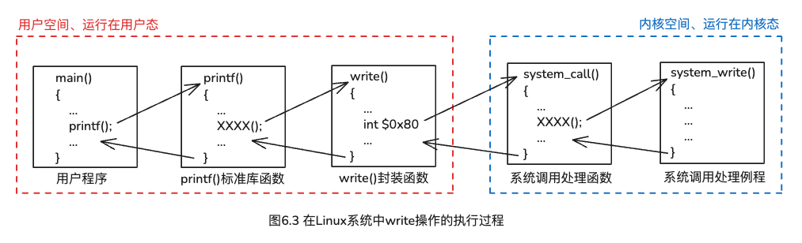

# 第六章、程序中的I/O操作实现

---
## 目录

- [一、I/O子系统](#考点一io子系统)
- [二、在Linux系统中write操作的执行过程](#考点二在linux系统中write操作的执行过程)
- [三、用户空间的I/O函数](#考点三用户空间的io函数)
- [四、系统级I/O函数](#考点四系统级io函数)
- [五、内核空间的I/O函数](#考点五内核空间的io函数)
- [六、设备驱动程序](#考点六设备驱动程序)
- [七、外设、总线](#考点七外设总线)
- [八、I/O接口的职能](#考点八io接口的职能)
- [九、I/O端口及其编址](#考点九io端口及其编址)
- [十、中断系统](#考点十中断系统)

---

### 考点一、I/O子系统

I/O子系统包含以下两大部分：

* <span style="color:red;">**I/O软件**</span>
    * <span style="background-color:yellow;">用户</span>空间I/O软件（称为<span style="color:dodgerblue;">**用户**</span>I/O软件）
    * <span style="background-color:yellow;">内核</span>空间I/O软件（称为<span style="color:dodgerblue;">**系统**</span>I/O软件）
        * 分三个层次
            * 设备无关的I/O软件层
            * 设备驱动程序层
            * 中断服务程序层
* <span style="color:red;">**I/O硬件**</span>
    * 在操作系统<span style="color:red;">**内核空间**</span><span style="color:limegreen;">**I/O软件**</span>的控制下完成具体的I/O操作。

I/O子系统的三大特性：

* **共享性**：I/O子系统被多个进程共享
* **复杂性**：I/O设备控制的细节比较复杂
* **异步性**：I/O子系统的速度较慢

### 考点二、在Linux系统中write操作的执行过程



* 1、假定用户程序中调用了库函数printf。
* 2、在printf函数中又通过一系列的函数调用，最终转到调用write函数。
* 3、在write函数对应的指令序列中，一定有一条用于系统调用的<span style="color:red;">陷阱指令</span>：int $0x80或sysenter，该指令<span style="color:red;">执行后</span>，进行就从<span style="color:red;">用户态</span>陷入<span style="color:red;">内核态</span>执行。
* 4、Linux中有一个系统调用的统一入口，即系统调用处理程序system_call。CPU执行<span style="color:red;">陷阱指令后，转到</span>system_call执行第一条指令进行。在system_call中，将根据EAX寄存器中的系统调用号跳转到当期那系统调用对应的系统调用服务例程sys_write去执行。
* 5、<span style="color:red;">system_call执行结束</span>时，从<span style="color:red;">内核态</span>返回到<span style="color:red;">用户态</span>下的陷阱指令后面一条指令继续执行。

### 考点三、用户空间的I/O函数

I/O子系统包含以下两大部分：

* **标准I/O库函数**（如：文件I/O函数 fopen、fread、fwrite和fclose） 标准库函数<span style="color:red;"> **＋ f**</span>
* **系统级I/O函数**（如：open、read、write和close）<span style="color:red;">**不加 + f**</span>

**标准I/O库函数相比较系统级I/.O函数的<span style="color:red;">优缺点</span>是什么？**【<span style="background-color:yellow;">简答题</span>】

**优点：**
> 1、使用标准I/O库函数得到的程序<span style="color:red;">移植性较好</span>  
> 2、标准I/O库函数中的文件操作<span style="color:red;">使用了在内存中的文件缓存区</span>，使得系统调用以及<span style="color:red;">I/O次数显著减少</span>

**缺点：**
> 1、I/O为<span style="color:dodgerblue;">同步操作</span>，即程序必须<span style="color:dodgerblue;">等待I/O操作真正完成后才能继续执行</span>  
> 2、在<span style="color:dodgerblue;">一些情况</span>下不适合甚至<span style="color:dodgerblue;">无法使用标准I/O库函数实现I/O功能</span>  
> 3、使用标准I/O库函数<span style="color:dodgerblue;">网络编程容易造成缓冲区溢出</span>等风险，同时<span style="color:dodgerblue;">不提供对文件进行加锁和解锁</span>等功能

### 考点四、系统级I/O函数

在Linux操作系统中，<span style="background-color:yellow;"><span style="color:red;">一切皆文件</span></span>（键盘和显示器）

文件分成：<span style="color:red;">**ASCII文件**</span> 和 <span style="color:red;">**二进制文件**</span> 两类。

ASCII文件也称为**文本文件**。

与I/O操作相关的系统调用封装函数属于：<span style="color:red;">系统级I/O函数</span>。

在unix/linux系统中，常用的函数如下：

* create函数：创建文件
* open函数：打开文件
* read函数：读文件
* write函数：写文件
* **lseek函数**：调整文件的<span style="color:limegreen;">**当前读/写位置**</span>
* **stat、fstat函数**：查看文件<span style="color:limegreen;">**元数据**</span>
* close函数：关闭文件

<span style="color:red;">**输出缓冲区**</span>的属性有三种：

* **全缓冲**
    * 即使<span style="color:red;">遇到换行符</span>也<span style="color:red;">不会写文件</span>，只有<span style="color:red;">当缓冲区满时</span>才会将缓冲区内容真正<span style="color:red;">写入文件fd</span>中
* **行缓冲**
    * 遇到<span style="color:red;">换行符</span>或者<span style="color:red;">缓存区满</span>就将缓冲区内容<span style="color:red;">写文件fd</span>中
* **非缓冲**
    * <span style="color:red;">直接</span>写到文件fd中

### 考点五、内核空间的I/O函数

例6.2、在Linux系统中，假设当前文件目录中硬盘文件test.txt由4个ASCII码字符“test”组成，下列程序的输出结果是什么？
```c
#include <stdio.h>
#include <fcntl.h>
#include <unistd.h>

int main(){
    int fd1,fd2;
    char c;

    fd1=open("test.txt", O_RDONLY, 0);
    fd2=open("test.txt", O_RDONLY, 0);
    read(fd1,&c,1);
    read(fd2,&c,1);
    printf("fd1=%d,fd2=%d,c=%c\n", fd1,fd2,c);
    return 0;
}
```

**解析：**

<span style="color:red;">**Linux中前3个文件描述符0、1、2分别分配给自动打开的三种标准设备文件：stdin、stdout、stderr**</span>

**所以open函数从3开始分配，因此fd1=3、fd2=4。**
```c
test.txt = "t e s t"
            ↑ ↑ ↑ ↑
            0 1 2 3
```
每次打开一个文件时，Linux的虚拟文件系统VFS通过路径解析找到该文件的inode后，对其初始化，**将当前读/写位置设为0，指向字符串“test”中的字符“t”**。  

所以程序输出结果为：fd1=3,fd2=4,c=t

### 考点六、设备驱动程序

设备驱动程序的实现方式域设备的I/O控制方式相关。

**I/O控制方式**主要有三种：【<span style="background-color:yellow;">填空题</span>】

* 1、程序直接控制
    * 输入：数据输入时从I/O设备通过CPU传到内存
    * 输出：数据输出时从内存通过CPU传到I/O设备
    * <span style="color:red;">**需要经过CPU**</span>
    * 适用于<span style="color:red;">简单的</span>或者<span style="color:red;">数据传输要求不高</span>的场景
* 2、中断控制
    * 输入：数据输入时从I/O设备通过CPU传到内存
    * 输出：数据输出时从内存通过CPU传到I/O设备
    * <span style="color:red;">**需要经过CPU**</span>
    * 适用于对 <span style="color:red;">响应速度要求较高</span> 且 <span style="color:red;">设备速度不是特别快</span>的场景
* 3、DMA控制
    * 输入：数据输入时直接从I/O设备传到内存
    * 输出：数据输出时直接从内存传到I/O设备
    * <span style="color:red;">**不再需要经过CPU**</span>
    * 适用于<span style="color:red;">高速I/O设备</span>进行<span style="color:red;">大规模数据传输</span>的场景，如硬盘存取和图像处理。


### 考点七、外设、总线

设备驱动程序的实现方式域设备的I/O控制方式相关。

通常将<span style="color:red;">**I/O设备**</span>分成两种：【<span style="background-color:yellow;">填空题</span>】

* **字符设备**【对应=》程序直接控制    数据量<span style="color:red;">小</span>】
* **块设备**【对应=》DMA控制   数据量<span style="color:red;">大</span>】

通常将总线分成三种：【<span style="background-color:yellow;">填空题</span>】

* **处理器总线**
* **存储器总线**
* **I/O总线**

### 考点八、I/O接口的职能

**I/O接口的主要职能包括以下几个方面**：【<span style="background-color:yellow;">简答题</span>】

> * **1、数据缓冲**
> > 外设速度低，在**设备控制器**中引入<span style="color:dodgerblue;">**数据缓冲存储器**</span>后，输入数据时，CPU从数据缓冲存储器取数即可；输出数据时，CPU只能把数据送到数据缓冲存储器即可。
> * **错误和就绪检测**（<span style="color:dodgerblue;">结果保存在状态寄存器中，供CPU查用</span>）
> > 提供错误和就绪检测逻辑，并将结果保存在状态寄存器，供CPU查用
> * **控制和定时**
> > 根据相应的逻辑，向外设发送控制信号，<span style="color:dodgerblue;">控制外设工作</span>。
> * **数据格式的转换**
> > 提供<span style="color:dodgerblue;">数据格式转换部件</span>

### 考点九、I/O端口及其编址

<span style="color:dodgerblue;">**I/O端口的编址**</span>方式有两种：【<span style="background-color:yellow;">填空题</span>】

* <span style="color:red;">**统一编址**</span>方式
    * I/O端口被视同内存单元，与主存<span style="color:red;">共享同一地址空间</span>
    * I/O端口占用了一部分内存空间，使<span style="color:red;">可用内存减少</span>
* <span style="color:red;">**独立编址**</span>方式、
    * **为I/O创建了一个<span style="color:red;">单独的地址空间</span>，此地址空间与内存地址空间相区分，确保<span style="color:red;">二者不冲突</span>**。
    * I/O端口<span style="color:red;">**不占用**</span>内存空间

### 考点十、中断系统

**中断系统的基本功能包含以下几个方面**【<span style="background-color:yellow;">简答题</span>】

1. **及时记录各种中断请求**，通常用一个  <span style="color:red;">中断请求寄存器</span> 来记录
2. **自动响应中断请求**。
   3. CPU在开“中断”状态下，现有中断请求后会自动响应中断。
3. **同时有多个中断请求时，能自动选择并响应优先级最高的中断请求**。
4. **保护被打断程序的断点和现场**。

<span style="color:red;">**中断屏蔽字**</span>的作用：<span style="background-color:yellow;"><span style="color:red;">**暂停对某些中断的响应**</span></span>。


